这是我的算法刷题小指南。和大多数人一样，我并不对算法有着十分高超的水准，只是一个热爱计算机，并且愿意练习的普通人。我会在这里记录我刷题的一些心得和一些题目的解法。希望能够帮助到一些人。

本文的内容部分参考了[字节跳动程序媛教你如何刷算法题：面试手撕代码我就没怕过](https://blog.csdn.net/qq_29966203/article/details/122890389)等多篇文章。在此感谢他们的贡献。

# 写在最前

刷题，要有策略，讲究方法和效率。

**按照面试考察频率的排列，按照以下顺序刷题：**

**哈希表与字符串 > 链表 > 二叉树与图 > 二分查找与二叉排序树 > 栈、队列、堆 > 其他（主要是一些数学问题）> 递归、回溯与分治 & 贪心算法 > 搜索 > 复杂数据结构 > 动态规划**

首先刷题一定是有针对性地刷，看完题目后请各位先来一个灵魂三问：

1.  这道题属于哪类题型？
2.  这类题型的解法是什么？
3.  有没有模板可以套？

对于刷完了的题目，要善于总结，针对每个类型的题目归纳出一套通用的方法。对每个题目模式化，并且对于每一类题型总结出一套伪代码。

首先看下这个思路与伪代码的契合度。如果无法直接套用，有2个原因。1是伪代码不够通用，2是着实属于一道新题型；

如果是1，需要根据总结出的思路进一步完善自己的伪代码；
如果是2的话，可以作为这一类题型的一个衍生题型，单独去记忆。这里的记忆不是去背题，而是去总结另一套模版。

可能有的人会好奇伪代码怎么写，我这里教大家一个通用的方法：既然不好抽象解法，我们抽象题目。将题目去简化为一个知识点，然后针对这个知识点写算法。

**套用上面的办法，我在题海中循序渐进。**

备注：到目前，第297（449）题、仍未通过，但算法貌似没问题。

**仓库中的代码为临时代码，不保证直接可以跑通。**

## 相关概念解释：

**原地算法**：在计算机科学中，一个原地算法（in-place algorithm）基本上不需要额外辅助的数据结构,然而,允许少量额外的辅助变量来转换数据的算法。

## 编写可读代码的三大法则：

①避免深度嵌套：在写每个if时都要想想，我能不能不用这个if？能不能合并逻辑？当然这个合并是为了逻辑更清晰，如果逻辑变复杂了更难理解了不合并也是可以的。

②避免代码重复：遇到相似的代码时，要用函数封装起来，这样子在后续修改代码的过程中可以只修改函数，而不是遗漏修改的地方，否则改起来会很麻烦。

③按意思命名函数，这个应该很清晰。

## 关于求余和大数运算

有的时候，由于我们要输出的结果太大，超过了int或者long的范围，这个时候我们需要对结果取余。但是，有的时候我们需要对中间结果取余，有的时候我们需要对最终结果取余。这个时候，我们需要注意，**对于中间结果，我们需要在每一步运算后都取余，而对于最终结果，我们只需要在最后取余。有的时候光对最终结果取余还不行，因为最终结果会溢出。**

### 加法和乘法的模运算

我们需要知道，关于加法和乘法运算是满足模运算的分配律的：

加法：$(a + b) \% p = (a \% p + b \% p) \% p$

乘法：$(a \times b) \% p = (a \% p \times b \% p) \% p$

### 负数、减法的模运算

对于负数，我们需要知道，**在计算机科学中，负数的模运算是负数。而在纯数学中，只要你的模数是正数，那么负数的模运算是正数**。这也是新手非常容易搞混的地方。但有的时候，我们需要把负数的模运算搞成正数，那要怎么办呢？

举个例子，如果一个负数x要对m取模，答案就是：

$$(x \bmod m + m) \bmod m$$

对于减法，我们的核心结论就是：

$$(a-b)\bmod m=\big((a \bmod m)-(b \bmod m)+m\big)\bmod m$$

如果中间出现负数，我们就在中间及时加上m，利用负数求模的公式进行调整。

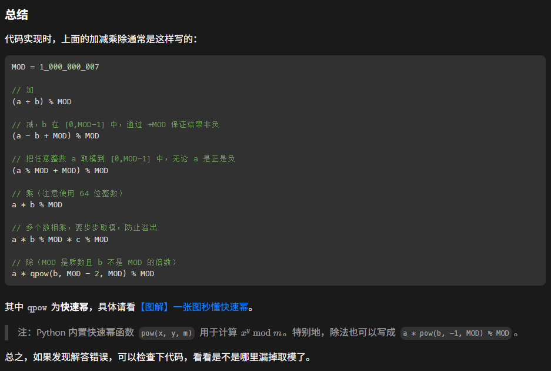

## 最大公约数、最小公倍数

这两个基础的计算要会。最大公约数是gcd，最小公倍数是lcm。

另外，$lcm(a, b) = (a * b) / gcd(a, b)$。

至于如何去求gcd，我们采用欧几里得辗转相除法：

$gcd(a,b) = gcd(b,a \% b)$

## 关于LeetCode的一些执行机制

主要是针对一些需要进行预处理的题目。对于预处理的代码块，建议放到函数的外面，这样的话力扣只会执行一次预处理代码。如果放到函数体内，就会每次调用函数都执行一次预处理代码，容易导致时间超限。

# 0. C++要点

## 0.1 指针

①指针声明时，如果不规定初值，那么一定要赋NULL值防止出错。

## 0.2 字符串

①字符串的比较，可以直接用==，但是字符串的赋值不能直接用=，需要用`strcpy()`函数。

②字符串转整数，可以使用`stoi()`函数。转浮点数用`stof()`函数。转双精度用`stod()`函数。

③数字转字符串，可以使用`to_string()`函数。

### 字符串的访问方式

`string`类是C++语言引入的新的类，用于处理字符串。下面是如何使用下标运算符来访问 `std::string` 类中的字符：

```cpp
std::string str = "Hello, World!";
char front_char = str[0];  // 获取字符串的第一个字符，结果是 'H'
char back_char = str.back();  // 获取字符串的最后一个字符，结果是 '!'
char middle_char = str[5];  // 获取字符串中索引为5的字符，结果是 ' '
```

使用 operator[] 访问字符串中的字符时，**C++ 标准不要求进行边界检查**。这意味着如果访问的索引超出了字符串的当前长度，将不会抛出异常，但行为是未定义的（undefined behavior）。因此，访问之前应确保索引是有效的。

此外，下标运算符operator[] 也可以用来修改字符串中的字符，但请确保你访问的是有效的索引。

```cpp
str[0] = 'h';  // 将字符串的第一个字符从 'H' 修改为小写的 'h'
```

### 将`vector<char>`转换为`string`

```cpp
std::vector<char> vec = {'H', 'e', 'l', 'l', 'o'};
std::string str(vec.begin(), vec.end());
```

## 0.3 时间复杂度

参考 https://blog.csdn.net/qq_41306849/article/details/117664292

一般而言，ACM或者力扣时间限制为1秒或者2秒。在这种情况下，C++代码中的操作次数控制在 1e7 为最佳。

**一旦n到达1e4，就不适合n2的暴力解法，达到1e6就要开始考虑n的解法，达到1e7就要往更小的去考虑。基本上1e7往上没有暴力法可行。**

## 0.4 常用的容器与库函数

注意，库函数作用在容器上时，往往需要使用迭代器。

`__gcd(a, b)`函数：求a和b的最大公约数。

`swap(a, b)`函数：交换两个变量的值。

`reverse(it, it2)`函数：反转容器中的元素。

`sort(it, it2)`函数：对容器中的元素进行排序。时间复杂度：`O(nlog(n))`。 注意，`sort`函数的默认排序是升序，如果要降序，需要自定义比较函数。关于自定义比较函数，参见下面的例子：

```cpp
bool cmp(int a, int b) {
    return a > b;
}

int main(){
    sort(vec.begin(), vec.end(), cmp);
}
```

**对于容器`vector`，我们可以使用`erase`来删除某一段容器中的数据，操作方法如下：这个操作是`O(n)的`**

```cpp
vector<int> vec = {1, 2, 3, 4, 5};
vec.erase(vec.begin() + 1, vec.begin() + 3);  // 删除vec中索引为2和3的元素
// 除此之外，erase(it)即删除迭代器为it处的元素
```

## 0.5 C++ `set`

下面是一个简单的`set`示例。注意：**C++除了`vector`、`string`、`deque`外，其余的容器大多都不可以使用`[]`来进行访问，只能通过迭代器进行访问。只需要记住前面提到的三种容器支持随机访问即可。**

**此外，映射`map`可以通过键值进行随机访问。**

```cpp
#include <iostream>
#include <set>

int main() {
    std::set<int> mySet;

    // 向set中插入元素
    mySet.insert(10);
    mySet.insert(20);
    mySet.insert(5);
    mySet.insert(10); // 重复的元素，不会插入

    // 打印set中的元素
    for (int num : mySet) {
        std::cout << num << " ";
    }
    std::cout << std::endl;

    // 查找元素
    auto it = mySet.find(15);
    if (it != mySet.end()) {
        std::cout << "找到了元素: " << *it << std::endl;
    } else {
        std::cout << "没有找到元素" << std::endl;
    }

    // 移除元素
    mySet.erase(10);
    std::cout << "移除元素后的set: ";
    for (int num : mySet) {
        std::cout << num << " ";
    }
    std::cout << std::endl;

    return 0;
}
```

## 0.6 动态内存分配

请看下面的例子：

```cpp
int n = 5;
int **dp = new int*[n];
for(int i = 0; i < n; ++i) {
    dp[i] = new int[n]();
}

for(int i = 0; i < n; ++i) {
    delete[] dp[i]; // 释放每一行的内存
}
delete[] dp; // 释放指针数组的内存
```

## 0.7 Vector的几个常见方法用法

### 构造方法

```cpp
vector<int> pre(n, 1);
```

这行代码是声明了一个 `pre` vector容器，并且初始化所有容器内元素为1。

### resize()

该方法用于调整vector大小，如果新大小大于当前大小，新增加的元素将被初始化为默认值。如果新大小小于当前大小，vector将被截断，超出新大小的元素将被丢弃。

resize()和构造方法一样，也可以有两个参数，第一个参数代表新vector大小，第二个参数就代表默认值，例如：

```cpp
vector<int> v = {1, 2, 3, 4, 5};
v.resize(7, 0);
```

在这个例子中，vector v的大小被改变为7，新增加的元素被初始化为0。

# 0. JavaScript 要点

## 0.1 `let` `var` 与 `const`

详见：https://www.runoob.com/js/js-let-const.html

在JavaScript中，`let`、`var` 和 `const` 是用来声明变量的关键字。它们在作用域和提升（hoisting）方面有一些不同。以下是它们的主要区别：

### 1. 作用域（Scope）

- **`var`**：拥有函数作用域或全局作用域。如果在一个函数内部声明，那么它只能在该函数内部访问。如果在函数外部声明，那么它是一个全局变量，可以在任何地方访问。
- **`let`** 和 **`const`**：拥有块级作用域。这意味着它们只能在声明它们的代码块（例如，一个`if`语句或`for`循环）内部访问。

### 2. 变量提升（Hoisting）

- **`var`**：会被提升到其所在作用域的顶部，但只有声明被提升，赋值不会提升。
- **`let`** 和 **`const`**：不会像`var`那样被提升，它们会经历一个称为“暂存死区”（Temporal Dead Zone, TDZ）的阶段。在变量声明之前访问它们会抛出一个`ReferenceError`。

### 3. 可变性（Mutability）

- **`var`** 和 **`let`**：允许重新赋值。
- **`const`**：不允许重新赋值。一旦声明并赋值，其值就不能被改变。需要注意的是，如果`const`声明的是一个对象或数组，那么对象或数组的属性可以被修改，但变量指向的对象本身不能被重新赋值。

### 4. 初始值

- **`var`**：可以不立即初始化，稍后赋值。
- **`let`** 和 **`const`**：必须在声明时立即初始化。

### 示例

```javascript
function example() {
  console.log(foo) // 输出: undefined
  var foo = 1
  console.log(foo) // 输出: 1
}

function example2() {
  console.log(bar) // 抛出 ReferenceError: bar is not defined
  let bar = 2
  console.log(bar) // 输出: 2
}

function example3() {
  const baz = 3
  console.log(baz) // 输出: 3
  baz = 4 // 抛出 TypeError: Assignment to constant variable.
}

function example4() {
  const obj = { value: 1 }
  console.log(obj.value) // 输出: 1

  obj.value = 2 // 允许修改对象属性，这里要特别注意！！！
  console.log(obj.value) // 输出: 2

  const obj = { value: 2 } // 抛出 TypeError: Assignment to constant variable.
}
```

### 总结

- 使用`var`时，需要注意变量提升和作用域问题。
- 使用`let`可以避免变量提升和作用域问题，适用于需要重新赋值的变量。
- 使用`const`可以保证变量的值不变，适用于不需要重新赋值的变量，有助于减少错误和提高代码的可读性。

**在现代JavaScript开发中，推荐尽可能使用`let`和`const`，因为它们提供了更严格的作用域控制和更清晰的代码结构。**

## 0.2 类

在JavaScript中，使用`function`关键字来定义一个类是一种语法糖，它允许我们以一种更传统的方式来定义对象的结构和行为。这种语法实际上是基于JavaScript的原型链机制的。下面是使用`function`关键字定义类的两种主要方式：

1. **构造函数**：在JavaScript中，`function`关键字可以用来定义一个构造函数，这个构造函数可以用来创建具有相同属性和方法的对象实例。当你使用`new`关键字来调用这个函数时，它就相当于一个类。

   ```javascript
   function Person(name, age) {
     this.name = name
     this.age = age
   }

   Person.prototype.greet = function () {
     console.log(
       `Hello, my name is ${this.name} and I am ${this.age} years old.`,
     )
   }

   const person1 = new Person('Alice', 30)
   person1.greet() // 输出: Hello, my name is Alice and I am 30 years old.
   ```

2. **ES6类定义**：在ES6（ECMAScript 2015）中，`class`关键字被引入，提供了一种更清晰的方式来定义类。然而，`class`实际上是一种语法糖，它背后的实现仍然是基于`function`的。

   ```javascript
   class Person {
     constructor(name, age) {
       this.name = name
       this.age = age
     }

     greet() {
       console.log(
         `Hello, my name is ${this.name} and I am ${this.age} years old.`,
       )
     }
   }

   const person2 = new Person('Bob', 25)
   person2.greet() // 输出: Hello, my name is Bob and I am 25 years old.
   ```

在ES6类定义中，`constructor`方法是一个特殊的方法，用于创建和初始化类的对象。它的作用类似于使用`function`关键字定义的构造函数。

使用`function`来修饰类的原因包括：

- **原型链**：JavaScript是基于原型的，每个对象都有一个原型对象，对象的属性和方法实际上是通过原型链来继承的。
- **语法糖**：`class`关键字提供了一种更简洁和易于理解的方式来定义类，但它实际上是对原型链和构造函数语法的封装。
- **兼容性**：在ES6之前，JavaScript没有内置的`class`语法，因此使用`function`来定义类是一种常见的做法，这也保证了代码的向后兼容性。

总的来说，`function`关键字在JavaScript中扮演了多重角色，包括定义函数、构造函数和类。这使得JavaScript在面向对象编程方面具有很高的灵活性。

### 0.2.1 Array, New Array(), []的区别和使用

https://www.jianshu.com/p/75a45851b655

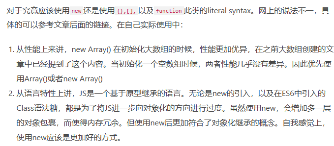

## 0.3 JavaScript `map` 方法

**注意！这里描述的是map方法而不是Map这种类。这里的map是和forEach相对应。**

在`forEach`中，我们相当于取了数组中的每一个值，对它们进行操作，请看下面的例子：

```javascript
let arr = [1, 2, 3, 4, 5]
arr.forEach((value, index) => {
  arr[index] = value * 2
})
console.log(arr) // [2, 4, 6, 8, 10]
```

这段代码相当于把`arr`的每一个值都乘以2，最终仍旧回到`arr`的内存中。

而在`map`方法中，我们是直接返回一个新的数组，而不是在老数组上进行操作。最终老数组不变。请看下面的例子：

```javascript
let arr = [1, 2, 3, 4, 5]
let newArr = arr.map((value) => {
  return value * 2
})
console.log(newArr) // [2, 4, 6, 8, 10]
console.log(arr) // [1, 2, 3, 4, 5]
```

## 0.4 JavaScript 字符串

`length()` 获取字符串长度，`toUpperCase()` 把一个字符串全部变为大写，`toLowerCase()` 变为小写。

`indexOf()` 搜索指定字符串出现的位置，找到返回下标开始值，没找到返回-1。

`substring()` 返回指定索引区间的字串。但我也比较喜欢用`slice()`这个函数，参见下面的例子：

```javascript
s = 'woshiniba'
let sub = s.slice(1, 3) // 'os'
```

它表示从0起始到（2-1）位置处结束。因此`slice(i,j)`代表从i开始j-1处结束。**注意，`s.slice()`方法并不会改变原来的`s`字符串中的数据！** 此外，如果你想要从i开始一直到最后，那么只需要`slice(i)`即可。

**另外请特别注意，你不能使用迭代器（即`s[i]`）直接修改字符串的某一位，修改办法要么是字符串拼接，要么是把它先变成一个数组，在数组上修改，再把它重新变回字符串，要么就调用字符串的方法`replace()`（这个方法我感觉不好用，暂时先不讲）**。

`includes()` 方法用于判断一个字符串是否包含另一个字符串。如果包含，返回true；如果不包含，返回false。它是区分大小写的。

### 0.4.1 关于字符串中的`indexOf()`方法

`indexOf()`方法用于查找一个字符串在另一个字符串中第一次出现的位置。如果找到了，返回该位置的索引；如果没有找到，返回-1。它是区分大小写的。

然而在学习KMP算法的过程中，我开始想这样一个问题，那就是这个方法的时间复杂度到底是多少，它和KMP比哪个更快呢？包括除了`indexOf()`方法之外，JavaScript中还有例如`sort()`等等的方法，它的时间复杂度又是多少呢？

经过查阅资料后发现，这些算法在JS中实现的时间复杂度受到引擎的限制，比如说在chrome和node.js中广泛采用的V8引擎，它的内部采用C++实现，并使用了相应的CPU指令集和缓存进行了深度优化，和理论上的时间复杂度是不能够相提并论的。实际上，在99.9%的时候经过优化的`indexOf()`方法都会比我们自己去实现KMP来的快。因此，除非题目明确要求使用KMP算法，否则我们可以直接使用`indexOf()`方法来解决字符串查找问题。

详情可以参考下面两个链接：

https://www.infoq.cn/article/4UVdTsOA0qkxyCydCycB

https://segmentfault.com/q/1010000022022918

### 0.4.2 字符串的`padStart()` `padEnd()`方法

`padStart()` 方法用另一个字符串填充当前字符串，直到达到指定的长度。从当前字符串的左侧开始填充。

`padEnd()` 方法用另一个字符串填充当前字符串，直到达到指定的长度。从当前字符串的右侧开始填充。

这两个方法都接受两个参数：

1. 目标长度。
2. 可选的填充字符串。如果省略此参数，则使用空格填充。

下面是一个简单的例子：

```javascript
let str = '123'
let paddedStr = str.padStart(5, '0')
console.log(paddedStr) // '00123'
```

## 0.5 JavaScript 数组

### 0.5.1 JavaScript 多维数组

直接看例子：

```javascript
// 生成dp[i][i]，并用false填充。
let dp = new Array(n)
for (let i = 0; i < n; i++) {
  dp[i] = new Array(n).fill(false) // fill就是填充
}
```

### 0.5.2 数组嵌套空数组对象

尤其注意，如果你要生成一个数组，里面的元素是空数组对象，那么你需要这样写：

```javascript
// let dp = new Array(n).fill([]);    // 这样写是不行的
let hashList = new Array(n)
for (let i = 0; i < n; i++) {
  hashList[i] = new Array() // 这样写ok
}
```

### 0.5.3 Array.from()作为序列生成器

在学习并查集的过程中，遇到一种很牛的写法：

```javascript
const parent = Array.from({ length: n }, (_, index) => index)
```

查阅官方文档后发现，`Array.from()` 方法从类似数组或可迭代对象创建一个新的，浅拷贝的数组实例。它接受两个参数：

1. 一个类似数组或可迭代对象。
2. 一个可选的映射函数，用于对每个元素进行处理。

在这个例子中，`Array.from()` 方法被用来创建一个长度为 `n` 的新数组。第一个参数 `{ length: n }` 创建了一个具有指定长度的类数组对象。第二个参数 `(_, index) => index` 是一个映射函数，它接受两个参数：当前元素的值（在这里未使用，因此用 `_` 占位）和当前元素的索引。这个函数返回当前索引值，从而初始化数组，使得每个元素的值等于其索引。

下面举一个使用了当前元素值的例子，带有真实数组时，映射函数的第一个参数是元素值，加深理解：

```javascript
Array.from([10, 20, 30], (v, i) => v + i)
// 解释：i=0 => 10+0=10, i=1 => 20+1=21, i=2 => 30+2=32
// 结果: [10, 21, 32]
```

而在我们之前的并查集中的实现方法中，源是 { length: N }，没有实际元素，所以“当前元素值”为 undefined，索引 i 仍然从 0 开始。

### 0.5.4 清空一个数组

对于清空一个数组，最好的方法是直接将数组长度置0，这样最省时，只需要$O(1)$的时间复杂度，也不会发生多余的内存泄漏。

### 0.5.5 连接两个数组

`concat()` 方法用于合并两个或多个数组。

```javascript
let arr1 = [1, 2, 3]
let arr2 = [4, 5, 6]
let arr3 = arr1.concat(arr2)
console.log(arr3) // [1, 2, 3, 4, 5, 6]
```

请注意，`concat()`方法不会改变原数组，而是返回一个新的数组。

## 0.6 除法

注意：**JS使用"/"时不会默认向下取整。需要使用Math.floor()方法对括号内的值进行向下取整。**

## 0.7 JavaScript `Set`

JS的Set和C++的很像。它不含重复元素，所有的元素都是唯一的。**另外，这个`Set`它搜索、删除和插入元素方法的时间复杂度都是$O(1)$，这是因为它的底层是通过哈希表实现的。** 参看这个https://blog.csdn.net/yiyueqinghui/article/details/107773347

**此外，遍历`Set`时，得使用`for...of`方法，它不能通过索引访问，它不是Array。**

```javascript
let set = new Set()
set.add(1)
set.add(2)
set.add(3)

for (let item of set) {
  console.log(item)
}
```

此外，JS中循环还有一个`for...in`方法，你还记得它是用来遍历对象属性的吗？https://zh.javascript.info/object#forin

### 0.7.1 使用`Set`去重

使用`Set`去重非常简单，只需要把数组传入`Set`构造函数中，然后再将其转换为数组即可。**它的时间复杂度是$O(1)$的，非常高效，所以算法题里面经常使用，需要牢记。** 下面是一个示例：

```javascript
let arr = [1, 2, 3, 1, 2, 4]
let uniqueArr = [...new Set(arr)]
console.log(uniqueArr) // [1, 2, 3, 4]
```

### 0.7.2 `Set`的常用方法

```javascript
// 创建一个新的 Set 对象
let mySet = new Set([1, 2, 3, 4, 5])

// 添加元素
mySet.add(6) // 添加单个元素
mySet.add(7)
mySet.add(8) // 添加单个元素
mySet.add(1) // 添加重复元素，不会生效

// 删除元素
mySet.delete(2) // 删除元素2
mySet.delete(9) // 删除不存在的元素，不会报错

// 检查元素是否存在
console.log(mySet.has(3)) // true
console.log(mySet.has(10)) // false

// 获取 Set 的大小
console.log(mySet.size) // 6

// 遍历 Set
mySet.forEach((value) => {
  console.log(value) // 输出每个元素
})

// 清空 Set
mySet.clear() // 清空所有元素
console.log(mySet.size) // 0
```

`has`方法可以在O(1)的时间内查找一个元素是否在`Set`中。`add`方法可以在O(1)的时间内添加一个元素到`Set`中。`delete`方法可以在O(1)的时间内删除一个元素。

### 0.7.3 取`Set`的第一个元素

对于`Set`，元素出现的顺序和我们插入的顺序是一致的。在很多题目中，我们需要取`Set`的第一个元素。可以使用`values()`方法获取一个迭代器，然后使用`next()`方法获取第一个元素。示例代码如下：

```javascript
let mySet = new Set([1, 2, 3, 4, 5])
let firstElement = mySet.values().next().value
console.log(firstElement) // 输出: 1
```

**需要注意的是，没有直接的办法可以在$O(1)$的时间内获取`Set`的最后一个元素。**

## 0.8 数字字符串转数字

使用`parseInt()`方法。或者`Number(str)`方法。

## 0.9 JS `Map`

`Map`是ES6引入的一种新的数据结构，它允许我们使用对象作为键，并且保持键值对的插入顺序。这一类数据结构很重要，原因是它可以解决我们哈希表类型的题目，它的效率很高。**注意：JS中是不存在专门的哈希表的数据结构的。**

### 0.9.1 JS 遍历 `Map`

```javascript
// 使用Map的forEach方法遍历Map对象
map.forEach((value, key) => {
  console.log(`Key: ${key}, Value: ${value}`)
})
```

forEach 方法是为 Map 对象设计的，它提供了一种更清晰和直接的方式来遍历键值对。如果你需要对 Map 进行复杂的遍历操作，使用 forEach 方法会是更好的选择。

此外，为了统一，我们也可以使用`for...of`方法遍历`Map`，见下：

```javascript
for (const [key, value] of myMap) {
  console.log(`${key} => ${value}`)
}
```

### 0.9.2 JS `Map`的常用方法

常用的方法有：

- `set(key, value)`：添加或更新一个键值对
- `get(key)`：根据键获取对应的值，如果不存在返回 `undefined`
- `has(key)`：判断是否存在某个键
- `delete(key)`：删除指定键对应的值
- `clear()`：清空所有的键值对
- `size` 属性：返回当前 Map 中元素的数量

示例代码如下：

```javascript
const map = new Map()

// 添加键值对
map.set('name', 'Alice')
map.set(1, [10, 20, 30])
map.set({ id: 1 }, 'objectKey')

// 获取值
console.log(map.get('name')) // 输出: Alice

// 判断是否存在
console.log(map.has(1)) // 输出: true

// 遍历 Map
for (const [key, value] of map) {
  console.log(key, value)
}

// 删除键值对
map.delete('name')

// 获取 Map 的大小
console.log(map.size) // 输出当前 Map 中剩余的元素数量
```

Map 对象非常适合用于需要键的多种类型以及保持插入顺序的场景。**此外，由于Map内部根据哈希表实现，因此查找、添加、删除的平均性能都接近$O(1)$。**

### 0.9.3 取`Map`的第一个元素

和`Set`一样，`Map`也可以获取一个迭代器，然后使用`next()`方法获取第一个元素。需要注意的是，对于`Map`，我们可以使用`entries()`方法获取一个包含所有键值对的迭代器，使用`keys()`方法获取所有键的迭代器，使用`values()`方法获取所有值的迭代器。示例代码如下：

```javascript
let myMap = new Map([
  ['a', 1],
  ['b', 2],
  ['c', 3],
])
let firstEntry = myMap.entries().next().value
console.log(firstEntry) // 输出: ['a', 1]
let firstKey = myMap.keys().next().value
console.log(firstKey) // 输出: 'a'
let firstValue = myMap.values().next().value
console.log(firstValue) // 输出: 1
```

**特别注意，JS中，无论是`Set`还是`Map`，它们的插入、删除、查找的平均性能都接近$O(1)$，但也仅是平均性能，因为里面还涉及了一系列非常复杂的操作，在极端情况下，可能性能会退化为$O(n)$。**

## 0.10 JS中的性能优化

JS中的性能优化有很多种办法。在刷算法题的过程中，我们可以使用一些技巧来提高代码的性能，例如：

- **尽量不要使用`undefined`：** 在JavaScript中，`undefined`是一个特殊的值，它表示一个变量未被赋值。使用`undefined`会导致代码的可读性和性能下降。应当尽量避免使用它，如果需要判断一个变量是否被赋值，可以使用`null`或其他合适的值来代替。

## 0.11 JS求一个数组的最大值或最小值

```javascript
let max = Math.max(...nums)
let min = Math.min(...nums)
```

**一定要加展开运算符！**（可以这样理解：如果不加展开运算符，那么传入`max()`函数的就是一个对象，单个对象是没办法求最值的，通过展开运算符展开之后，数组就被拆成了一个个独立的数字参数，就能够正确求最值了。）上面这种方法适用于一整个数组，如果我要求一个数组的一部分的最大值或最小值，可以使用下面的方法：

```javascript
let max = Math.max(...nums.slice(0, 3))
let min = Math.min(...nums.slice(0, 3))
```

**另外需要特别注意的是，如果数组里面有`undefined`，那么`Math.max()`和`Math.min()`都会返回`NaN`。因此在使用这两个函数之前，一定要确保数组里面没有`undefined`**。

## 0.12 JS `Sort`排序数组

**这一部分至关重要。**

### 数字排序

```javascript
let arr = [1, 3, 2, 5, 4]
arr.sort((a, b) => a - b)
console.log(arr) // [1, 2, 3, 4, 5]
```

### 字符串排序

```javascript
var arr = ['A', 'cds', 'esadf', 'As', 'Ds']
arr.sort((a, b) => {
  if (a.toLocaleLowerCase() < b.toLocaleLowerCase()) return -11
  else return 1
})
console.log(arr) // ['A', 'As', 'cds', 'Ds', 'esadf']
```

上面这种是全都转化为小写来比较大小。**如果不转化，那么默认大写字母在小写字母之前。**

另外，关于字符串比较，通常我们遵循如下准则，请牢记，当我们不给调用的`sort()`方法添加任何的回调函数时，直接调用`sort()`排序就会遵循下面的准则：

字符串比较通常从左到右逐个字符进行比较。如果两个字符串长度相等且每个相应位置的字符都相同，则认为两个字符串相等。**如果两个字符串长度不等，则以第一个不相同的字符作为基准，不考虑其后字符的比较结果。** 例如，"abc"等于"abc"，"abh"大于"abfc000"，"abc"小于"abc000"。

**另外需要特别注意的是，两个字符串不能够直接相减，会返回NaN，如果在排序里面要按照某些字符串的顺序来排的话，应该写成下面的样子**：

```javascript
arr.sort((a, b) => {
    if (a =< b) return -1;
    else if (a > b) return 1;
});
```

## 0.13 JS 字符串输出处理

我们可以使用`join()`方法来把一个字符串数组连接成一个字符串，并且每个字符子串之间用空格进行分割。

```javascript
let arr = ['a', 'b', 'c']
let str = arr.join(' ')
console.log(str) // 'a b c'
```

而要把一个字符串按照某东西来进行分割，可以使用`split()`方法，下面的0.14就是讲解。

## 0.14 Nodejs ACM 模式 输入输出模板

```javascript
const rl = require('readline').createInterface({ input: process.stdin })
var iter = rl[Symbol.asyncIterator]()
const readline = async () => (await iter.next()).value

void (async function () {
  // Write your code here
  while ((line = await readline())) {
    let tokens = line.split(' ')
    let a = parseInt(tokens[0])
    let b = parseInt(tokens[1])
    console.log(a + b)
  }
  rl.close() // 关闭输入输出流
  process.exit() // 退出程序
})()
```

## 0.15 JS 求某一个字符的ASCII码

```javascript
let a = 'abc'
let b = a.charCodeAt(0)
console.log(b) // 97
```

看上面的例子，对某一个字符串`a`求某个字符的ASCII码，只需要使用`a.charCodeAt(p)`即可，其中p为字符的下标。

## 0.16 JS 将某个字符的ASCII码转为对应的字符

```javascript
let a = 97
let b = String.fromCharCode(a)
console.log(b) // 'a'
```

看上面的例子，对某一个ASCII码求对应的字符，只需要使用`String.fromCharCode(a)`即可。

## 0.17 JS 中的乘方运算符

**这个需要特别注意！** JS中的乘方运算符是`**`，而`^`是异或运算符。

## 0.18 JS 中向数组中插入、删除元素

`splice`方法用于向数组中添加或删除元素，并返回被删除的元素。它会直接修改原数组。通常情况下，该方法的时间复杂度是$O(n)$（最优情况下也有可能下降至$O(1)$），所以一般不推荐大量使用该方法。以下是`splice`方法的语法和一些示例：

```javascript
array.splice(start, deleteCount, item1, item2, ...);
```

- `start`：必需，指定添加或删除的起始位置。
- `deleteCount`：可选，指定要删除的元素个数。如果设置为0，则不删除元素。
- `item1, item2, ...`：可选，要添加到数组的新元素。

### 插入元素

```javascript
let arr = [1, 2, 3, 4, 5]
arr.splice(2, 0, 6) // 在索引2处插入6
console.log(arr) // [1, 2, 6, 3, 4, 5]
```

### 删除元素

```javascript
let arr = [1, 2, 3, 4, 5]
arr.splice(2, 1) // 删除索引2处的元素
console.log(arr) // [1, 2, 4, 5]
```

**同样地，替换元素在结合了插入和删除元素之后可以直接搞定。**

需要特别注意的是，`splice()`方法的返回值不是删完之后的那个数组，而是**一个包含了被删除元素的数组**。如果没有删除任何元素，那么返回的是一个空数组。

## 0.19 JS 在数组中选出最大值

```javascript
let arr = [1, 2, 3, 4, 5]
let max = Math.max(...arr)
console.log(max) // 5
```

道理其实很简单，**但注意一定要在`Math.max()`的括号中加上...。**

## 0.20 循环：for...of

使用`for...of`循环可以遍历数组、字符串、Map、Set等可迭代对象。它会返回每个元素的值，而不是索引，它不能获取当前元素的索引，只是获取元素值，但大多数情况是够用的。而且这样写更短。下面为一些示例：

```javascript
let arr = [1, 2, 3, 4, 5]
for (let value of arr) {
  console.log(value) // 1 2 3 4 5
}
```

```javascript
let str = 'Hello'
for (let char of str) {
  console.log(char) // H e l l o
}
```

```javascript
let map = new Map([
  ['a', 1],
  ['b', 2],
])
for (let [key, value] of map) {
  console.log(key, value) // a 1 b 2
}
```

**注意，对于`Map`对象，ES6还提供了更为简洁的`forEach`遍历方法，不要忘了这个方法。**

```javascript
let set = new Set([1, 2, 3])
for (let value of set) {
  console.log(value) // 1 2 3
}
```

## 0.21 JS中处理大数运算：BigInt

在 JavaScript 中，普通的数字（Number 类型）是基于 IEEE 754 双精度浮点数格式存储的，这导致它们只能安全地表示 -9007199254740991（即 -(2^53 - 1) 约9\*10^15）到 9007199254740991（即 2^53 - 1）之间的整数。而 BigInt 就解决了这个问题。

创建BigInt对象的方法有两种：

1. 使用`BigInt()`函数：可以将一个数字或字符串转换为BigInt类型。
2. 使用`n`后缀：在数字后面加上`n`，表示这个数字是一个BigInt类型。

```javascript
let bigInt1 = BigInt(12345678901234567890) // 使用BigInt函数
let bigInt2 = 12345678901234567890n // 使用n后缀

console.log(bigInt1) // 输出: 12345678901234567890n
console.log(bigInt2) // 输出: 12345678901234567890n
```

而将BigInt转换为普通数字时，可以使用`Number()`函数。需要注意的是，如果BigInt的值超出了Number的范围，转换可能会导致精度丢失。

```javascript
let bigInt = 12345678901234567890n
let num = Number(bigInt) // 转换为普通数字
console.log(num) // 输出: 12345678901234567000（可能会丢失精度）
```

## 0.22 JS 空值合并运算符

空值合并运算符（`??`）是 JavaScript 中的一种逻辑运算符，用于处理可能为 `null` 或 `undefined` 的值。它的作用是返回其左侧操作数，如果左侧操作数为 `null` 或 `undefined`，则返回右侧操作数，否则返回左侧操作数。

```javascript
let a = null
let b = 5
let c = a ?? b // 如果 a 是 null 或 undefined，则 c 的值为 b
console.log(c) // 输出: 5
```

## 0.23 JS LeetCode 进阶技巧——`datastructures-js/priority-queue`库

在LeetCode中，有很多题目需要用到优先队列（Priority Queue）或者堆这种数据结构。JavaScript本身并没有内置优先队列的数据结构，但我们可以使用第三方库`datastructures-js/priority-queue`来实现。这个库已经被附在LeetCode的代码编辑器中，可以直接使用。

该库提供了 3 种主要的优先级队列类型，它们的区别主要在于底层实现和性能特性上：

1. `MinPriorityQueue` - 最小优先级队列（优先级数字越小，优先级越高）

2. `MaxPriorityQueue` - 最大优先级队列（优先级数字越大，优先级越高）

3. `PriorityQueue` (基于最小堆实现)

（注：库中同时提供了基于不同内部实现的具体实现变体，上述为主要 API）

最常用的是前两种，因为它们提供了最直观的 API。我们将重点介绍 `MinPriorityQueue`。优先级值最小的元素位于队列前端。

```javascript
// 导入（LeetCode里可以略去）
const { MinPriorityQueue } = require('@datastructures-js/priority-queue')
// 或者 ES6 语法
import { MinPriorityQueue } from '@datastructures-js/priority-queue'

// 创建一个最小优先级队列实例
const minQueue = new MinPriorityQueue()

// 入队元素。你可以提供一个可选的自定义优先级
// 方式一：只提供元素（优先级默认为元素本身，如果元素是数字）
minQueue.enqueue(5)
minQueue.enqueue(3)
minQueue.enqueue(8)
// 现在队列：[3, 5, 8]，3 是队首

// 方式二：提供元素和优先级（推荐，更清晰）
minQueue.enqueue('task_medium', 2)
minQueue.enqueue('task_low', 5)
minQueue.enqueue('task_high', 1)
// 现在队列： [‘task_high’ (prio:1), ‘task_medium’ (prio:2), ‘task_low’ (prio:5)]

// 查看队首元素（优先级最高的，即最小的）但不移除
const frontElement = minQueue.front() // ‘task_high’
console.log(frontElement) // 输出: ‘task_high’

// 出队（移除并返回队首元素）
const highestPriority = minQueue.dequeue() // ‘task_high’
console.log(highestPriority) // 输出: ‘task_high’
// 现在队列： [‘task_medium’ (prio:2), ‘task_low’ (prio:5)]

// 获取队列大小
const size = minQueue.size() // 2
console.log(size)

// 检查队列是否为空
const isEmpty = minQueue.isEmpty() // false
console.log(isEmpty)

// 清空队列
minQueue.clear()
console.log(minQueue.size()) // 0
console.log(minQueue.isEmpty()) // true
```

还有个常见的用法，对于优先级，在构造时，我们也可以显式指定一个回调函数，例如：`new MinPriorityQueue(e => e[0])`。当你像这样在构造函数中传入一个回调函数时，这个函数被称为 "优先级获取器" (Priority Callback)。这个回调函数的作用是：告诉队列如何从你传入的复杂元素对象中提取出优先级数值。

在没有优先级获取器的情况下，你需要在 `enqueue` 时显式指定优先级：

```javascript
const pq = new MinPriorityQueue()
pq.enqueue(['task1', 'some data'], 5) // 必须传入优先级 5
pq.enqueue(['task2', 'more data'], 3)
```

有了优先级获取器后，队列会自动从元素中提取优先级：

```javascript
const pq = new MinPriorityQueue((e) => e[0]) // 告诉队列：优先级是元素的第一个值
pq.enqueue([5, 'task1', 'some data']) // 自动提取 5 作为优先级
pq.enqueue([3, 'task2', 'more data']) // 自动提取 3 作为优先级
```

关于堆中一些基本操作的时间复杂度如下：

- 入队（enqueue）：$O(\log n)$
- 出队（dequeue）：$O(\log n)$
- 查看队首元素（front）：$O(1)$
- 获取队列大小（size）：$O(1)$
- 建立堆（heapify）：$O(n)$

此外，我们还可以去自定义一个优先级，比如下面的例子：

```javascript
// Car queue prioritizing newest, then cheapest
const carsQueue = new PriorityQueue((a, b) => {
  if (a.year > b.year) return -1
  if (a.year < b.year) return 1
  return a.price < b.price ? -1 : 1
})
```

这个思想和`sort()`方法的回调函数是类似的，需要注意的是当我们自定义优先级比较方法时，就不要具体初始化大根堆还是小根堆了，**直接使用`PriorityQueue`类即可**。

## 0.24 数组拷贝

在刷题过程中，我们一般会对数组进行拷贝，下面列出常用的两种方法：

- Array.from() 方法
- [...oldArr]

请注意，除了上面两种方式外，不再建议使用其他方式，因为容易出问题。

## 0.25 数字转数字字符串

使用`toString()`方法。或者`String(n)`。

如果需要转成K进制的，需要在`toString()`方法中传入K作为参数，例如：`n.toString(2)`表示将n转成2进制字符串。

## 0.26 与位运算相关的运算符优先级

我们需要特别注意的是，比较运算的运算优先级高于按位运算！！！下面的几幅图中，数字越大的代表运算优先级越高，也就是越先参与运算。

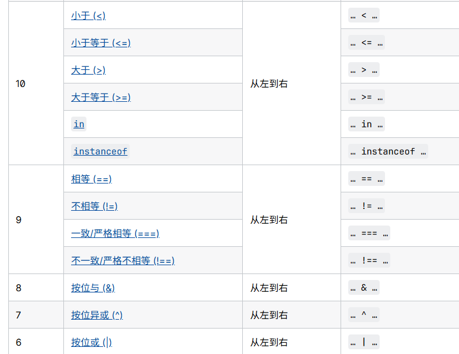

但是，按位左移和按位右移的运算优先级高于比较运算！！！


此外还需要特别注意的是，普通的加减乘除，哪怕是加减，它的优先级都要高于按位左移或者右移！！！

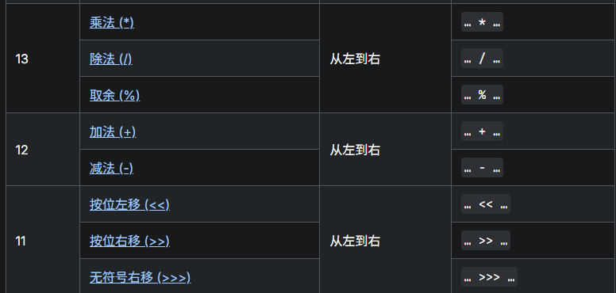

以上图来自于MDN。总结一下：乘除>加减>按位左移右移>比较运算>与或异或。一句话建议就是凡是位运算最好都加上括号。

## 0.27 数组空槽

我们先来看这么样一个示例：

```javascript
const arr = []
arr[5] = 0
console.log(arr) // [ <5 empty items>, 0 ]
```

很奇怪，我明明没有给出长度，但是JS竟然还能根据索引赋值（这就是弱类型语言的神奇之处）！在上面的代码中，我们创建了一个空数组`arr`，然后给它的第5个索引赋值为0。打印出来的结果显示，数组的前5个位置是空的，这些位置被称为“空槽”（holes）。

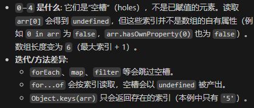

## 0.28 数组中push、pop、shift、unshift的时间复杂度

我们需要注意，虽然JS为我们提供了API，方便进行数组的操作，但是我们对头里进行操作时，时间复杂度都是O(n)的，如下面所示：

- push()：$O(1)$
- pop()：$O(1)$
- shift()：$O(n)$
- unshift()：$O(n)$

此外，我还调用了其他的代码，特意做了实验，结果如下：

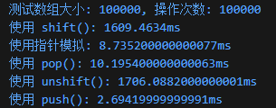

可以看出来，当数据很大时，使用`shift()`和`unshift()`方法的时间复杂度是非常高的，因此在实际刷题中，我们需要注意时间复杂度，避免超时。

整理这条笔记的时间是20260317，我目前还没有在使用数组代替队列（指针实现）的一些场景中，遇到超时的问题，可能是题目做的还不够太难，到时候刷一些新题时，没准会遇到，到时候再回来更新笔记。

# 0. Java 要点

为什么要用Java刷题呢，一是因为很多后端岗位普遍要求Java，二是因为CCF的一个首届CACC比赛必须使用C/C++/Python/Java四种语言中的一种。因此，我也会在这里记录一些Java的要点。

## 0.1 Java `Scanner`类

`Scanner`类是Java的一个类，用于获取用户的输入。下面是一个简单的例子：

```java
import java.util.Scanner;

public class Main {
    public static void main(String[] args) {
        Scanner scanner = new Scanner(System.in);
        int a = scanner.nextInt();
        int b = scanner.nextInt();
        System.out.println(a + b);
    }
}
```

## 0.2 Java 排序数组

Java中的数组排序可以使用`Arrays.sort()`方法。下面是一个简单的例子：

```java
import java.util.Arrays;

public class Main {
    public static void main(String[] args) {
        int[] arr = {3, 1, 2, 5, 4};
        Arrays.sort(arr);
        for (int num : arr) {
            System.out.print(num + " ");
        }
    }
}
```

## 0.3 Java 初始化数组并填充

Java中的数组初始化可以使用`new`关键字，而填充数组采用`Arrays.fill(arr, obj)`语句。下面是一个简单的例子：

```java
int[] arr = new int[5];
Arrays.fill(arr, 1);    // 将数组arr填充为1
```

## 0.4 Java 和 JS 的一些区别

由于本人在练习Java刷题之前，已经是一个比较成熟的JS选手，因此在这里记录一些Java和JS的一些区别，以便达到快速上手的目的。

### 0.4.1 Java 中逻辑判断与JS的区别

在Java中，条件判断的语句只能是`true`或`false`，而JS中，条件判断的语句可以是任何值。例如：

```java
// Java
if (1) {    // 这样子写在Java中会报错
    System.out.println("Hello, World!");
}
```

上面这段代码在Java中会报错，因为条件判断的语句只能是`true`或`false`。而在JS中，这段代码是可以正常运行的。

### 0.4.2 Java 判断两东西是否相等

在Java中，判断两个东西是否相等，使用`==`，**记住，Java中只有双等于而没有三等于！** 而在JS中，判断两个东西是否相等，常常使用`===`，这是为了判断类型也相同。例如：

```java
// Java
if (a == b) {
    System.out.println("a equals b");
}
```

### 0.4.3 Java 求字符串的长度

在Java中，求**字符串**的长度使用`length()`方法，**需要带上括号，** 而在JS中，求字符串的长度使用`length`属性。例如：

```java
// Java
String str = "Hello, World!";
int len = str.length();
System.out.println(len);    // 13
```

```javascript
// JS
let str = 'Hello, World!'
let len = str.length
console.log(len) // 13
```

对于数组而言，Java和JS的求长度方法是一样的，都是使用`length`。

## 0.5 Java 的类型提升

Java中的类型提升是指，当两个不同类型的数据进行运算时，Java会自动将较小的数据类型提升为**较大的类型**，然后再进行运算。类型提升的规则如下：

1. **byte、short、char类型**：这三种类型在进行运算时，会自动提升为`int`类型。
2. **int类型**：当`int`类型和`long`类型进行运算时，`int`类型会自动提升为`long`类型。
3. **float类型**：当`float`类型和`double`类型进行运算时，`float`类型会自动提升为`double`类型。

## 0.6 Java 动态数组

在JS中，我们定义的数组都是动态的，实现起来非常的方便。

Java中的动态数组是通过`ArrayList`类实现的。`ArrayList`类是Java中的一个类，它提供了一个动态数组的实现，可以根据需要动态调整数组的大小。下面是一个简单的例子：

```java
import java.util.ArrayList;

public class Main {
    public static void main(String[] args) {
        ArrayList<Integer> list = new ArrayList<>();
        list.add(1);
        list.add(2);
        list.add(3);
        list.remove(1);     // 删除索引为1的元素
        int size = list.size();    // 获取数组的大小 2
        int first = list.get(0);    // 获取索引为0的元素
        list.set(0, 10);    // 将索引为0的元素设置为10
        for (int num : list) {
            System.out.print(num + " ");    // 10 3
        }
    }
}
```

## 0.7 Java 中的 `Map`

Java中的`Map`是一种键值对的数据结构，它提供了一种将键映射到值的方式。`Map`接口是Java中的一个**接口**，它有多个实现类，如`HashMap`、`TreeMap`、`LinkedHashMap`等。下面是一个简单的例子：

```java
import java.util.HashMap;
import java.util.Map;

public class Main {
    public static void main(String[] args) {
        Map<String, Integer> map = new HashMap<>();
        map.put("Alice", 30);
        map.put("Bob", 25);
        map.put("Charlie", 35);
        int age = map.get("Alice");
        System.out.println(age);    // 30
        map.remove("Bob");

        // 遍历 Map 中的所有键
        System.out.println("遍历键:");
        for (String name : map.keySet()) {
            System.out.println(name);
        }

        // 遍历 Map 中的所有值
        System.out.println("遍历值:");
        for (int value : map.values()) {
            System.out.println(value);
        }

        // 遍历 Map 中的所有键值对
        System.out.println("遍历键值对:");
        for (Map.Entry<String, Integer> entry : map.entrySet()) {
            System.out.println(entry.getKey() + ": " + entry.getValue());
        }
    }
}
```

此外，`HashMap`还有

1. `putIfAbsent()`方法，它可以在键不存在时，将键值对添加到`HashMap`中。
2. `merge()`方法，它也可以将键值对插入`HashMap`中，如果原先的`key`已经存在，可以自定义合并规则。

例如：

```java
import java.util.HashMap;

class Main {
    public static void main(String[] args) {
        // 创建一个 HashMap
        HashMap<Integer, String> sites = new HashMap<>();

        // 往 HashMap 添加一些元素
        sites.put(1, "Google");
        sites.put(2, "Runoob");
        sites.put(3, "Taobao");
        System.out.println("sites HashMap: " + sites);


        // HashMap 不存在该key
        sites.putIfAbsent(4, "Weibo");

        // HashMap 中存在 Key
        sites.putIfAbsent(2, "Wiki");
        System.out.println("Updated Languages: " + sites);
    }
}
```

```java
import java.util.HashMap;

class Main {
    public static void main(String[] args) {
        // 创建一个 HashMap
        HashMap<String, String> countries = new HashMap<>();

        // 往HashMap插入映射项
        countries.put("Washington", "America");
        countries.put("Canberra", "Australia");
        countries.put("Madrid", "Spain");
        System.out.println("HashMap: " + countries);

        //合并 key为 Washington的映射
        String returnedValue = countries.merge("Washington", "USA", (oldValue, newValue) -> oldValue + "/" + newValue);
        System.out.println("Washington: " + returnedValue);

        //输出更新后的HashMap
        System.out.println("Updated HashMap: " + countries);
    }
}
```

3. `getOrDefault()`：返回 key 相映射的的 value，如果给定的 key 在映射关系中找不到，则返回指定的默认值。

例如：

```java
import java.util.HashMap;

class Main {
    public static void main(String[] args) {
        // 创建一个 HashMap
        HashMap<Integer, String> sites = new HashMap<>();

        // 往 HashMap 添加一些元素
        sites.put(1, "Google");
        sites.put(2, "Runoob");
        sites.put(3, "Taobao");
        System.out.println("sites HashMap: " + sites);

        // key 的映射存在于 HashMap 中
        // Not Found - 如果 HashMap 中没有该 key，则返回默认值
        String value1 = sites.getOrDefault(1, "Not Found");
        System.out.println("Value for key 1:  " + value1);

        // key 的映射不存在于 HashMap 中
        // Not Found - 如果 HashMap 中没有该 key，则返回默认值，默认值是我定义在代码中的"Not Found"
        String value2 = sites.getOrDefault(4, "Not Found");
        System.out.println("Value for key 4: " + value2);
    }
}
```

**注意，对于`HashMap`而言，它是无序的，它在计算机中存储的顺序依赖于系统的哈希函数，而不是我们的插入顺序。如果需要按照我们插入Map的顺序进行输出的话，那么需要使用`LinkedHashMap`。**

## 0.8 Java 求字符串的ASCII码

Java中求字符串的ASCII码，可以使用`charAt()`方法和`int`类型的强制转换。下面是一个简单的例子：

```java
String str = "abc";
int ascii = (int) str.charAt(0);
System.out.println(ascii);    // 97
```

**简单来说，Java只要使用强制类型转换就可以把字符转为ASCII码。**

## 0.9 Java 将某个字符的ASCII码转为对应的字符

Java中将某个ASCII码转为对应的字符，可以使用`Character.toString()`方法。下面是一个简单的例子：

```java
int ascii = 97;
char str = (char) ascii;
System.out.println(str); // 'a'
```

**简单来说，Java只要使用强制类型转换就可以把ASCII码转为字符。**

## 0.10 Java 数组初始化与JS和C++的区别

**请注意，对于Java语言而言，JVM在初始化`int`型数组时，每个元素会被默认的初始化为0，你无需手动再赋一遍值。而对JS或者C++而言，必须赋值为0才能保证数组初始化的正确。**

# 1. 哈希表与字符串、数组、双指针、滑动窗口、前缀和、差分

## 1.1 滑动窗口

**本节基于LeetCode 3。**（本题20240908已解决）

关于滑动窗口，思路很简单。就是维护一个窗口，窗口的左右边界分别是left和right。然后，right向右移动，直到找到一个满足条件的窗口。然后，left向右移动，直到找到一个不满足条件的窗口。然后，再次重复上述过程。**要注意，left需要移动到第一个不满足题目要求的地方。**

这里有一个小技巧。就是维护一个哈希表，用来记录窗口中的元素。这样子，我们就可以在O(1)的时间复杂度内判断窗口中是否满足条件。

### 1.1.1 越长越合法型滑动窗口

#### 1.1.1.1 LeetCode 2537 统计好子数组的数目

本题20251129首刷，自认为很有价值，没有想到使用滑动窗口。看了灵神的题解感觉又似乎很好理解。是一道比较巧妙的题目值得二刷。

#### 1.1.1.2 LeetCode 3325 字符至少出现K次的子字符串 I

本题20251201首刷，没什么难度，但是你过若干天从头写下来我觉得不容易。实现上我觉得有点反直觉，未来可以二刷。

#### 1.1.1.3 LeetCode 2799 统计完全子数组的数目

这道题20251203首刷，被我解决，但是从这道题中我领悟出，并不是所有的越长越合法型滑动窗口都是需要有`ans += left`这个过程。把里面的内在想清楚，有的时候加一个`n - right`反而会更好理解。

这道题下面给出两个算法：

```javascript
/**
 * @param {number[]} nums
 * @return {number}
 */
var countCompleteSubarrays = function (nums) {
  const set = new Set(nums)
  const diffNum = set.size
  const n = nums.length
  const map = new Map()
  let left = 0,
    ans = 0
  for (let right = 0; right < nums.length; right++) {
    if (map.has(nums[right])) {
      map.set(nums[right], map.get(nums[right]) + 1)
    } else {
      map.set(nums[right], 1)
    }
    while (map.size >= diffNum) {
      let cnt = map.get(nums[left])
      if (cnt === 1) map.delete(nums[left])
      else map.set(nums[left], cnt - 1)
      left++
    }
    ans += left
  }
  return ans
}
```

```javascript
/**
 * @param {number[]} nums
 * @return {number}
 */
var countCompleteSubarrays = function (nums) {
  const set = new Set(nums)
  const diffNum = set.size
  const n = nums.length
  const map = new Map()
  let left = 0,
    ans = 0
  for (let right = 0; right < nums.length; right++) {
    if (map.has(nums[right])) {
      map.set(nums[right], map.get(nums[right]) + 1)
    } else {
      map.set(nums[right], 1)
    }
    if (map.size >= diffNum) {
      while (map.size >= diffNum) {
        ans += n - right
        let cnt = map.get(nums[left])
        if (cnt === 1) map.delete(nums[left])
        else map.set(nums[left], cnt - 1)
        left++
      }
    }
  }
  return ans
}
```

第一个我觉得不如第二个好理解，当时一直调不出来，后面问了GPT一个问题：

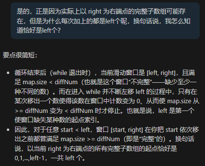

其中有一句话是核心：**left是第一个使窗口缺失某种数的起点索引**，也就是在你后面right怎么加，left只要后退一个，就一定能够成为一个合法窗口的起点，所以我们每次right加1的时候，ans就可以直接加上left。起初我把while循环放在了一个if语句里面：

```javascript
if (map.size >= diffNum) {
  while (map.size >= diffNum) {
    let cnt = map.get(nums[left])
    if (cnt === 1) map.delete(nums[left])
    else map.set(nums[left], cnt - 1)
    left++
  }
  ans += left
}
```

这样子就不对了，就会漏解。

所以滑动窗口有时还是十分的精妙。

## 1.2 哈希表散列函数的构造与冲突处理方法

**本节参照ZJU的MOOC**。设计哈希表散列函数的构造中，要尽量避免冲突。下面讲两个点，一个是散列函数的构造，另一个是冲突的解决。

### 1.2.1 散列函数的构造

下面继续分成两类。一类是整数散列函数，另一类是字符串散列函数。

整数散列函数主要有**直接定址、除留余数、平方取中**等方法。

字符串散列函数的处理方法有，ACII码相加法、**移位法**等等。把每个字符看成是32进制的一个数，计算出该字符串的数值，最后对每个计算结果除以哈希表大小算出最终应该把该字符串放在哈希表的哪个位置。

### 1.2.2 冲突的解决

解决的办法很简单，我们一般使用**拉链法**。就是在哈希表的每个位置上，都维护一个链表。这样子，当冲突发生时，我们就把新的元素插入到链表的头部。随后要查找，只需要遍历这个链表。

**拉链法的优点是容易实现和理解，适用于处理哈希冲突，并且相对节省内存。然而，当哈希冲突较为频繁时，链表可能会变得很长，导致查找效率下降。为了避免这种情况，可以考虑在链表长度达到一定阈值时，将链表升级为更高效的数据结构，比如红黑树。**

## 1.3 LeetCode 128 最长连续序列

(20240909还是不会)

这个题需要掌握一个STL容器`unordered_set`。`unordered_set`是一个无序的集合，底层实现是哈希表。这个容器的插入、删除、查找操作的时间复杂度都是O(1)。

**在思维上，遍历nums数组，假设某个连续串的开始值为$x$，那么我只需要检查$x - 1$是否在原先的数组中，如果在，那这个值我就不需要检查；如果不在，那么这个值就一定是某个序列的开始值，我需要检查。**

## 1.4 LeetCode 283 移动零 双指针

（20240920）这个题很好，我可以用其他方法做出来，不一定局限于双指针的思路。

典型的双指针例题。维护两个指针，左指针左边全是非0数，右指针左边到左指针为止全是0。右指针向右移动，遇到非0数，就和左指针交换。这样子，左指针左边全是非0数，右指针左边全是0。

## 1.5 LeetCode 11 盛最多水的容器 双指针

这个题其实还是个**贪心**问题。我们设置一左一右指针分别位于数组起点和数组终点，贪心策略是，每次都移动较短的那根柱子。证明其实很简单，因为如果保留较短的那根柱子，另外一边的柱子无论比原来长，还是比原来短，加上两者距离变短，那么它都会比原来的面积小。所以，我们每次都移动较短的那根柱子，直到两根柱子相遇。

## 1.6 LeetCode 15 三数之和 双指针

这个题感觉技巧性很强。（20240914还是不会）

这个题解法见灵神视频，十分巧妙。如何避免遇到重复的解，我们只需要在遍历`nums`数组的时候，如果遇到重复的元素，我们就跳过这个元素。此外，对于指针p和q也是采用相同的办法，遇到重复元素直接略去。

## 1.7 LeetCode 303 前缀和模板题 区域和检索-数组不可变

本题思路见灵神题解。在这里我们引出**前缀和**的概念：

对于一个数组a[n]，我们可以构造一个前缀和数组s[n]，其中s[i]表示数组a[0]到a[i]的和。这样子，我们就可以在O(1)的时间复杂度内求出数组a[i]到a[j]的和，即s[j] - s[i - 1]。

**但在实际操作中，我们一般把s[0]默认设置成为0，从s[1]开始记录前缀和，最终生成了大小为`s[n+1]`的前缀和数组。**

**前缀和的主要目的，在于我能用`O(1)`的时间复杂度，求出任何数组a[i]到a[j]的和。**

## 1.8 LeetCode 238 除自身以外数组的乘积 前缀和

这道题也是一道典型的前缀和问题，题目要求不用除法实现，这就引入了左右两端的前缀和。`front`数组用于存储从前向后的前缀和，`back`数组用于存储从后向前的前缀和。这样，我就很容易算出ans，只需要把左右两个前缀和相乘，不包含中间就行。

## 1.9 LeetCode 56 合并区间

（20241002重新做了）

**这个题的关键在于，我们要想到按照左端点来进行排序。** 排完序之后就方便合并了。

## 1.10 LeetCode 3186 施咒的最大总伤害

这个题目和打家劫舍很类似。同时也像第740题。但是，它和第740的区别在于，740可以直接开一个数组记录，而这个题不行，需要用到**哈希表**的思想。本题的方法为：动态规划+哈希表。

是一个很好的题，可以练一练。（20241103）

## 1.11 LeetCode 1094 拼车 差分

（20241114）差分就是前缀和的逆过程。这道题应该是所有差分的基础。

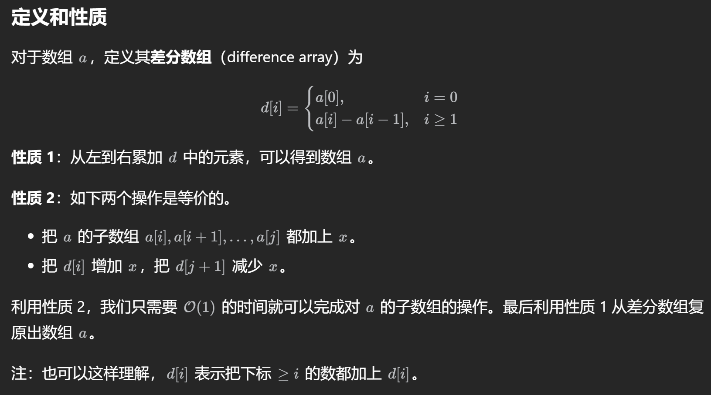
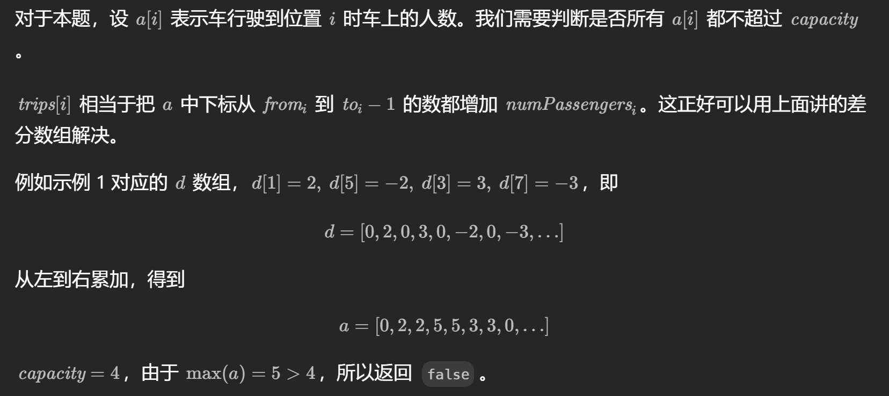

### 1.11.1 LeetCode 732 我的日程安排表III 差分

这道题20251110首刷，也是差分的应用，只不过我们不能直接开按题意要求的那么大的数组，那么怎么办呢，我们用一个`Map`去维护。在中间求和的时候，差分数组里默认情况下就是0，这部分我们可以忽略不记。在下面贴出这道题的代码，后面会看应该好好理解：

```javascript
var MyCalendarThree = function () {
  this.cnt = new Map()
}

/**
 * @param {number} startTime
 * @param {number} endTime
 * @return {number}
 */
MyCalendarThree.prototype.book = function (startTime, endTime) {
  this.cnt.set(startTime, (this.cnt.get(startTime) || 0) + 1)
  this.cnt.set(endTime, (this.cnt.get(endTime) || 0) - 1)

  let maxBook = 0
  let ans = 0
  const sortedKeys = Array.from(this.cnt.keys()).sort((a, b) => a - b) // 对key而不是value排序
  for (const key of sortedKeys) {
    const freq = this.cnt.get(key)
    maxBook += freq // 可以直接跳过中间某些含0的数字，从而节省了内存
    ans = Math.max(ans, maxBook)
  }
  return ans
}

/**
 * Your MyCalendarThree object will be instantiated and called as such:
 * var obj = new MyCalendarThree()
 * var param_1 = obj.book(startTime,endTime)
 */
```

## 1.12 二维前缀和

### 1.12.1 LeetCode 304 二维区域和检索-矩阵不可变

这道题是前面LC303的升级版。


**请注意，对于Java语言而言，JVM在初始化`int`型数组时，每个元素会被默认的初始化为0，你无需手动再赋一遍值。而对JS或者C++而言，必须赋值为0才能保证数组初始化的正确。**

和一维的思想是很像的。
$sum[i][j] = 0 当 i = 0 或 j = 0$

直接上代码：

```java
class NumMatrix {
    private final int[][] sum;

    public NumMatrix(int[][] matrix) {
        int m = matrix.length;
        int n = matrix[0].length;
        sum = new int[m + 1][n + 1];
        for (int i = 0; i < m; i++) {
            for (int j = 0; j < n; j++) {
                sum[i + 1][j + 1] = sum[i + 1][j] + sum[i][j + 1] - sum[i][j] + matrix[i][j];
            }
        }
    }

    // 返回左上角在 (r1,c1) 右下角在 (r2,c2) 的子矩阵元素和
    public int sumRegion(int r1, int c1, int r2, int c2) {
        return sum[r2 + 1][c2 + 1] - sum[r2 + 1][c1] - sum[r1][c2 + 1] + sum[r1][c1];
    }
}
```

### 1.12.2 LeetCode 1292 元素和小于等于阈值的正方形的最大边长

这道题的思想也需要用到二维前缀和，只不过它多了个枚举的技巧。如何去优化，让算法时间复杂度降低呢？一是二分查找，二是直接从题目出发。20250606首刷，用的方法二，实在是太妙了。


## 1.13 前缀和+哈希表 560 和为K的子数组、437 路径总和III

这一类型题，是典型的**枚举右，维护左**问题，这两道题很相似，一题是在数组中使用前缀和+哈希表，另一题是在树中使用递归+哈希表。你必须先弄明白 560 题（特殊情况），再来做437题（一般情况）。20250614首刷437，20240713首刷560。给一个437题的代码，细品：

另外，在刷了很多题之后，有一个问题我花了很久才想明白：


所以这种类型的问题一般都是需要添加一个`s[0] = 0`的统计。

```javascript
const pathSum = function (root, targetSum) {
  let ans = 0
  const cnt = new Map()
  cnt.set(0, 1) // 把 s[0] = 0 统计进来
  function dfs(node, s) {
    if (node === null) {
      return
    }

    s += node.val
    // 把 node 当作路径的终点，统计有多少个起点
    ans += cnt.get(s - targetSum) ?? 0

    cnt.set(s, (cnt.get(s) ?? 0) + 1)
    dfs(node.left, s)
    dfs(node.right, s)
    cnt.set(s, cnt.get(s) - 1) // 恢复现场
  }
  dfs(root, 0)
  return ans
}
```

### 1.13.1 LeetCode 3728 边界与内部和相等的稳定子数组

这道题也是前缀和+哈希表的思路。作为20251026第473场周赛的题目，在20251027首刷。比赛时候我想到了使用前缀和，但是没有想到使用哈希表优化，整理笔记时发现上一次回顾此类题目已经是4个月前。实际上这道题目的整个思路和560非常相似，只不过这道题存在`Map`中的key是一个二元组，在JS中需要进行处理一下。（当然，想到这个二元组也是需要一些硬功夫的）

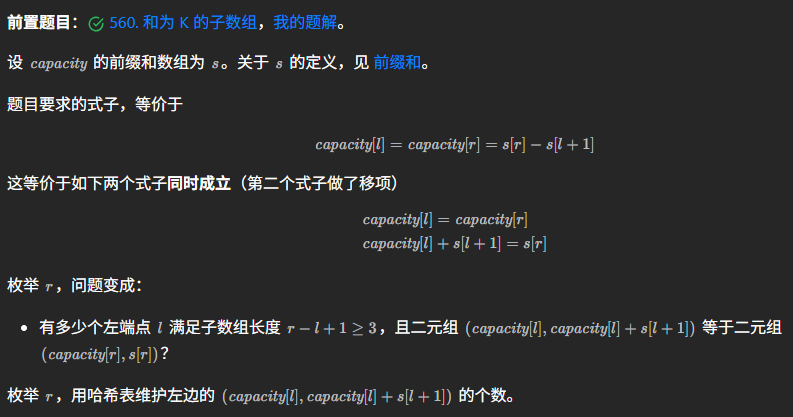

那么怎么处理这个二元组匹配呢，使用对象是不行的，使用数组也是不行的，实际上，要么你自己手动写一个Class去匹配，要么就使用字符串拼接的方式。这里我使用字符串拼接的方式。

```javascript
if (r >= 2) {
  const leftKey = `${c[r - 2]}, ${c[r - 2] + s[r - 1]}`
  if (map.has(leftKey)) {
    let temp = map.get(leftKey)
    map.set(leftKey, temp + 1)
  } else map.set(leftKey, 1)
  const rightKey = `${c[r]}, ${s[r]}`
  ans += map.get(rightKey) || 0
}
```

### 1.13.2 LeetCode 3755 最大平衡异或子数组的长度

这道题的整个思想和3728是一样的，都是pair的哈希表匹配。20251125首刷，难在需要推理出下面的位运算结论：

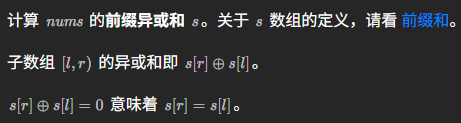

**0和任何数做异或运算，结果都是那个数本身。同样的，只有两个数一样，异或结果才是0**。

此外，对于奇偶，我们要进行适当的变形：


搞清楚了上面两点之后，这道题基本上就是3728的套壳。

### 1.13.3 LeetCode 1442 形成两个异或相等数组的三元组数目

这道题同样也可以用枚举右，维护左的思想进行优化。

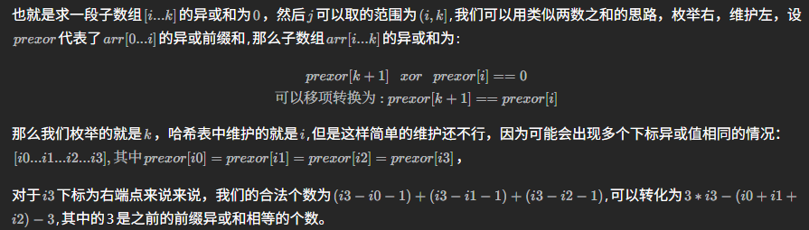

给出我的代码：

```javascript
/**
 * @param {number[]} arr
 * @return {number}
 */
var countTriplets = function (arr) {
  let preXor = 0
  let ans = 0
  const map = new Map()
  map.set(0, [0, 1])
  for (let i = 0; i < arr.length; i++) {
    preXor ^= arr[i]
    if (map.has(preXor)) {
      let [sum, cnt] = map.get(preXor)
      ans += cnt * i - sum
      sum += i + 1
      cnt++
      map.set(preXor, [sum, cnt])
    } else {
      map.set(preXor, [i + 1, 1])
    }
  }
  return ans
}
```

## 1.14 LeetCode 41 缺失的第一个正数

这道题是**原地哈希**。20250627首刷，不是很理解，感觉只能死记硬背方法。灵神的方法是：

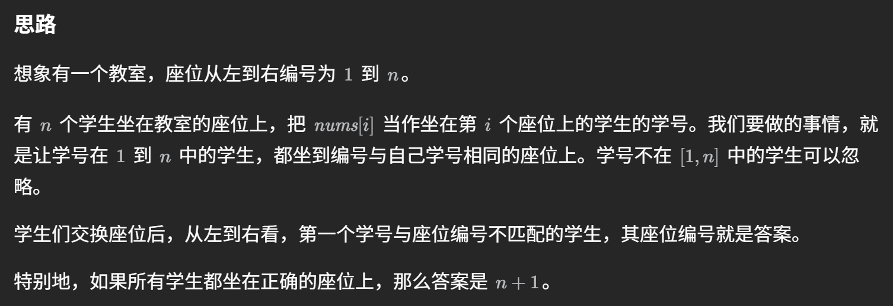
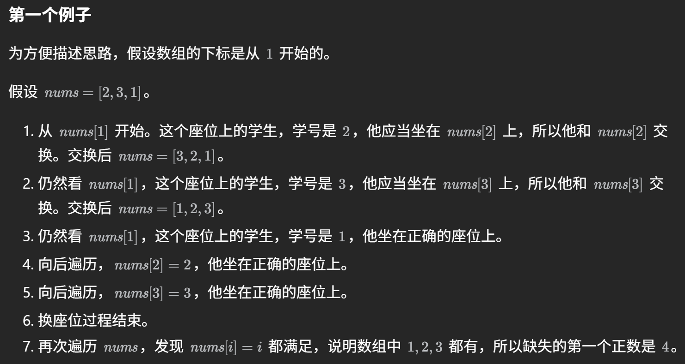
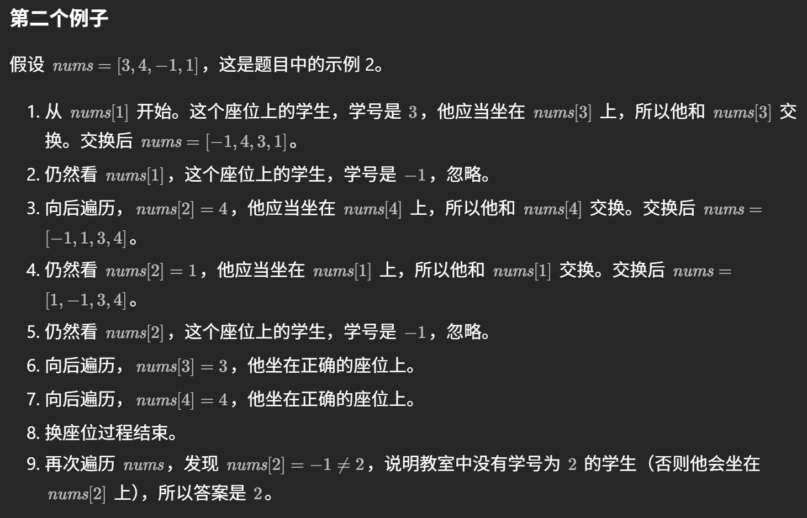
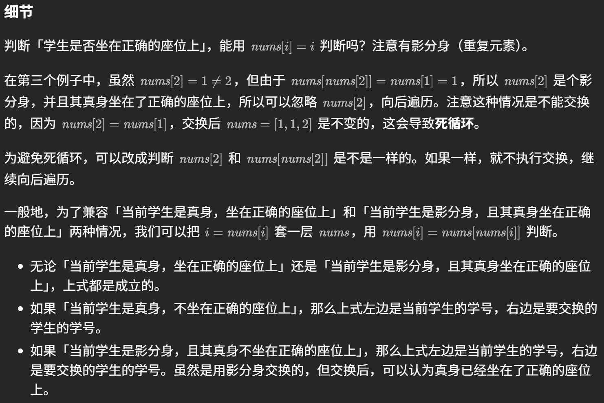

**实在是太难搞懂了，期待二刷！**

## 1.15 KMP算法

【最浅显易懂的 KMP 算法讲解】 https://www.bilibili.com/video/BV1AY4y157yL/?share_source=copy_web&vd_source=adb76b0abd2583fe45600a97ce5e6760

KMP算法主要用于在字符串中查找子串。KMP算法的核心思想是利用已经匹配过的信息，避免重复匹配，从而提高匹配效率。KMP算法的时间复杂度为 $O(n+m)$，其中 $n$ 为主串长度，$m$ 为模式串长度。

在暴力匹配中，我们用一个指针标记在主串上，另一个指针标记在模式串上。当两个指针所指的字符相等时，两个指针都向后移动一位；当两个指针所指的字符不相等时，主串指针回溯到上一次匹配的下一个位置，模式串指针回溯到模式串的开头，造成了巨大的时间浪费。**而KMP算法，可以不让主串的指针回溯，只需要一次遍历主串，就能找到是否匹配**。

在KMP算法中，我们需要隆重介绍一个重要的概念——**部分匹配表**（也称为失配函数，next数组）。部分匹配表用于记录模式串中**每个位置的最长相同前后缀的长度**。通过部分匹配表，我们可以在匹配失败时，快速找到下一个匹配位置，从而避免重复比较。

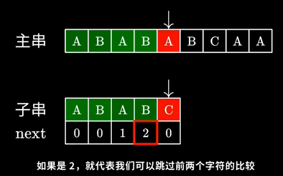

我们看到上面这个例子，一开始匹配，当匹配到主串中的“A”时，由于不相同，这个时候我们要做的是把字串往后移动，得到下图所示的一个状态。我们的算法是，当遇到不匹配的情况时，查找当前模式串所在指针位置的前一个位置，那个位置next数组对应的值（如上图中是2），代表了下次比较时可以跳过2个字符，直接从第3个字符开始比较。**这个时候，我们主串的指针是不需要改变的**，如下图所示：

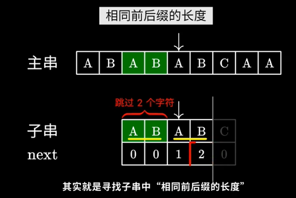

很显然，我们观察字串的前四个字符“ABAB”，它的最大公共前后缀是“AB”，由于我们刚才比对到了“C”的位置，出了问题，而在此之前我们比较的应该是“ABAB”中的后缀“AB”，这个和前缀“AB”是相同的，所以我们可以直接跳过“AB”，从“C”开始继续比较，从而实现了不回溯主串指针的目的。

同时也很显然，我们需要找到模式串每个位置下的最大公共前后缀（不能是自身）（证明略去）。而求模式串每个位置下最大公共前后缀的算法，显然与主串是没有关系的，我们只需要观察模式串就能求解。那么如何去求模式串的最大公共前后缀呢？

还是以图中为例，对于第一个字符，显然它不存在除了自身外的公共的前后缀，因此 `next[0] = 0`；第二个字符“B”也没有除了自身以外的公共前后缀，仍旧是0。对于前3个字符，由于“A”是最长公共前后缀，所以next为1（到目前为止，求前后缀的方法都是拿最后一个数和开头去比较，看看能否有重叠）。而到了第四个字符“B”，我们怎么能够快速发现最长公共前后缀是“AB”呢？我们可以发现，前3个字符的最长公共前后缀是“A”，已经存在了1个公共前后缀，我们先去比较“ABA”中，第1个“A”后面的字符，是否与第四个字符“B”相同，相同的话，那么我们直接在此基础上+1就行了。图中的示例恰好是相同的，因此直接为2。

我们现在继续来看另外一个例子，

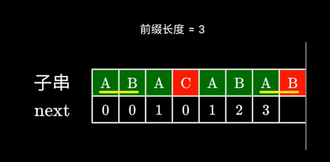

如图所示，模式串为“ABACABAB”，现在要求出最后一个位置的最长公共前后缀的长度。我们往前看一个位置，前7个字符“ABACABA”的最长公共前后缀是“ABA”，长度为3。那么我们就去比较第4个字符“C”和第8个字符“B”，发现不相同。那么怎么办呢？由于第7个位置告诉我们，前面7个字符“ABACABA”存在最长公共前后缀ABA，这7个字符中一开始的ABA和后面的ABA是一样的，也就是说**右边这部分的后缀等同于左边这部分的后缀，那我们直接在左边寻找共同的前后缀不就好了吗？（这一步我认为是整个KMP中最难理解的）**我们继续往前看，前3个字符“ABA”的最长公共前后缀是“A”，长度为1。那么我们就去比较第2个字符“B”和第8个字符“B”，发现相同，那么我们就可以在1的基础上+1，得到2，即为该位置的最长公共前后缀。

说完了它的理解，接下来我们来说一说它的实现。实现主要分成两个部分，一个是求next数组，另一个是使用next数组进行匹配。

标准的求next数组算法如下：

```javascript
function buildNext(pattern) {
  const next = new Array(pattern.length).fill(0)
  let j = 0 // 前缀末尾位置

  for (let i = 1; i < pattern.length; i++) {
    // 关键观察：j 的减少量 <= j 的增加量
    while (j > 0 && pattern[i] !== pattern[j]) {
      j = next[j - 1] // j 减少
    }

    if (pattern[i] === pattern[j]) {
      j++ // j 增加
    }

    next[i] = j
  }

  return next
}
```

我起先自己实现了KMP算法，但是我自己实现的代码非常的繁琐，后面又去学习了标准的代码。核心要点是，我们需要维护一个变量`j`，它表示当前最长公共前后缀的长度。对于模式串中的每个字符，我们都要和`j`所指的字符进行比较。如果相同，那么我们就把`j`加1，并把`next[i]`设置为`j`。如果不相同，那么我们就需要回溯`j`，直到找到一个相同的字符或者`j`为0。

让我始终琢磨不透的是，为什么这个算法说到底时间复杂度是O(m)呢？（m为模式串长度）因为我想不清楚中间的回溯到底经历了多少次。后面deepseek给出了它的分析：

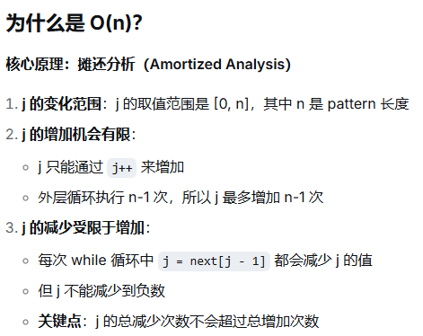
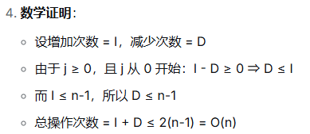

非常的巧妙，实际上，这个就是KMP算法的核心与精华之处。而至于使用next数组进行匹配的操作，实现起来较为简单，因此此处不再赘述。

## 1.16 LeetCode 459 重复的子字符串

这道题20251024首刷，力扣难度标简单，但实际上很恶心，面试就会喜欢经常考这种类型的题目。首先我们注意它的数据范围，发现是在10e4以内，这个范围在某种情况下采用暴力是可行的，而如果到了10e5，那肯定就不可行了（其实根据题目难度系数也能直接看出来，一般来说暴力不可行的题目不会标注简单）。那么无论如何，暴力做法应该是杀手锏，必须掌握。

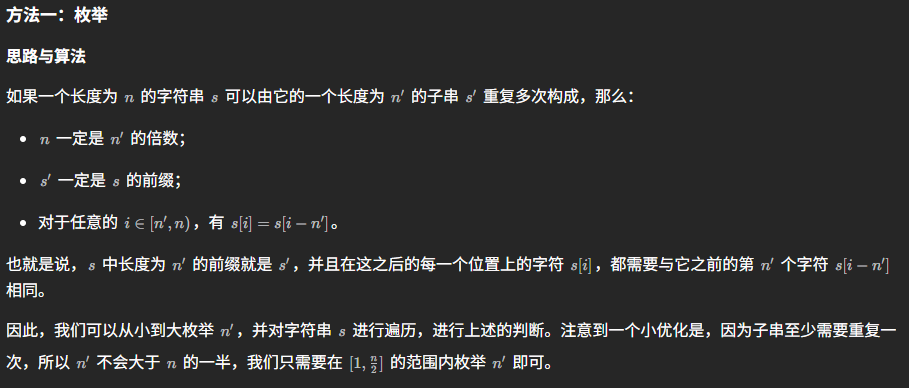

除此之外，官解还给出了一种脑筋急转弯的做法，**而必须首先想到这种做法，接下来才能使用KMP去做**：


我个人认为如果之前没做过这道题，这个方法是在想起来有些困难。

## 1.17 LeetCode 2800 包含三个字符串的最短字符串

这道题20251025首刷，同样是一道暴力的题，关键是在于想到它就是六种不同的全排列（如果一个字符串包含了另外一个，那么这两个字符串拼接的结果就是直接取大的一个字符串）：

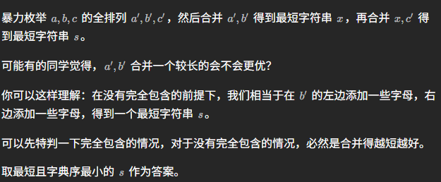

此外，我们可以使用KMP算法去优化中间的过程，将$O(n^2)$的复杂度降到$O(n)$。我们中间会需要求`a`和`b`两个字符串的最长公共前后缀，我们知道，对于一个字符串，求它的最长公共前后缀可以调用KMP中求next数组的算法；对于两个字符串，在一定的条件下，我们可以进行相应的变形：

```javascript
// 如果b不在a中，那么去求a的后缀与b的前缀的最长公共值
let s = b + '#' + a
// 这样去拼接，就一定保证了使用kmp求出来的数组不会ab拼在中间的这一部分放进去
```

这样子我们就快速解决了。

## 1.18 二维差分

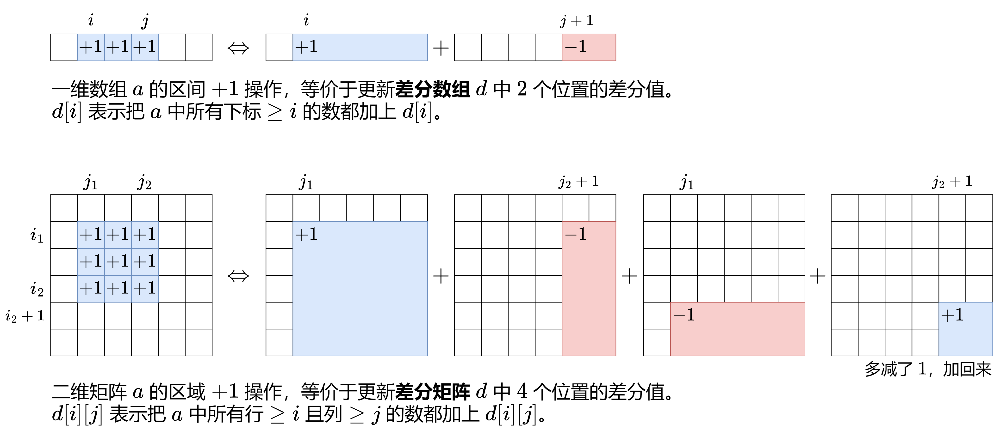

如果二维差分想不明白，建议和二维前缀和一起看。

在实现时，可以给前面第0行第0列同时加上一行一列0，同时给最末尾也添加一行一列。这样子就不用考虑边界问题。

## 1.19 LeetCode 1752 检查数组是否经排序和轮转得到

这道题20260523首刷，同样难度也为简单，但是实际上要考虑的思路只有一种，如果不是这种思路，代码就会写的很繁琐，并且容易出错，不好实现。非常适合二刷，我们来看思路：

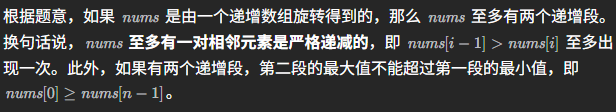

## 1.20 LeetCode 1163 按字典序排在最后的子串 双指针

本题20260628首刷，个人认为难度分应该超过了1900，这道题的思维十分灵活。首先，你的脑子要能灵活想到，字典序排在最后的子串一定是原字符串s的后缀子串。想明白这一点之后，就是这道题接下来精髓的地方：

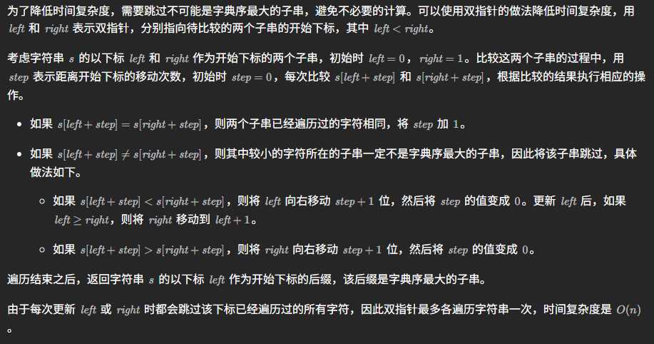

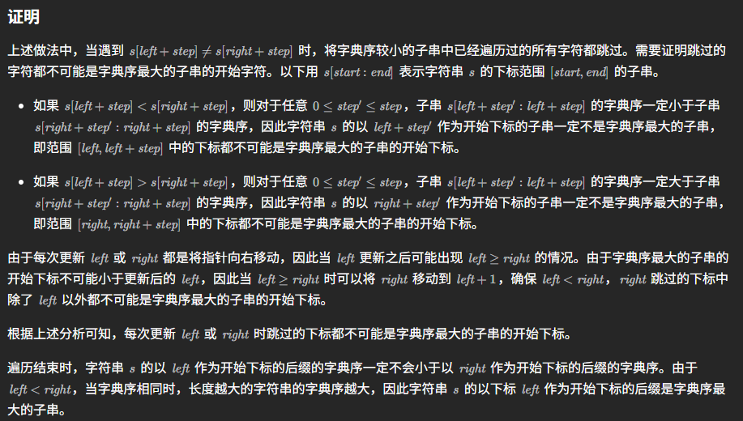

个人觉得这个题不太好想，把答案看懂也不容易，比较难，推荐二刷。

# 2. 链表

## 2.0 概述

链表的题大多与指针相关，这里需要记住，**在设置指针时一定要首先置空，避免出现野指针的情况。**

此外，在进行链表节点的更改时，同时也需要记得一次性修改好多节点，思维一定要清楚，需要及时进行验证（参考LeetCode 24的教训，想当然但是实际情况不是这样）。

**另外，什么时候需要添加哨兵节点呢，一般而言，如果我们需要对头节点进行改动，那么加上哨兵节点是为了找到链表的开始，如果不对头节点改动可以省略哨兵节点。** 如果想不明白，那么就默认都加哨兵节点就可以。

## 2.1 链表倒序

**本节基于LeetCode 92、206。**

针对链表倒序，使用迭代法。从头结点开始遍历，设置两个指针，curr和prev。curr指向当前节点，prev指向当前节点的前一个节点。每次迭代，将curr的next指向prev，然后prev和curr都向后移动一位。直到curr为空，prev就是新的头结点。同时，需要暂存curr的next节点，以免丢失。

还请记住一个性质。当遍历完链表，curr会指向null。而prev会指向最后一个节点。所以，prev就是新的头结点。

## 2.2 链表求交点 (Leetcode 161)

一般解法不难，这里如果想要使用时间复杂度为O(m+n)，空间复杂度为O(1)的办法，可以使用双指针法。两个指针分别指向两个链表的头结点，然后同时向后移动。当一个指针到达尾部时，将其指向另一个链表的头结点。这样，两个指针走过的路程是一样的。

这样子，如果他们真的有公共交点，假设链表a长度是m，链表b长度是n，公共部分长度为p，那么a指针走过的路程是m+(n-p)，b指针走过的路程是n+(m-p)，两个部分长度一样。所以，他们会在公共交点相遇。如果没有公共交点，他们会在null处相遇。

## 2.3 链表合并（LeetCode 23 21）

这两道题的启示是，在建立新链表的时候，需要创建一个**哨兵**节点，这个节点指向新链表的头结点。这样子，我们就可以在不知道新链表头结点的情况下，方便地返回新链表。

同时，链表的题目需要反复用到curr、prev等指针，循环条件往往是这些指针非空，在内存改接的时候需要经常注意是否访问到了不合法的内存，以免报错。

## 2.4 前后指针（LeetCode 19）

## 2.5 双向链表+哈希表 LeetCode 146 LRU缓存

这个题非常好。难度大，要在短时间内解出就必须多练。它同时是vue keep-alive组件中的核心算法。2024.7.31首刷。

## 2.6 前缀树 LeetCode 208

这个题采用前缀树思想，代码不好编，一定要上手操练。

## 2.7 LeetCode 61 旋转链表

这道题20260505首刷，十分的巧妙，我们只需要先把链表首尾相接成环，然后再断开，就能实现。十分经典，且有些脑筋急转弯性质。

# 3 树

写下这章时，本人已经好久没碰树了。树的题目一般都是通过递归，有的时候还会需要用到栈。必须掌握三种遍历方法。主要都是模板题。但下面的这些题还是很有意思的。

## 3.1 LeetCode 543 二叉树的直径

20240805首刷。直接写思路：从上往下遍历。当前结点的直径 = 左子树链长 + 右子树链长 + 2，当前节点链长 = max(左子树链长，右子树链长) + 1。

# 4 图

## 4.1 Vector存图

在C++语言中，图可以使用Vector进行存储。例如：

```cpp
vector<vector<int>> edges;
```

这实际上是一个邻接表，这样子，`edges[i]`就是一个`vector`，存储了`i`节点的所有邻接节点。

在Leetcode 207中，还用到了对于`vector`的`resize()`函数。通过该函数可以初始化（重置）邻接点的个数，方便图的建立。

## 4.2 LeetCode 207 课程表拓扑排序

## 4.3 LeetCode 743 网络延迟时间 单源最短路 Dijkstra 算法

这道题是经典的Dijkstra算法模板题。Dijkstra算法是解决单源最短路径问题的经典算法，适用于图中所有边的权值**非负**的情况。我们来看一下这个算法的流程：

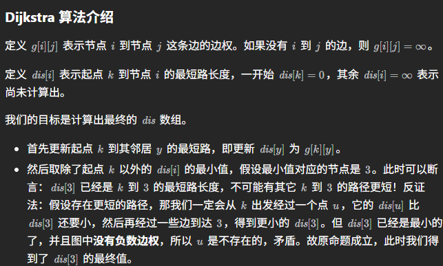

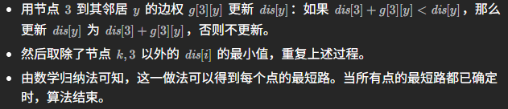

在实现上，我们有两种实现方式，一种是时间空间复杂度均为 $O(n^2)$ 的朴素实现，另一种是使用堆，时空复杂度更优的实现。对于前者的朴素算法，适用于稠密图，也就是边的数量是 $n^2$ 数量级相当的图。后者采用堆优化法，适用于稀疏图，也就是边的长度远小于 $n^2$ 的图。

在下面，我们先给出743题的Dijkstra算法，适用于稠密图的的JS代码，对于稠密图我们使用邻接矩阵的方式去存储：

```javascript
var networkDelayTime = function (times, n, k) {
  const g = Array.from({ length: n }, () => Array(n).fill(Infinity)) // 邻接矩阵
  for (const [x, y, d] of times) {
    g[x - 1][y - 1] = d
  }

  const dis = Array(n).fill(Infinity)
  dis[k - 1] = 0
  const done = Array(n).fill(false)
  while (true) {
    let x = -1 // 标记当前的最短路节点下标
    for (let i = 0; i < n; i++) {
      if (!done[i] && (x < 0 || dis[i] < dis[x])) {
        x = i // 找到未确定最短路的节点中，距离起点最近的节点
      }
    }
    if (x < 0) {
      return Math.max(...dis) // 所有节点的最短路都已确定，返回最大值
    }
    if (dis[x] === Infinity) {
      // 有节点无法到达
      return -1
    }
    done[x] = true // 最短路长度已确定（无法变得更小）
    for (let y = 0; y < n; y++) {
      // 更新 x 的邻居的最短路
      dis[y] = Math.min(dis[y], dis[x] + g[x][y])
    }
  }
}
```

接着，我们采用堆优化方式，给出Dijkstra算法的JS代码。请注意，对于稀疏图的存储方式，我们一般使用邻接表，而不使用邻接矩阵去存储：

```javascript
var networkDelayTime = function (times, n, k) {
  const g = Array.from({ length: n }, () => []) // 邻接表
  for (const [x, y, d] of times) {
    g[x - 1].push([y - 1, d])
  }

  const dis = Array(n).fill(Infinity)
  dis[k - 1] = 0
  const pq = new MinPriorityQueue((e) => e[0])
  pq.enqueue([0, k - 1])
  while (!pq.isEmpty()) {
    const [dx, x] = pq.dequeue()
    if (dx > dis[x]) {
      // x 之前出堆过
      continue
    }
    for (const [y, d] of g[x]) {
      const newDis = dx + d
      if (newDis < dis[y]) {
        dis[y] = newDis // 更新 x 的邻居的最短路
        pq.enqueue([newDis, y])
      }
    }
  }
  const mx = Math.max(...dis)
  return mx < Infinity ? mx : -1
}
```

这个题实在经典，20250819、20250820首刷，应该多次回看、回味。

在Dijkstra算法中，我们需要注意节点在被优先队列取出并确定最短距离之前可能会被**多次松弛更新**；一旦被取出，其最短路径即为最终值。

另外，在20260129刷第3112题时，我注意到这个判断方式是十分经典的：

```javascript
if (dx > dis[x]) {
  // x 之前出堆过
  continue
}
```

应该好好回味。

此外，对于两种不同的实现，我们需要注意它们的时空复杂度：

在下面中，图的顶点数使用n表示，边数使用m表示。对于朴素实现，很显然，时间复杂度为 $O(n^2)$，空间复杂度为 $O(n^2)$（邻接矩阵存储）。

对于堆优化实现：

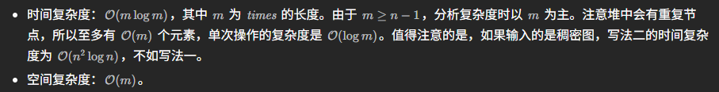

其实严格来讲，时间复杂度应该为 $O(n + m \log m)$，只不过由于m远大于n，所以简化为 $O(m \log m)$（注意，教科书上有时也会写成 $O(m \log n)$，这也是正确的，因为它们的渐进都一样。其实这个地方我也有些没搞太懂，不过问题不大，先暂且放一边）。而我们知道，如果一个图稠密时（也就是这个图的边非常的多），数量接近于 $n^2$，那么 $m \log m$ 近似等于 $n^2 \log n^2$，也就是 $O(n^2 \log n)$（对数的2可以提取常数，进而被优化），这个时候就不如朴素实现了。

大多数情况下，图论的题目都是稀疏图，因此堆优化的Dijkstra算法是更常用的。另外个人觉得，堆优化的Dijkstra算法更容易理解，朴素方法有些反直觉。

### 4.3.1 LeetCode 3650 边反转的最小路径总成本

这道题和743题没啥区别，是20250816双周赛竞赛题，20250821首刷。关键在于理解，开关最多使用一次这个条件没用，因为最短路中每个点本来就至多经过一次，因此直接建图（反向边的边权是正向的两倍）跑最短路即可。（目前不是很理解，希望二刷时能彻底理解）。

### 4.3.2 LeetCode 3341 到达最后一个房间的最小时间 I

这道题20260102首刷，此题中我学会了Dijkstra算法的一个实现细节，就是说我们的某个点可能会重复入队列多次，我们可以用一些trick跳过过时条目，如此题的：

```javascript
const pq = new PriorityQueue((a, b) => a[0] - b[0])
pq.enqueue([0, 0, 0]) // [time, x, y]
while (pq.size() > 0) {
  const [t, i, j] = pq.dequeue()
  if (t !== reachTime[i][j]) continue // 跳过过时条目
  // ...
}
```

### 4.3.3 LeetCode 3342 到达最后一个房间的最小时间 II

这道题20260102首刷，我们需要用一个办法标记到该点实际上一共跳了多少次。事实上，当该点是路径最小时，不难理解前面的点也都至多访问了恰好一次，那么这样我们可以根据奇偶性去标记。


这是本题的精髓所在。

## 4.4 图中的DFS

对于网格图中的DFS，一般需要注意四个方向的移动，而下面的方法写起来，代码会比较简洁，值得学习：

```javascript
for (const [x, y] of [
  [i, j - 1],
  [i, j + 1],
  [i - 1, j],
  [i + 1, j],
]) {
  // 左右上下
  if (0 <= x && x < m && 0 <= y && y < n && grid[x][y]) {
    // 把统计岛屿面积的任务交给其他人去处理，自己只需累加其他人统计出来的岛屿面积
    area += dfs(x, y)
  }
}
```

### 4.4.1 LeetCode 1020 飞地的数量

这是一道网格图DFS题，20251222首刷。有一点脑筋急转弯蕴藏在里面，就是你一开始不知道从哪里下手去DFS，直到参考了答案：


另外，这道题的思想也可以用在130、1254两个题目上，几乎一模一样，因此值得二刷。

### 4.4.2 LeetCode 2192 有向无环图中一个节点的所有祖先

这道题20260108首刷，也是有一点脑筋急转弯的性质在里边，这道题我们正难则反。很经典，非常适合二刷。

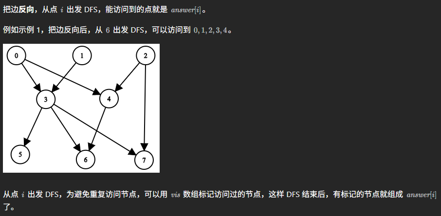

## 4.5 图中的BFS

重要！BFS一般用于求最短路径，DFS一般用于搜索。

```text
问题：找最短路径吗？
├── 是 → 用BFS
└── 否 → 继续判断
    ├── 需要所有可能方案？ → 用DFS
    ├── 只是检查连通性？ → DFS/BFS都可以
    └── 需要层次信息？ → 用BFS
```

参照上面的原则，可以使时间/空间复杂度最优。

### 4.5.1 LeetCode 1162 地图分析 多源BFS

这道题20251228首刷，虽然可以用单源BFS求解，但是理论上肯定是超时，时间复杂度为$O(n^4)$，但是本题又恰恰数据比较弱，能过。但这里我还是要说经典的多源BFS方法。这道题我们反过来想，从陆地开始去查找，并给最近的海洋标号，直到把所有的海洋都填满就结束。在填海洋的过程中，我们同时记录最大距离，这样子只需要遍历整个grid就能解决这道题，时间复杂度为$O(n^2)$。

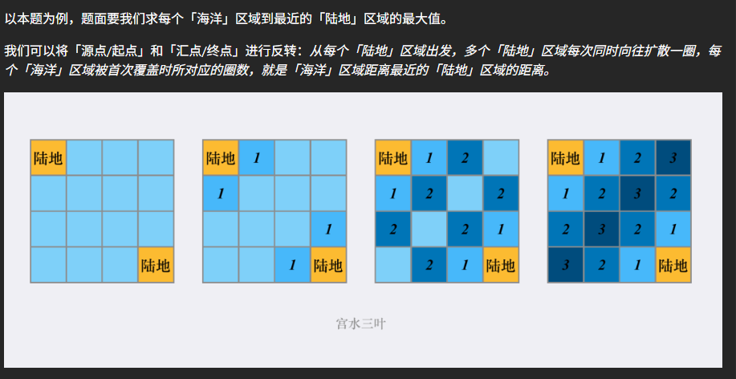

与这道题类似的还有第542题。

### 4.5.2 LeetCode 1284 转化为全零矩阵的最少反转次数 BFS最短路建模

这道题20260124首刷，需要用到抽象成图的问题来解决，接着使用BFS建立最短路。我觉得难点在于抽象这个问题，我们来看一下解法，不过这种题做过一次，后面就能有印象了：

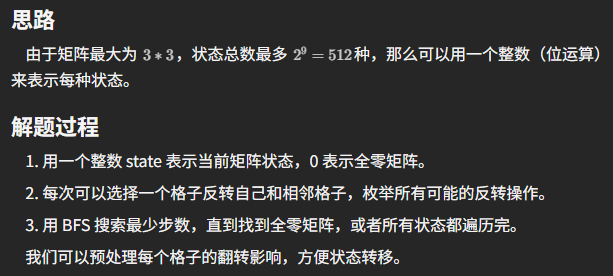

与这题相类似的还有第773题。

## 4.6 0-1 BFS

0-1 BFS 是一种用于解决带权图中单源最短路径问题的算法，适用于边权只有0和1的情况。它结合了广度优先搜索（BFS）和双端队列（Deque）的思想，能够在 $O(V + E)$ 的时间复杂度内找到最短路径，其中 $V$ 是顶点数，$E$ 是边数。

### 4.6.1 LeetCode 3286 穿越网格图的安全路径

这道题20251231首刷，可以用一个最小堆处理最短路径，也可以直接使用一个双端队列（JS中数组就是双端队列）。我们直接看解法：

```javascript
/**
 * @param {number[][]} grid
 * @param {number} health
 * @return {boolean}
 */
var findSafeWalk = function (grid, health) {
  const m = grid.length
  const n = grid[0].length
  const leastHealth = new Array(m)
  for (let i = 0; i < m; i++) {
    leastHealth[i] = new Array(n).fill(Infinity)
  }
  leastHealth[m - 1][n - 1] = grid[m - 1][n - 1] === 0 ? 1 : 2
  // const minQueue = new PriorityQueue((a, b) => leastHealth[a[0]][a[1]] - leastHealth[b[0]][b[1]])
  // minQueue.enqueue([m - 1, n - 1])
  const queue = [[m - 1, n - 1]]
  while (queue.length > 0) {
    const pos = queue[0]
    queue.shift()
    if (leastHealth[pos[0]][pos[1]] > health) return false
    let i = pos[0],
      j = pos[1]
    for (const [x, y] of [
      [i - 1, j],
      [i + 1, j],
      [i, j - 1],
      [i, j + 1],
    ]) {
      if (
        x >= 0 &&
        x < m &&
        y >= 0 &&
        y < n &&
        leastHealth[x][y] === Infinity
      ) {
        if (grid[x][y] === 1) leastHealth[x][y] = leastHealth[i][j] + 1
        else leastHealth[x][y] = leastHealth[i][j]
        if (x === 0 && y === 0) {
          if (leastHealth[x][y] <= health) return true
          else return false
        }
        if (grid[x][y] === 1) queue.push([x, y])
        else queue.unshift([x, y])
      }
    }
  }
  return false
}
```

### 4.6.2 LeetCode 1824 最少侧跳次数

这道题20260101首刷，需要先转化成图的问题，然后使用0-1 BFS去解决。转化很巧妙：

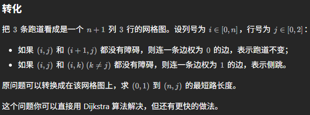

那么既然我们使用的是Dijkstra的算法思想，就有可能一个点的最短路径被多次更新，直到它从队列中被取出为止。

### 4.6.3 LeetCode 310 最小高度树 分层BFS

这道题20260208首刷，是一道十分经典的题目，非常适合二刷。

这道题巧妙地结合了拓扑排序+分层BFS的思想。需要把这两个都搞懂才好理解。我一开始理解了半天。

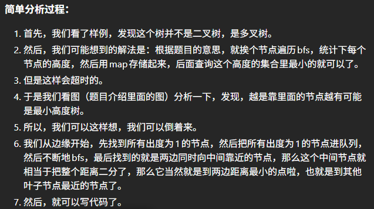

上面已经是非常通俗的想法了，但是，第6步之后我还是不会写，因为我不知道什么时候该停止，换句话说就是怎么表示最后这个最小的点的条件？

实际上，结合了官方题解，这道题需要搞清楚两个结论。第一个就是拓扑排序之后，剩下来最终的点要么是一个，要么是两个；第二个就是我们要尝试使用分层BFS，而不能使用普通的，因为实际上树就是一层一层的。

接下来我们来尝试进行分析。首先是第一个问题，为什么最后要么剩一个点，要么剩两个点？

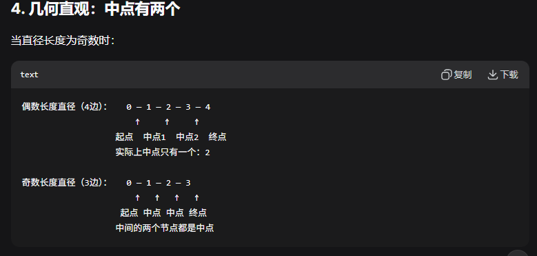


第二个问题，为啥要使用分层？

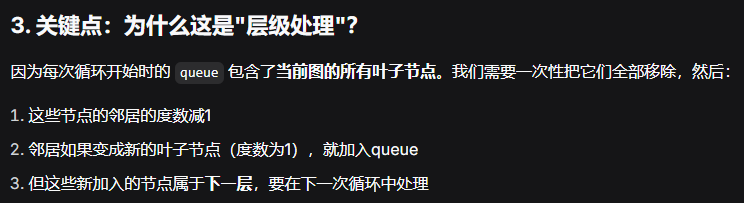

体现在下面的关键代码片段：

```javascript
while (remainNodes > 2) {
  const sz = queue.length
  remainNodes -= sz
  for (let i = 0; i < sz; i++) {
    const curr = queue.shift()
    for (const v of adj[curr]) {
      degree[v]--
      if (degree[v] === 1) {
        queue.push(v)
      }
    }
  }
}
```

实在是有点意思啊，应该好好品味这道题。

## 4.7 LeetCode 1334 阈值距离内邻居最少的城市 多源最短路 Floyd算法

这道题20260203首刷，是多源最短路Floyd算法的鼻祖。Floyd算法本质上就是一个三维DP。我们直接来看灵神的讲解：

https://leetcode.cn/problems/find-the-city-with-the-smallest-number-of-neighbors-at-a-threshold-distance/solutions/2525946/dai-ni-fa-ming-floyd-suan-fa-cong-ji-yi-m8s51/

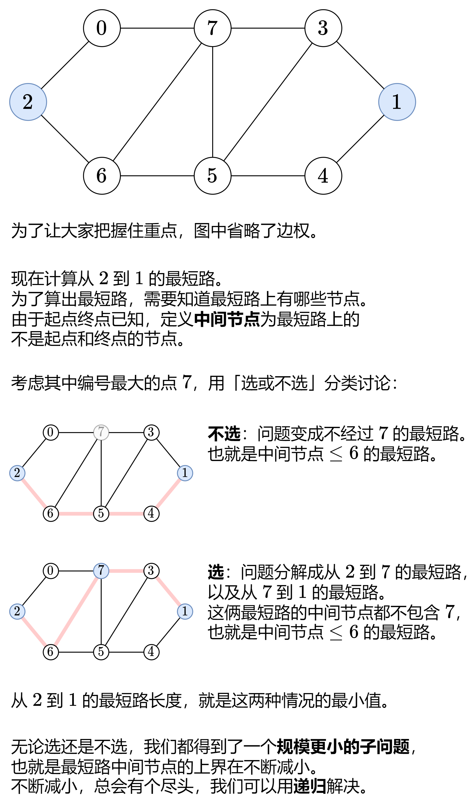

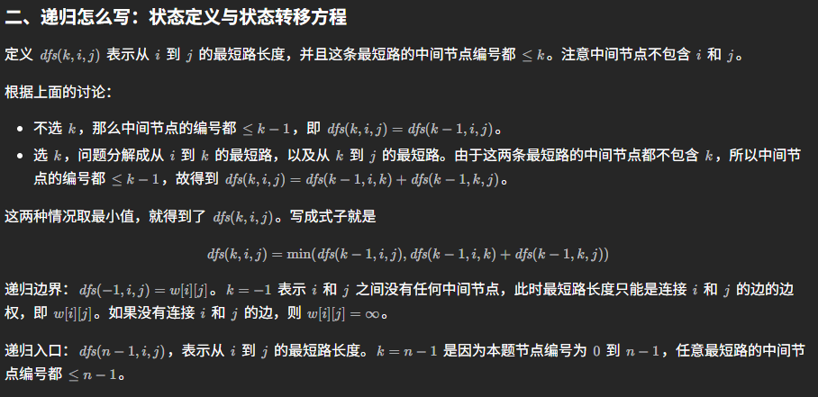

有了状态转移方程之后，我们很好将它转化成记忆化搜索的版本，就实现了这个算法。时间与空间复杂度均为 $O(n^3)$ 。当然，鉴于目前对动态规划的理解还不够，后续的转化为递推以及空间优化暂时略过，后面再来补充。

## 4.8 LeetCode 1584 连接所有点的最小费用 最小生成树

这道题20260703首刷。本质上是一个**最小生成树**问题。对于最小生成树，我们可以使用Kruskal算法或者Prim算法来解决。Kruskal算法，该算法以边为单元，时间主要取决于边数，比较适合于稀疏图；Prim算法，该算法以顶点为单元，与图中边数无关，比较适合于稠密图。

如下图，对于Kruskal算法，我们先将所有边按照权重排序，然后从权重最小的边开始，每次选择一条边，如果这条边不会导致环的形成，就将这条边加入到最小生成树中。如果所有边都被加入到最小生成树中，那么最小生成树就形成了。实现需要基于**并查集**。

另外，如果需要求最大生成树，那么就只需要把边按照权重从大到小排序。

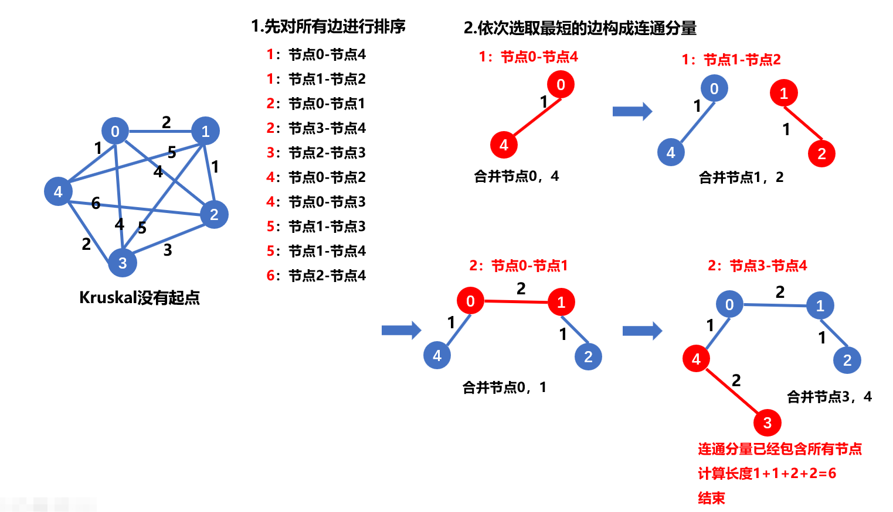

下面介绍Prim算法：

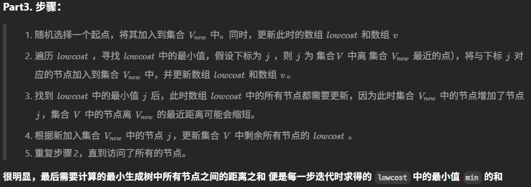

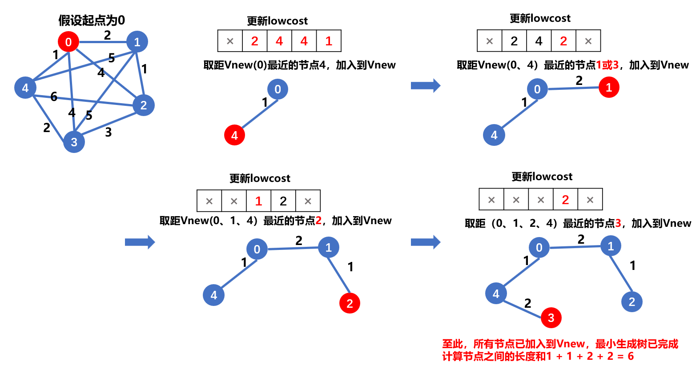

上面我们要指出一个问题，就是我们把新点加入连通图之后，实际上不需要更新所有的lowcost，只需要更新和这个新加入的点连着的点的lowcost即可，因为其他点是不会受到影响的。

# 5 二分查找 && 二叉查找树

关于树，需要知道几种特殊的树的定义和性质：

- 二叉树：每个节点最多有两个子节点的树。
- 完全二叉树：除了最后一层外，其他层的节点都达到最大值，且最后一层的节点都集中在左侧。（**最后一层节点从左到右排列**）
- **满二叉树（国际上称完美二叉树）\***：除最后一层无任何子节点外，每一层上的所有结点都有两个子结点的二叉树。也就是说，假设有 $h$ 层，那么该二叉树一共有 $2^h - 1$ 个节点。

  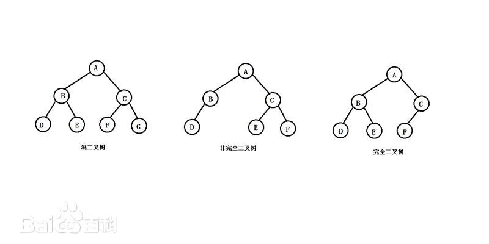

- \*：需要注意的是，国际国内上所说的满二叉树，定义不同。我们在这里指的满二叉树，一般默认是国内的定义，也即国际上说的**完美二叉树**的定义，对于国际上说的满二叉树如何定义，见下：

  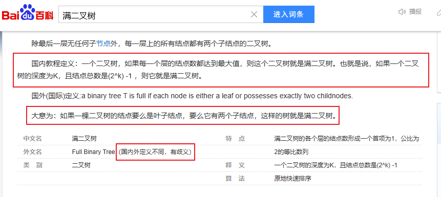

---

- 平衡二叉树（AVL树）：任意节点的左右子树高度差不超过1的二叉树。
- 二叉搜索树（BST树）：左子树的所有节点值都小于根节点值，右子树的所有节点值都大于根节点值。**中序遍历可以得到有序数列，同时BST树不一定是AVL树！！**

## 5.1 二分查找

二分查找有模板和变式，此处以模板为例。模板如下：

这个模板是我高中时候学会的模板。什么都不用变。不用加一也不用减一。

```cpp
int binarySearch(vector<int>& nums, int target) {
    int left = 0, right = nums.size() - 1;
    while (left <= right) {
        int mid = (left + right) / 2;   // 中间值
        if (nums[mid] == target) return mid;
        else if (nums[mid] < target) left = mid + 1;    // 中间值+1
        else right = mid - 1;   // 中间值-1
    }
    return -1;
}
```

**至于变式，主要喜欢在left right还有mid上面做文章，喜欢+1-1，或者考你错误的二分解法，为什么不可以此类。**

### 5.1.1 LeetCode 34 题带来的启示

**二分查找，本质上需要牢记区间的定义！区间内的数（下标）都是还未确定与 target 的大小关系的，有的是 < target，有的是 ≥ target；区间外的数（下标）都是确定与 target 的大小关系的。**

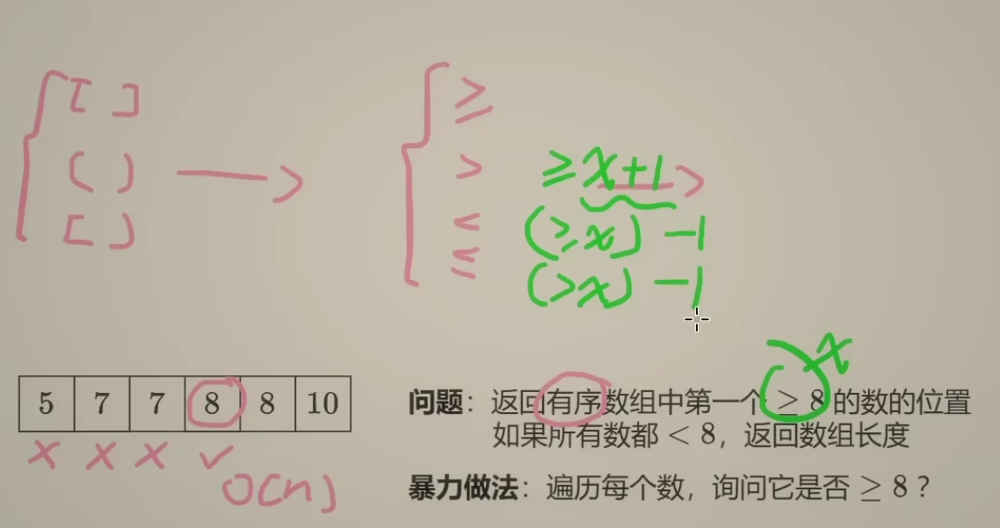

一般来说，有上面图片中出现的四个问题：

- 返回有序数组中第一个 ≥ target 的下标。这是我们的板子，下面的题都可以转换成这个问题。
- 返回有序数组中第一个 > target 的下标。这就可以等价转换到第一个问题，**即返回第一个 ≥ (target + 1) 的下标**。
- 返回有序数组中最后一个 < target 的下标。也可以等价转换到第一个问题，**即返回第一个 ≥ target 的下标，这个下标再减1即为所求**。
- 返回有序数组中最后一个 ≤ target 的下标。可以先等价转换到第二个问题，**即返回第一个 > target 的下标，这个下标再减1即为所求**。接着把前半部分转换到第一个问题就是所求。

针对34题，给出了一个二分模板：

```javascript
let lowerBound = function (nums, target) {
  let n = nums.length
  let a = 0
  let b = n - 1
  let mid = Math.floor((a + b) / 2)
  while (a <= b) {
    if (nums[mid] >= target) {
      b = mid - 1
      mid = Math.floor((a + b) / 2)
    } else if (nums[mid] < target) {
      a = mid + 1
      mid = Math.floor((a + b) / 2)
    }
  }
  return a
}
```

怎么去想a和b什么时候直接等于mid，什么时候要+1 -1？就是看**区间的定义**。区间里面哪些数字是已经确定了大小，哪些数字还要再次确定大小。上面的板子是左闭右闭区间形式，还有左闭右开、全开区间等形式，只需要掌握一个就可以，空余时间可以多想想。

### 5.1.2 LeetCode 108

这个题可以直接使用二分查找的思想。mid作为根节点，然后左右分别递归建立树即可。**感觉得把这题背下来。没遇到过可能想不出来。** 20250612二刷。

### 5.1.3 LeetCode 2439 最小化数组中的最大值 二分答案

20250530已解决。一般而言，像这种**最小化最大/最大化最小**这种类型的题目，都能用二分答案来解决。这道题的难点在于怎么去想到这样的一个二分法则。参看灵神题解。


### 5.1.4 LeetCode 2517 礼盒的最大甜蜜度

20250531已解决。这道题的难点和2439题一样，在于如何写出`check`函数。

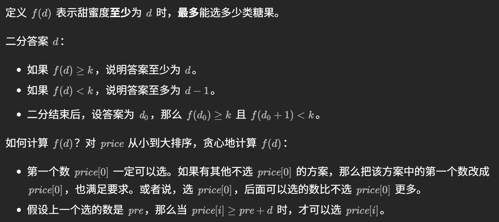

### 5.1.5 LeetCode 878 第N个神奇数字

我的评价是这个题想到二分就迎刃而解了，没有想到就很难做。

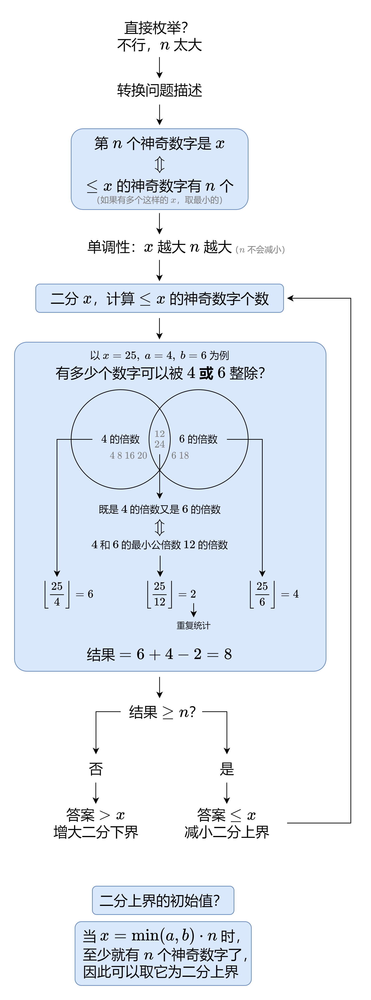

### 5.1.6 LeetCode 3453 分割正方形I 浮点数二分

这道题20251102首刷，一个比较好想的思想是，利用浮点数二分。对于浮点数的题目，一般题目中会规定误差不大于某个数。那我们只需要求出多少次二分之后，这个误差是符合题意的就可以了。题目中对y进行二分答案，y的取值范围是$(0, 2 * 10^9)$。

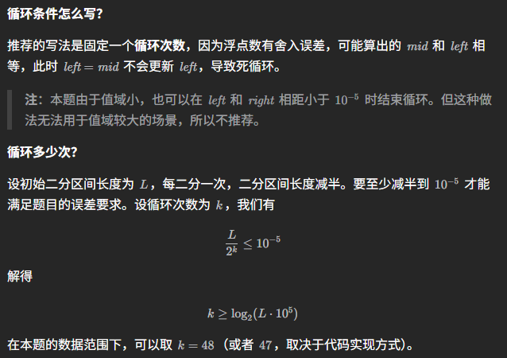

### 5.1.7 LeetCode 2064 分配给商店的最多商品的最小值

本题20260429首刷。这道题你能看出来是二分答案就赢，否则就输。这道题其实就是爱吃香蕉的珂珂那个题。

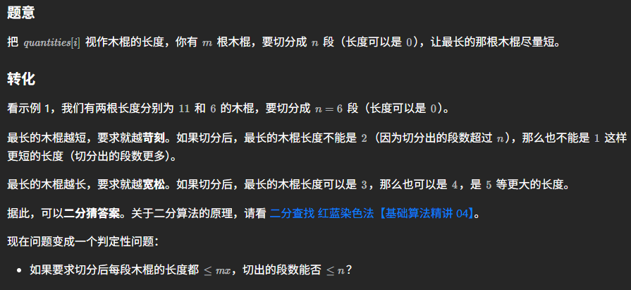

## 5.2 Leetcode 33 无序数组（旋转数组）二分查找

这道题是针对无序数组的二分查找。但实际上，二分查找的关键并不在于数组是否有序，**而是能否判断接下来的查找范围应该在数组的哪一边**。有序数组只是让这一步变得简单。

对于此题来说，也可以使用单次二分查找来解决。解题思路：按照二分模板算出mid，mid的左右两侧一定至少有一侧是有序的，如果target在有序的一侧，那么就在有序的一侧继续二分查找，否则在无序的一侧继续二分查找。

为什么可以这样做呢？**因为有序的一侧，我们可以直接判断target是否在这一侧，而无序的一侧，我们无法判断target是否在这一侧。** 所以，我们可以通过判断target是否在有序的一侧，来决定继续在哪一侧查找。

## 5.3 二叉查找树的恢复（Leetcode 449）

一个风和日丽的下午，还记得自己在学习数据结构的时候，听到ZJU何钦铭老师讲到如何恢复一棵二叉树。

**给定一棵二叉树，只要给出①先序遍历和中序遍历，或者②中序遍历和后续遍历，那么就一定能够恢复这棵二叉树。**

https://www.icourse163.org/learn/ZJU-93001?tid=1468825451#/learn/content?type=detail&id=1251326039&cid=1280334953

下面对①进行具体例子的分析：**先序遍历时，print的结果是根左右，中序遍历时，给的结果是左根右。** 那么，对于先序遍历和中序遍历，我们可以通过先序遍历找到根节点，然后在中序遍历中找到根节点的位置，这样子就可以确定左右子树的范围。然后，递归地构建左右子树。

**但是，这道题不能简单的用两种序列遍历方法恢复。此题的思路类似于LeetCode 297。**

## 5.4 Leetcode 315 树状数组

此题的另一种解法是归并排序。见**LCR 170**。

## 5.5 LeetCode 236 二叉树的最近公共祖先

这个题，递归+分类讨论，没有任何套路，直接贴解法。**非常好的典型题。用于深刻理解递归。**

```javascript
var lowestCommonAncestor = function (root, p, q) {
  if (root === null || root === p || root === q) {
    return root
  }
  const left = lowestCommonAncestor(root.left, p, q)
  const right = lowestCommonAncestor(root.right, p, q)
  if (left && right) {
    return root
  }
  return left ?? right
}
```

## 平衡二叉树（AVL树）

关于AVL树，一颗树是平衡的话，我们需要能够手撕RR、LL、RL、LR四种旋转方式。

写代码的方式很简单。把每种情况模型抽象出来就行。

# 6 栈、队列、堆

## 6.1 Leetcode 224 计算器——栈的灵活运用

这道题肯定要用到栈。一个解法是，使用三参数。具体如下：

```cpp
int presign = 1;    // 初始时符号为1，表示正数
long long num = 0;    // 记录当前的数值
long long ans = 0;    // 存储答案
```

其中，`presign`表示当前的符号，`num`表示当前的数值，`ans`表示答案。下面详细介绍这三个参数的具体用法：

1. 初始时，`presign`需要设置成1，接下来每当读入＋时，`presign`设置成1，读入-时，`presign`设置成-1。这样子，`presign`就可以表示当前的符号。

2. 一个指针可以指到数字，那么每当读取一个数字，我就`num * 10 + s[k]`，其中`s[k]`代表当前读入的值。这是一种常用做法，`num`也就因此暂存遇到的数字。

3. 当遇到`+`或者`-`时，我们需要根据`presign`和`num`来更新`ans`。`ans += presign * num`。这样子，`ans`就可以存储当前的答案。

4. **当遇到左括号时，我们要将此时的`ans`和`presign`通通压入栈中，然后把`presign`复位，`num`和`ans`统统归0，相当于新开了一个函数，能够从0开始计算括号内的值。**

5. **当遇到右括号时，我们需要计算出来括号内的值了。算完之后，括号内的值整体应该当作一个数，重新传回暂存当前数的`num`之中，然后将`presign`和`ans`统统弹出来。**

如此反复循环，就完成了这道题的解。

### 6.1.1 LeetCode 227 772 计算器II 计算器III

这两道题是对这道计算器题的一个拓展，227不要求实现括号，但要求实现乘除运算；772则是要求又要实现括号，又要实现乘除运算。使用上面6.1的方法标记`presign`理论上亦可以实现，不过太繁琐。**在这里介绍RPE逆波兰式的方法，可以解决此类所有的计算器问题：**

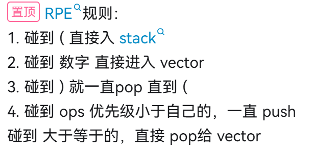

先根据以上规则，将中缀表达式转化为后缀表达式，并将后缀表达式存入到一个数组`vec`中，在通过后缀表达式进行计算即可。如果搞不懂看视频：https://www.bilibili.com/video/BV1Nb4y1z7hG?spm_id_from=333.788.videopod.episodes&vd_source=3f8c5c4e56e5c611151b798b557016c9

## 6.2 Leetcode 215 数组中第K大的元素——堆的灵活运用

**注意：堆排很常见也很重要，很重要，很重要，务必掌握。** 本题采用建立大顶堆的方法。这题十分经典。

## 6.3 Leetcode 295 数据流中的中位数

本题的核心思想也是用堆。这是一道Leetcode困难题，需要将时间复杂度降至`O(logn)`。注意以下两点结论：

1. 一个无序数组，建立堆的时间是`O(n)`，
2. **一个堆插入一个元素的时间是`O(logn)`，插入的方法是始终插入这棵完全二叉树最末尾的地方，然后反复调整。**
3. **一个堆删除一个元素的时间是`O(logn)`，始终删除堆顶，把堆的最末尾元素放到堆顶，然后反复调整。**

这里使用两个堆，一个大顶堆，一个小顶堆。大顶堆存储较小的一半，小顶堆存储较大的一半。这样子，中位数就可以通过两个堆的堆顶元素计算出来。下面是K神的代码：

```cpp
class MedianFinder {
public:
    priority_queue<int, vector<int>, greater<int>> A; // 小顶堆，保存较大的一半
    priority_queue<int, vector<int>, less<int>> B; // 大顶堆，保存较小的一半
    MedianFinder() { }
    void addNum(int num) {
        if (A.size() != B.size()) {
            A.push(num);
            B.push(A.top());
            A.pop();
        } else {
            B.push(num);
            A.push(B.top());
            B.pop();
        }
    }
    double findMedian() {
        return A.size() != B.size() ? A.top() : (A.top() + B.top()) / 2.0;
    }
};
```

**这段代码很巧妙。** 实际上，对于函数`addNum`，这里每次插入元素不用比较大小的原因在于，此时来了一个新的元素，我想插入A，他有两种情况，第一种他比B的堆顶元素大，此时理论上可以直接插入A；第二种情况，他比B的堆顶元素小，此时就不能直接插入A，需要先插入B维持较小的元素都在B内，然后取B的堆顶元素插入A； 而为了简化比较操作，回到第一种情况，可以先统一把元素插入B，然后此时B基于大顶堆的结构特性，会将该元素作为新的堆顶元素，此时再执行插入A的操作就相当于此前在B处过渡了一下，最终还是会插入A 可以理解是代码更简洁，但用堆的自身调整操作替换了比较大小的操作。

## 6.4 总结——堆

**通过 Leetcode 215 和 295，我们需要学会总结，一般而言，建立堆采用优先队列或者栈，虽然堆是一棵树，但是我们不能把它当成树来写。有的时候，数组也可以用来建堆。**

堆之所以叫优先队列，是因为可以像队列从 堆尾插入元素、堆顶删除元素，并且每次出队权值都是最大（大顶堆）/最小（小顶堆）元素。

### 建立堆

**我们必须搞清楚，我们可以在 $O(n\log(n))$ 的时间复杂度下，通过不断地插入元素建立一个堆。但是，这种方法比较慢，实际上我们一般采用调整一棵完全二叉树的形式，在 $O(n)$ 的时间内建立起一个堆，方法如下：（假设题目给我们了一个数组，使用数组建堆）**

1. 首先，我们可以把数组当成一个完全二叉树。
2. 然后从最后一个非叶子节点开始，依次向前调整，使得每个节点都满足堆的性质。这样子，我们就可以在`O(n)`的时间内建立起一个堆。

严格证明：

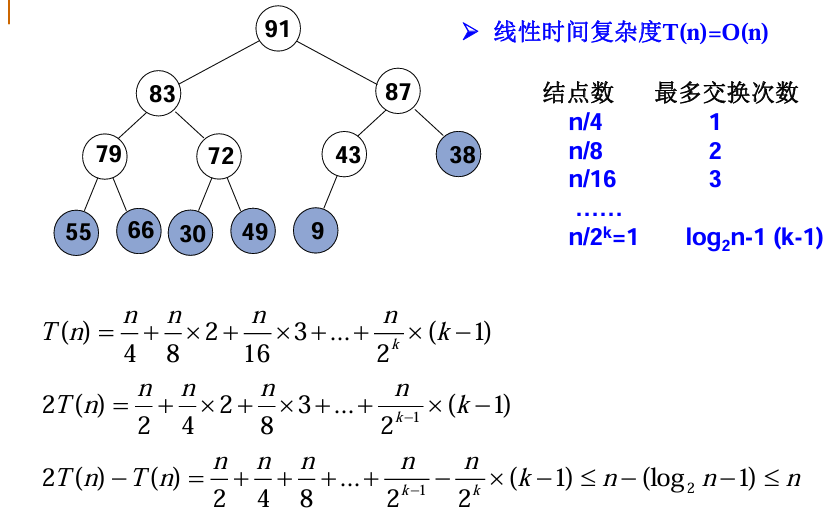
如上图所示，上图中的树是一棵完全二叉树，但是并不是一棵完美二叉树。假设这棵树有 $n$ 个结点，那么如图所示，我们从最后一个非叶子结点开始调整堆，**我们的目的是，让以该结点为根结点的树满足堆的性质**，很显然，这一层最多需要调整的次数为 $1$ 次，而很容易想到（证明），该层的结点数至多有 $\lfloor n/4 \rfloor$ 个结点。接着，往上走一层，这一层最多需要调整的次数为 $2$ 次，而该层的结点数至多有 $\lfloor n/8 \rfloor$ 个结点。依次类推，我们一直推理到根节点，可以按照图中求出总的时间复杂度。然后我们对其根据等比数列的求和公式，可以算出最终的时间复杂度 $< O(n)$ 。

### 堆排序

堆排序的思想是，我们先用`O(n)`时间或者`O(nlogn)`时间可以建立起一个堆，接着，我们每次删除堆顶元素，然后把堆的最末尾元素放到堆顶，然后调整堆（这样子从堆顶出来的数据一定有序），使得堆满足堆的性质，这又需要`O(nlogn)`的时间。这样子，我们就可以在`O(nlogn)`的时间内完成排序。

下面放几道使用堆的题目，大多通过库函数来实现。

### 6.4.1 LeetCode 2336 无限集中的最小数字

这道题看起来不是很难，20251205首刷，实际上，它的思路我认为有些反直觉。

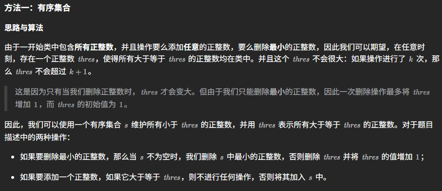

脑子需要转个弯，而不是简单的堆叠各种算法，认为值得二刷。

与这道题相似的题目还有1845题，20251207首刷，如果想要时间复杂度与n没关系，那么和这题的思路就几乎一模一样。

### 6.4.2 LeetCode 703 数据流中的第K大元素

这道题20251206首刷，也是脑子需要转个弯。我们把最大的K个元素放入小顶堆即可，那么堆顶就一定是第K大的元素，至于再小的元素，我们不用管，不需要入堆。所以每次add时候加入堆，如果堆的元素数量超过了K，那么弹出最小的堆顶，堆顶那个就是第K大的。

### 6.4.3 LeetCode 1834 单线程CPU

这道题20251212首刷，难点在模拟上。

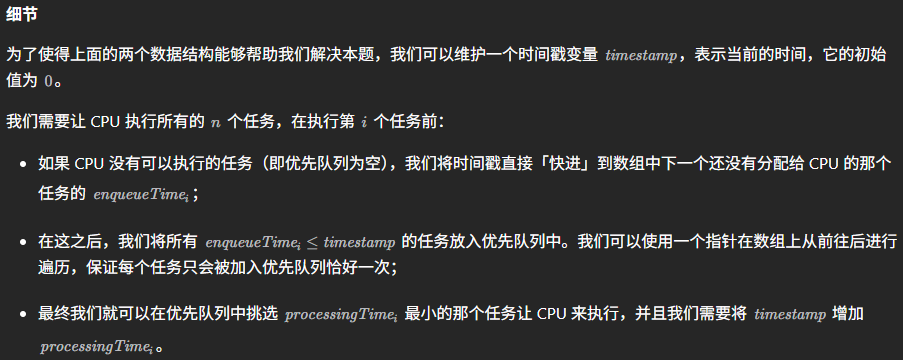

以上三个步骤，理顺了先后才能解决这道题。下面给一个具体实现：

```javascript
let time = 0
let p = 0
// 边执行，边入队
while (p < n) {
  if (minQueue.size() === 0 && time < tasks[p][0]) {
    time = tasks[p][0]
  }
  while (p < n && tasks[p][0] <= time) {
    minQueue.enqueue([tasks[p][2], tasks[p][1]])
    p++
  }
  if (minQueue.size() > 0) {
    const temp = minQueue.dequeue()
    time += temp[1]
    order.push(temp[0])
  }
}
// 全部都入队了，剩下来的依次按顺序执行
while (minQueue.size() > 0) {
  order.push(minQueue.dequeue()[0])
}
```

## 6.5 单调队列

**单调队列套路：**

1. 入（元素进入**队尾**，同时维护队列**单调性**）
2. 出（元素离开**队首**）
3. 记录/维护答案（根据**队首**）

在C++语言下，我们使用`deque`来实现单调队列。`deque`是一个双端队列，可以在队首和队尾进行插入和删除操作。**需要注意的是，`deque`也可以支持随机访问，它是除了`vector` `string`外又一个可以使用`[]`访问的容器。**

`deque`的操作方法也很简单，加上队首只是相比于`vector`多了`pop_front()`和`push_front()`方法。

### 6.5.1 LeetCode 239 —— 滑动窗口最大值

这道题是一道经典的单调队列题。单调队列的特点是，队列中的元素是单调递增或者单调递减的。这样子，我们可以在O(1)的时间复杂度内找到队列中的最大值或者最小值。

这道题20240714首刷，20250407二刷，还是不会做，非常经典，三刷还是应该再做一做。

### 6.5.2 LeetCode 1438 绝对差不超过限制的最长连续子数组

这是上面第239题的变形，解法十分巧妙，20250408首刷，目前还没有合适的题解，直接看代码，二刷一定要做，非常精悍。

```javascript
/**
 * @param {number[]} nums
 * @param {number} limit
 * @return {number}
 */
var longestSubarray = function (nums, limit) {
  let qmax = [] // 最大值队列
  let qmin = [] // 最小值队列
  let ans = 0
  let l = 0
  for (let i = 0; i < nums.length; i++) {
    while (qmax.length !== 0 && nums[qmax[qmax.length - 1]] < nums[i]) {
      qmax.pop()
    }
    qmax.push(i)
    while (qmin.length !== 0 && nums[qmin[qmin.length - 1]] > nums[i]) {
      qmin.pop()
    }
    qmin.push(i)

    while (
      qmax.length !== 0 &&
      qmin.length !== 0 &&
      Math.abs(nums[qmax[0]] - nums[qmin[0]]) > limit
    ) {
      if (nums[qmax[0]] === nums[l]) qmax.shift()
      if (nums[qmin[0]] === nums[l]) qmin.shift()
      l++
    }

    ans = Math.max(ans, i - l + 1)
  }

  return ans
}
```

### 6.5.3 LeetCode 862 和至少为K的最短子数组

这个题是前缀和+单调队列，可以理解解题思路，但是感觉自己想不出来。20250410首刷，仿佛已经达到思维上限。参看灵神题解。

### 6.5.4 LeetCode 1499 满足不等式的最大值

20250425首刷。这个题经过一个简单的变形可以变成单调队列，需要注意的是，计算最大值一定要在队尾出列之前，否则会遗漏。

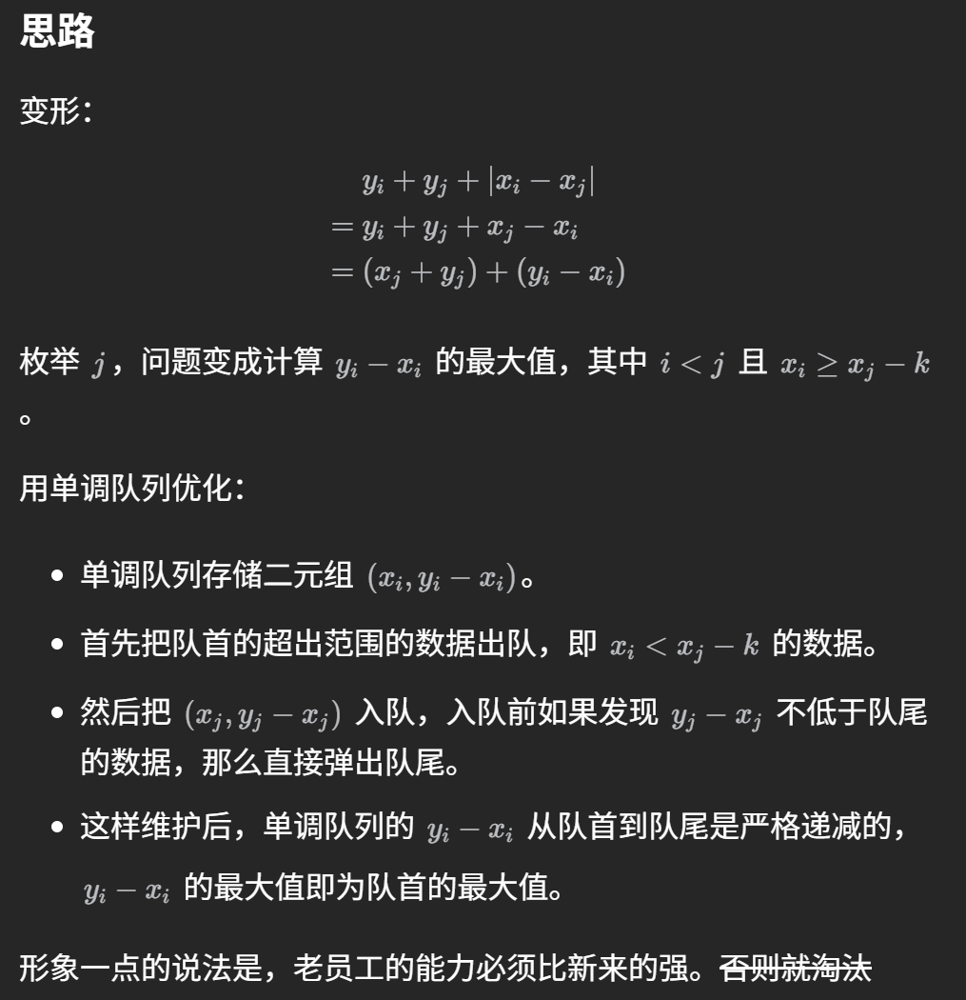

## 6.6 单调栈

### 6.6.1 LeetCode 739 每日温度

单调栈的入门题。这个题和“接雨水”很类似。更好用单调栈的解法是，从右向左看`temperatures`，如果当前元素大于等于栈中元素，那么在前面的看到的一定是当前元素，因此直接把栈中元素弹掉。栈中存储的是元素的索引，这样通过计算两数之间的差值就是需要花的时间。

### 6.6.2 LeetCode 42 接雨水

这是力扣“臭名昭著”的题目，20240518首刷，20250331二刷。二刷时有思路且正确，但是没能实现代码。我觉得下次刷要是还解决不了，就看灵神视频或者我的一刷代码。

### 6.6.3 LeetCode 84 柱状图中最大的矩形

刷这个题前我刷了很多单调栈的题目，但都没有变形，非常简单。这个题有一些变形。单调栈只是这个题目中的一部分，最关键是要知道，面积最大的矩形的高度一定在`heights`数组中。有点像是思维题，20250404首刷，不保证二刷能做出，所以值得二刷。


### 6.6.4 LeetCode 3542 将所有元素变为0的最少操作次数

这道题20260425首刷，起初和题解中的分治法想法一样，但是要用到ST表或者线段树，写起来很麻烦，也没学过，因此不知道该咋做。本题的单调栈解法非常的巧妙，但理解起来有比较困难，思维量大。

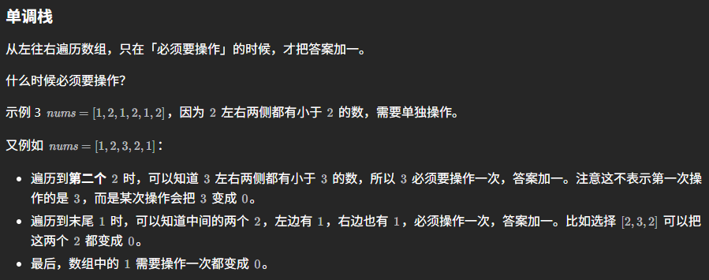

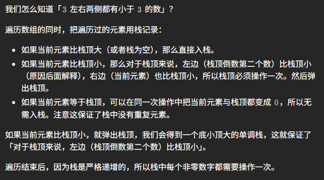

# 7 递归、回溯和分治

**从这一章开始我们跳出对基本数据结构的理解，开始走向算法设计。**

## 7.1 子集型回溯问题

本节基于LeetCode 78、17。

LeetCode 78 是我入手这一类问题的门。

下图是考虑子集型回溯问题的思路：

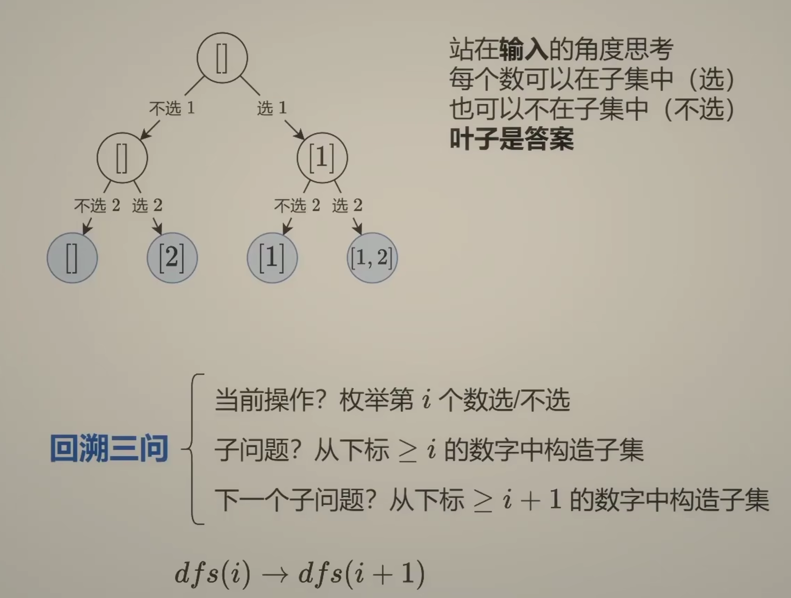

这是个思路一。事实上，还有思路二，按照灵神的说法就是站在答案的角度想问题。这种思路二的方法我还不会，有待补充。**思路一近似于动态规划的思想**。

模板见下：

```cpp
// LeetCode 78
class Solution {
public:
    int n;
    vector<vector<int>> ans;    // 全局变量存答案

    vector<vector<int>> subsets(vector<int>& nums) {
        vector<int> path;
        n = nums.size();
        dfs(nums, path, 0);
        return ans;
    }

    void dfs(vector<int>& nums, vector<int>& path, int i){
        if(i == n){
            ans.push_back(path);
            return;
        }
        // 不选这个，直接dfs下一个
        dfs(nums, path, i + 1);
        // 选这个，需要将这个加入path中，再dfs，最后再弹出
        path.push_back(nums[i]);
        dfs(nums, path, i + 1);
        path.pop_back();
    }
};
```

## 7.2 对称二叉树 LeetCode 101

这个题没啥好讲的，从上往下比较，比较左边节点和右边节点值是否相同后，在比较左边节点左儿子和右边节点右儿子是否相同以及左边节点右儿子和右边节点左儿子是否相同。但这个题的算法实在是太巧妙了，很难想到。

## 7.3 LeetCode 105 前序中序遍历构造树

也是递归。但是这题不好写。**可以动手多练。**

## 7.4 LeetCode 131 分割回文串

这个题，假设每对相邻字符之间有个逗号，那么就看每个逗号是选还是不选。通过这种方式完成回溯。这个题代码不容易写，建议多练。

## 7.5 排列型回溯问题 LeetCode 51 N皇后

这个题，20250703首刷，其实困扰我很长时间，之前看了题解，但是自己手敲不出来，最后是跟着灵神的代码敲了一遍，可以说看是看懂了，但下次大概率不会做，值得二刷。

这个题跟第46题全排列差不多，这是从灵神的视频里了解到的。

## 7.6 LeetCode 2002 两个回文子序列长度的最大乘积

这道题20260601首刷，其实就是一个暴力题，不要把它想复杂用普通回溯就可以做。这道题我的收获就是，有的时候难题练多了，可能有的题并没有那么难，反倒是简单方法能够解决问题。

# 8 贪心

**贪心，顾名思义，就是每一步都选择最优值。下面从几个例题中出发。**

## 8.1 LeetCode 376 摆动序列

**这个题略抽象。贪心的点在于，我们每一次都选择在`峰`或者在`谷`中的值。** 只需计算峰和谷的数量，我们就可以算出序列中存在多少个元素。

这个题贪心很复杂，我觉得不如动态规划。

## 8.2 LeetCode 402 移掉K位数字

**这个题目主要采用贪心+单调栈的思想。这个题目很经典，非常不错。**

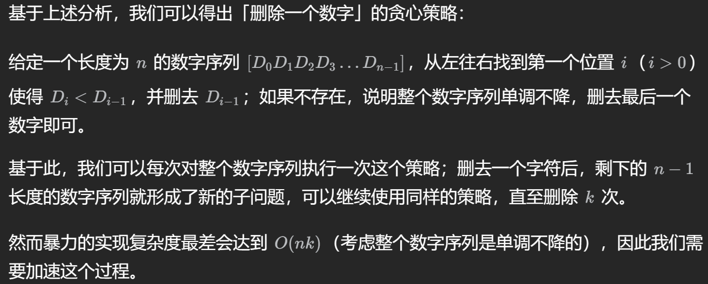


## 8.3 LeetCode 995 K连续位的最小翻转次数

这道题是贪心+差分结合，20251107首刷。贪心的点在于，每次遇到0就翻转，差分的点在于，如何高效地维护当前位的状态。

## 8.4 LeetCode 1558 得到目标数组的最少函数调用次数

这道题20260406首刷，我知道是贪心，也很容易想到要尽可能用乘法。问题是怎么实现呢？我们要使用逆向思维，从nums恢复到0，得到的效果是一样的。在恢复时，只有所有数字都是偶数我们才能除以2，这就好实现了。

## 8.5 LeetCode 1326 灌溉花园的最少水龙头数目

本题20260501首刷，是一道非常巧妙的贪心转化题。其实这道题并没有hard的难度，我们只需换一种方法表述本题，那么结果也就显然了。

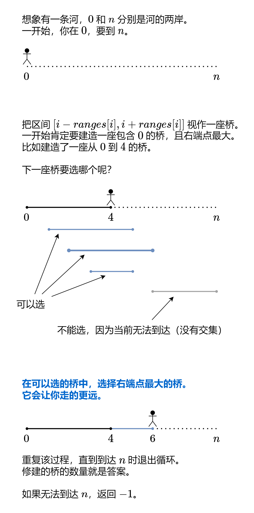

## 8.6 LeetCode 1616 分割两个字符串得到回文串

本题20260602首刷，是一道双指针+贪心的题。我在做的时候连双指针的部分也没想到，有一定的思维量，值得二刷。此外这个贪心，好像看着答案很好想，但是你自己做就没那么好做。

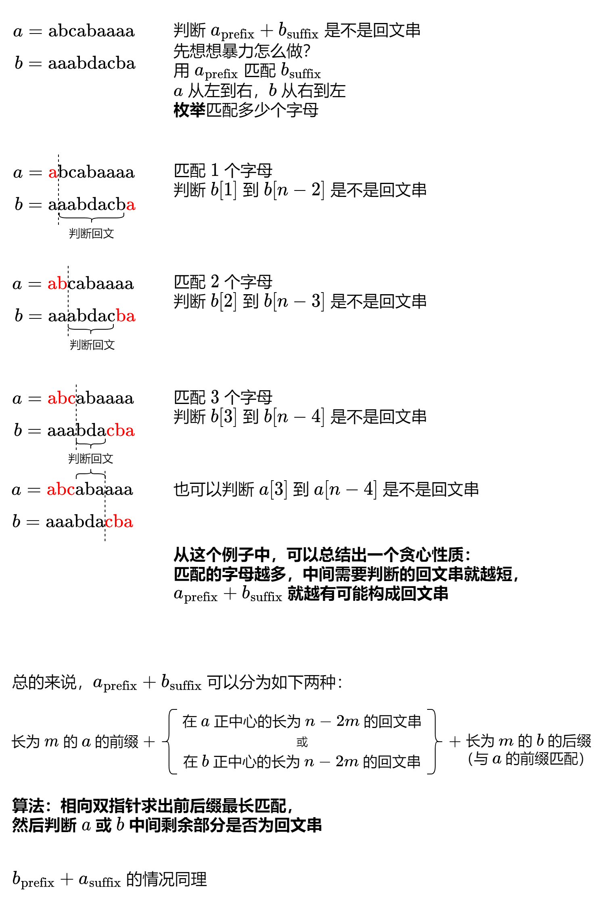

## 8.7 LeetCode 1717 删除子字符串的最大得分

本题20260604首刷，是一道贪心+栈的题。本题的贪心策略容易想到，但是不好证明。我们来看一下官解的证明方法：

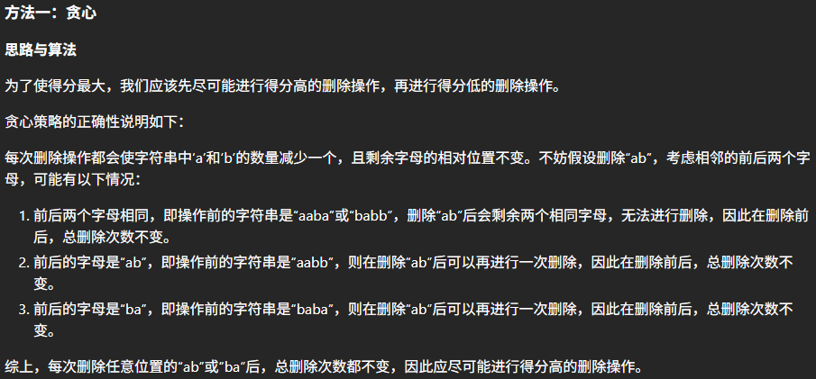

另外，我们只需要两次遍历就可以了，第一遍把所有的得分大的字符串删完，第二遍再把所有得分小的字符串删完。我们可以思考一下，第二遍删的时候，是一定不会有得分大的字符串出现的，为什么自己证明。总的时间复杂度就达到了$O(n)$。

## 8.8 LeetCode 1605 给定行和列的和求可行矩阵

本题20260605首刷，又是一道贪心题，甚至有点脑筋急转弯的性质。连续多天的贪心让我感觉自己的思维有点跟不上，我们来看一下这个题目的思路：

我们的解法就是，从最左上角的格子开始填，每次一行一行的填，每次填的格子都是允许的行列最大值（换言之，就是允许的行最大值和列最大值两个最大值再来个最小值，才能保证符合题意）。我们来看下实现代码：

```javascript
var restoreMatrix = function (rowSum, colSum) {
  const m = rowSum.length,
    n = colSum.length
  const ans = new Array(m)
  for (let i = 0; i < m; i++) {
    ans[i] = new Array(n)
  }
  for (let i = 0; i < m; i++) {
    for (let j = 0; j < n; j++) {
      ans[i][j] = Math.min(rowSum[i], colSum[j])
      rowSum[i] -= ans[i][j]
      colSum[j] -= ans[i][j]
    }
  }
  return ans
}
```

最重要的是贪心正确性的证明，我认为我的脑子目前是想不出这个思路的：

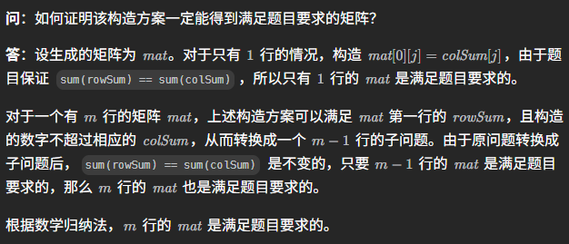

所以本题目值得二刷。

## 8.9 LeetCode 3961 设备评分的最大和

本题是20260614周赛的题，20260615首刷。难点在于想清楚它的思路：

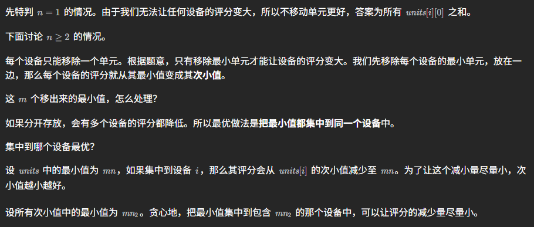

这一类题没有什么技巧可言，全在于对题目的灵感。值得二刷。

# 9 技巧题、数学题

## 9.1 LeetCode 136 只出现一次的数字（位运算）

这个题使用位运算来实现。算法是，可以证明，我们只要把所有数字都亦或一遍（因为两个数相同亦或是0，一个数和0亦或是这个数本身），最后的结果就是只出现一次的数字。

## 9.2 LeetCode 189 轮转数组

这个题看起来也像技巧题。假设需要向右轮转$k$次，那么将数组向右轮转的办法是反转整个数组之后，先反转数组的前$k$位，后反转数组的后$n-k$位。

## 9.3 UVa 846 一维石子游戏

这个题是一道经典的技巧题。**这个题的解法是，我们可以通过数学归纳法证明，我们只需要找到一个数，使得这个数的平方小于等于$n$，这个数就是我们的答案。**

## 9.4 LeetCode 3644 排序排列

这道题是20250810周赛的题，20250811首刷。脑筋急转弯。先从特殊情况开始想，题目没有说这题无解，但是`k`却又只能是唯一的值，难道这题一定有解吗？事实是一定有解。那么我们先想，位运算做出来，最小应该是`0`，那么如果`0`是`k`，一定能完成交换吗？答案是肯定的，见下面的推理流程：

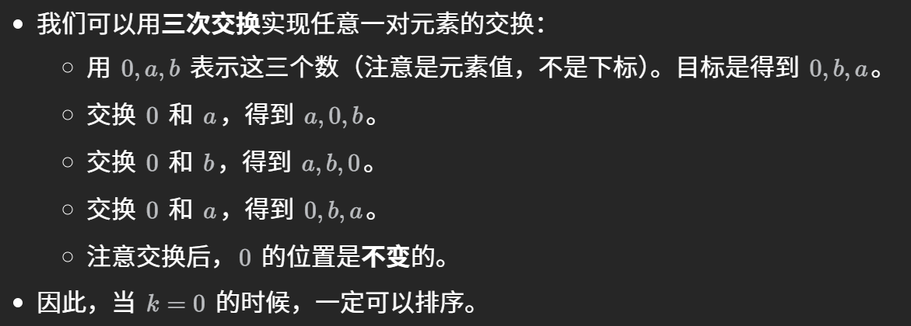

事实上，在证明了上面这个结论之后，不难想到这题的答案就是**所有一开始不在正确位置的数字，他们一起做`AND`运算之后的值**。具体怎么证明见灵神的视频，我感觉这题很难评价它的意义在哪里，从中我们能够学到什么。

## 9.5 LeetCode 3649 完美对的数目

这道题是20250816双周赛的题，20250818首刷。题目中有两个知识点，一个是利用绝对值的几何意义去化简绝对值不等式，另一个是一个小脑筋急转弯。这个题看起来不难，但是在比赛的时候还真不一定能想到做出来。

首先是化简绝对值不等式：

$$min(|a - b|, |a + b|) <= min(|a|, |b|)$$
$$max(|a - b|, |a + b|) >= max(|a|, |b|)$$

化简的方法很简单，**注意一定要想到 $|a + b| = |a - (-b)|$**，否则这题就做不出来，无法用几何意义化简。实际上，这里的第二个式子是恒成立的，而第一个式子，经过化简可以得到：**本质上来说，我们需要从数组中选两个数，满足大的那个数的绝对值，不能超过小的那个数的绝对值乘以2。**

接下来就来到了这道题的第二个点，脑筋急转弯。题目要求我们`i < j`，然而实际上，我们仔细想想，这个作用只是为了确保我们在选两个数的时候，例如`(a, b)`与`(b, a)`，他们俩是同一个数对。所以我可以直接花费 $O(n\log(n))$ 的时间复杂度对原来数组按照每个数的绝对值大小进行排序，再用滑动窗口解决。

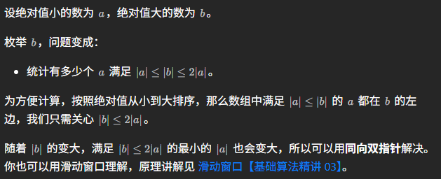

这道题十分巧妙，很好，非常值得二刷。

## 9.6 LeetCode 2327 知道秘密的人数

这道题20251015首刷。这道题的突破点在于，考虑维护一个数组`known`，其中`known[i]`表示恰好在第`i`天得知秘密的人数。为什么是恰好？如果不这样定义，第`i`天各种人（刚知道秘密，昨天知道秘密，前天知道秘密，……）混在一起，不好处理。

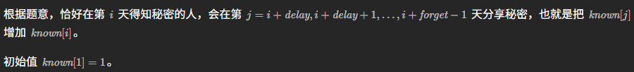

第二个转折点：

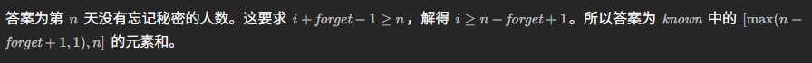

理解清楚上面两个点，这道题基本搞明白了，但是后面还有差分或者前缀和的优化，由于我还不会，在这里先不做赘述。

## 9.7 LeetCode 1526 形成目标数组的子数组最少增加次数

这道题20251108首刷，是一道差分数组的题目，同时有些脑筋急转弯的思想。我们要形成目标数组，其实可以变成形成目标数组的差分数组，这是显然且非常好理解的。

为了最小化操作次数，优先修改两个位置上的数（加一减一），然后再考虑单独加一。

注意到，无论每次操作修改的是两个数还是一个数，一定会把一个数加一。所以最小操作次数等于加一的次数，即 d 中所有正数之和。上面两步就是脑筋急转弯的地方。

## 9.8 LeetCode 3532 针对图的路径存在性查询 I

这道题20251120首刷，本来是在练习并查集过程中刷到的，但是我把它归类为脑筋急转弯。转弯的点在于，如果相邻的点的距离都大于了`maxDiff`，那么这两个点是不可能连在一起的，就算由别的点相连也不行（因为别的点之间的距离肯定大于这两个点），想清楚这一点之后，你只需要每每判断相邻两个点是否属于同一类就可以。

## 9.9 LeetCode 3551 数位和排序需要的最小交换次数 置换环

这道题20251121首刷，首次了解到了**置换环**的思想。如果没想到置换环，那么这个题就解不出来。

https://www.cnblogs.com/TTS-TTS/p/17047104.html


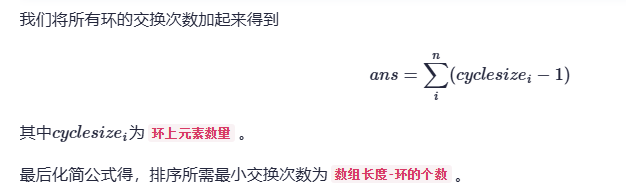

所以，这道题就变成了计算出如果要交换成后续的样子，形成多少个置换环的问题。这是一个求连通分量数量的问题，使用并查集来解决。

然而，在实现上面，仍然有技巧，我在这里贴上代码，来感受一下：

```javascript
/**
 * @param {number[]} nums
 * @return {number}
 */
var minSwaps = function (nums) {
  const n = nums.length
  const a = new Array(n)
  for (let i = 0; i < n; i++) {
    let s = 0
    for (let x = nums[i]; x > 0; x = Math.floor(x / 10)) {
      s += x % 10
    }
    a[i] = [s, nums[i], i]
  }
  a.sort((p, q) => (p[0] !== q[0] ? p[0] - q[0] : p[1] - q[1]))

  const uf = new UnionFind(n)
  for (let i = 0; i < n; i++) {
    uf.union(i, a[i][2])
  }
  return n - uf.cc
}
```

## 9.10 位运算

在这里单开一节位运算，是因为严格意义来说位运算属于数学范畴。位运算中有很多技巧，需要大量的刷题写题来沉淀。

先讲解两个常用符号：<< 表示左移，>> 表示右移。注：左移 i 位相当于乘以 $2^i$，右移 i 位相当于除以 $2^i$ 后向下取整。

### 9.10.1 常见位运算技巧

#### 9.10.1.1 求二进制长度

我们现在先来考虑一个非负整数的二进制长度。在JS中，我们如何计算一个数转化为二进制之后，它的长度是多少？也就是说我们把它叫成二进制长度大小，我们需要用到`Math.clz32()`方法，"clz32" 是 CountLeadingZeroes32 的缩写，这个函数的用途我们需要十分清楚，因为后面有很多用到它的地方：

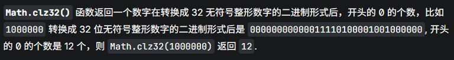

那么显然，一个数x的二进制长度就是：

`32 - Math.clz32(x)`

注意，上面的方法时间上是$O(1)$的。但是，上面这么做在x=0时会出现问题，因为当 x=0 时，32位二进制全为 0，因此前导零的个数是 32，即 Math.clz32(0) = 32。此时： [ 32 - Math.clz32(0) = 32 - 32 = 0 ]。但实际上，0的二进制表示为 0，其长度应为 1（至少包含一个0），因此 0 这个结果是错误的。

所以，我们需要特别考虑x=0的情况，单独处理。

```javascript
function getBinaryLength(x) {
  return x === 0 ? 1 : 32 - Math.clz32(x)
}
```

#### 9.10.1.2 求一个数的二进制表示中含1的个数

这个算法也非常重要。在Java中，求出一个数的二进制表示中含1的个数存在着库函数`Integer.bitCount(x)`。但是在JS中，我们需要手动实现。下面给出两种方法，都是在$O(1)$的时间内实现。

方法一：Brian Kernighan 算法

```javascript
function countOne(n) {
  let count = 0
  while (n) {
    n &= n - 1 // 每次消掉最右边的1
    count++
  }
  return count
}
```

算法的思想是，每次通过`n = n & n - 1`消掉最右边的1，直到n为0为止。每次消掉一个1，就说明原数的二进制表示中就多了一个1。所以，我们只需要统计消掉了多少个1，就可以得到原数的二进制表示中含1的个数。

为什么 n & (n-1) 一定消掉最右的 1？想清楚这个，本算法的思想就很好理解。

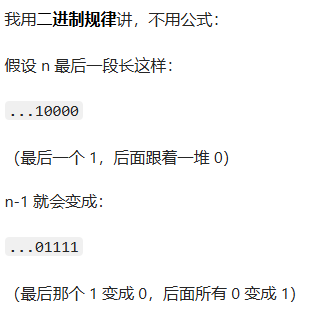

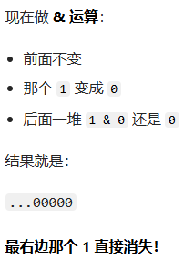

为什么算法是$O(1)$的？那是因为我们默认最多为32位整数，循环趟数最多为32，因此为$O(1)$。

方法二：直接参考Java库函数源码的实现方式

该方法叫做`bitCount32`，在此处只列出具体的算法逻辑，由于较难理解到目前（20260228）还未理解，因此不做解释：

```javascript
function bitCount32(n) {
  n = n - ((n >> 1) & 0x55555555)
  n = (n & 0x33333333) + ((n >> 2) & 0x33333333)
  return (((n + (n >> 4)) & 0xf0f0f0f) * 0x1010101) >> 24
}
```

#### 9.10.1.3 二进制反转（LeetCode 190 颠倒二进制位）

这里特别说明一下二进制反转。实际上Java、C++中有库函数可以实现O(1)的二进制反转，但是在JS、Python中，我们需要手动实现，没有能直接调用的API。

这道题20240427首刷，20260311二刷。题目需要注意两点，第一点是数据范围在$[0, 2^{31} - 2]$，也就是说都是正数，符号位一定为0。第二点就是我们再反转的过程中，不能忽视这个数的前导0，满足了第二点，下面的分治思想才能有效。

首先给出思路，采用分治思想：

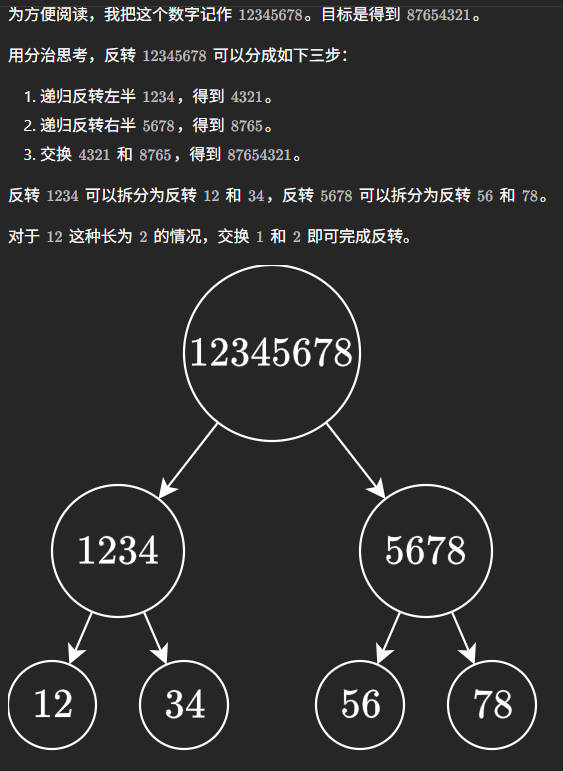

那么如何实现呢？只要理解了上面的图片，也就不难理解代码了：

```javascript
var reverseBits = function (n) {
  // 32位整数的二进制反转（O(1)时间复杂度）
  // 步骤1：16位块交换
  n = (n >>> 16) | (n << 16)
  // 步骤2：8位块交换
  n = ((n & 0xff00ff00) >>> 8) | ((n & 0x00ff00ff) << 8)
  // 步骤3：4位块交换
  n = ((n & 0xf0f0f0f0) >>> 4) | ((n & 0x0f0f0f0f) << 4)
  // 步骤4：2位块交换
  n = ((n & 0xcccccccc) >>> 2) | ((n & 0x33333333) << 2)
  // 步骤5：1位块交换
  n = ((n & 0xaaaaaaaa) >>> 1) | ((n & 0x55555555) << 1)
  return n
}
```

#### 9.10.1.4 异或求和（LeetCode 1486 数组异或操作）

这道题20260313首刷，暴力固然简单，但是我们的目标是做到O(1)时间复杂度。给出下面的分析：

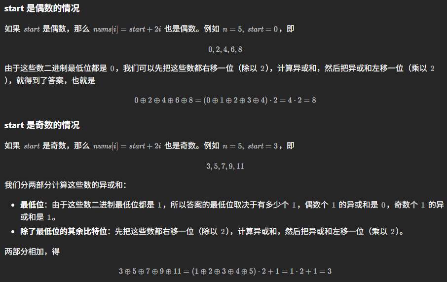

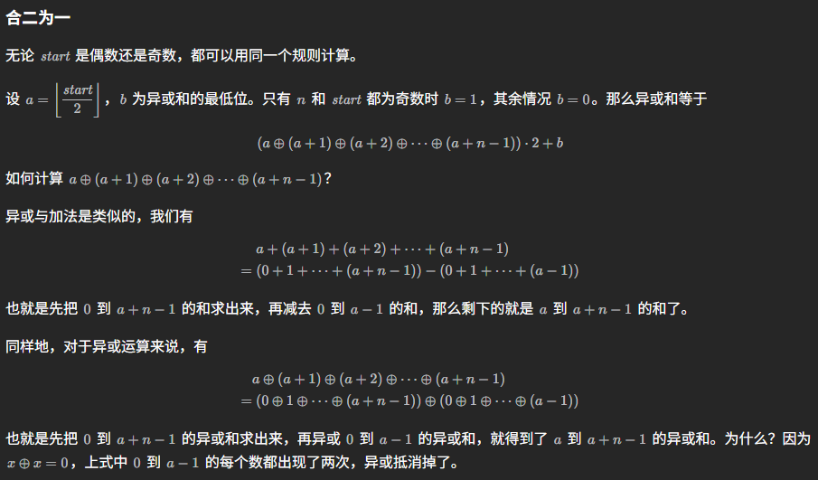

我们需要注意一点就是，异或运算它是满足交换律和结合律的。

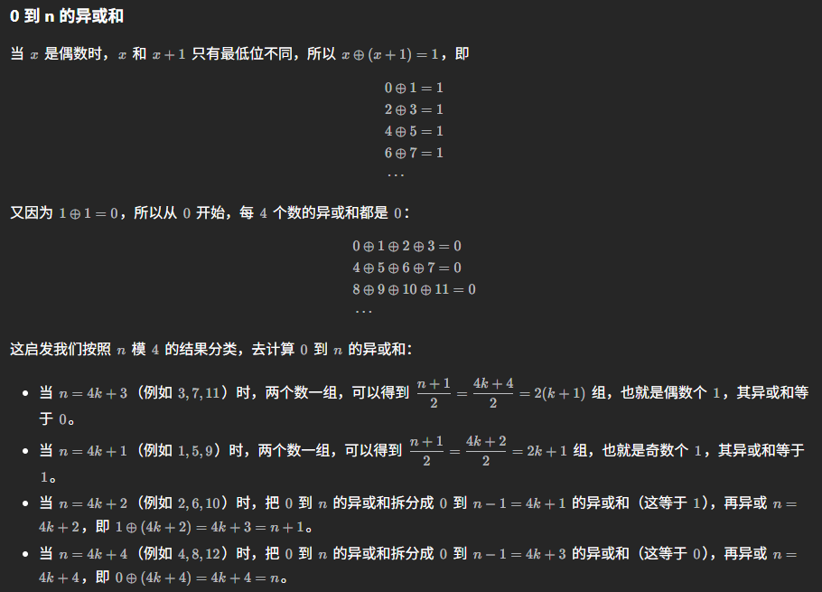

在这一张图中，我们需要清楚连续数字的异或运算4个一循环，这个结论很重要，后面会有很多题都可以套用这个结论。

#### 9.10.1.5 按位取反

我们需要注意的是，JS语言中不存在直接的有效位按位取反，如果使用`~`来取反，那么它会被当成32位有符号数，在计算机中把它的补码（包括符号位）来取反，示例如下：

```javascript
// 对于数字5（二进制：00000000000000000000000000000101）
console.log(~5) // 输出：-6
// 取反后：11111111111111111111111111111010，这是-6的补码表示

// 对于数字-3（二进制补码：11111111111111111111111111111101）
console.log(~-3) // 输出：2
// 取反后：00000000000000000000000000000010，这是2的补码表示，也是实际上的原码表示
```

关于原码、反码、补码，这里再多说一句，计算机中的数字以补码存储，我们现在只考虑整数，正数和0的原码、反码、补码相同，负数的反码是在其原码基础上，符号位不变，其他位取反，而对于负数的补码，是在其反码基础上，再加上1。

计算机在内部运算时，永远直接将两个用补码存储的数字来进行运算。

那我们如果要实际上将一个数现有的有效位的位数取反，其实很简单，只需要把它和`(1 << 有效位长度) - 1`进行异或即可。

#### 9.10.1.6 连续与 （LeetCode 201 数字范围按位与）

这道题其实有很多方法去解，一种是我想出来的思路，时间复杂度$O(\log n)$，当然还有更巧妙的$O(1)$解法，我们来看一下：

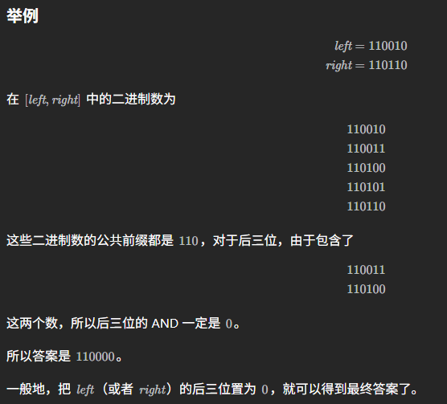

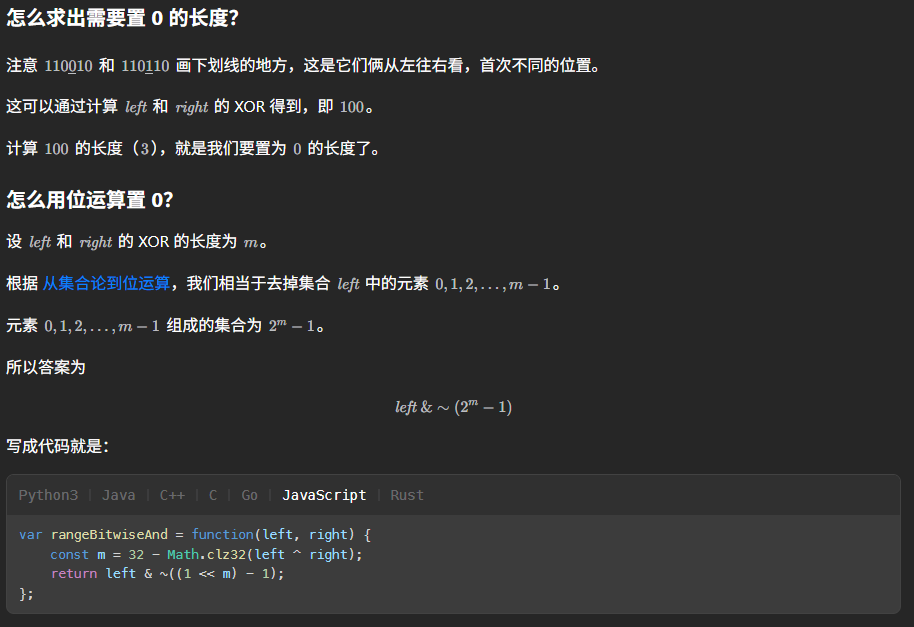

当然在这里也贴一个我的解法，虽然有点慢但是好理解：

```javascript
/**
 * @param {number} left
 * @param {number} right
 * @return {number}
 */
var rangeBitwiseAnd = function (left, right) {
  // 只要两二进制位数不同就一定是0
  const getBitLen = (x) => (x === 0 ? 1 : 32 - Math.clz32(x))
  let ans = 0
  let a = left,
    b = right
  while (getBitLen(a) === getBitLen(b)) {
    let temp = 1 << (getBitLen(a) - 1)
    if (temp === 1) {
      if (a === 1 && b === 1) ans |= temp
      break
    } else {
      ans |= temp
      a ^= temp
      b ^= temp
    }
  }
  return ans
}
```

### 9.10.2 LeetCode 3226 使两个整数相等的位更改次数

这道题20260216首刷。我们从位运算的角度去理解：

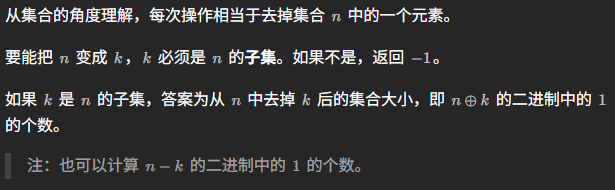

反应在代码上，就是这样：

```javascript
var minChanges = function (n, k) {
  return (n & k) !== k ? -1 : bitCount32(n ^ k)
}

function bitCount32(n) {
  n = n - ((n >> 1) & 0x55555555)
  n = (n & 0x33333333) + ((n >> 2) & 0x33333333)
  return (((n + (n >> 4)) & 0xf0f0f0f) * 0x1010101) >> 24
}
```

### 9.10.3 LeetCode 868 二进制间距

这道题20260303首刷，学到两个知识点，一个是lowbit，另一个是位运算中特别容易忽视的细节：

首先是lowbit，lowbit(x) 表示 x 二进制表示中最低位的 1 所对应的值：

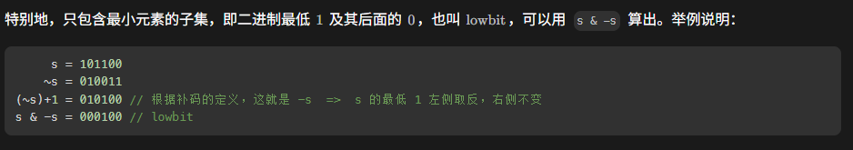

在计算机中，数字使用补码来存储和计算，实际上，把一个数按位取反，再加1，得到的数在计算机中的存储形式和它本身的相反数是一致的。我们看上面的图片中的例子，不难发现`s & ((~s) + 1)`可以得到lowbit，根据刚才说的结论，我们可以进一步化简成

$$lowbit = s \mathbin{\&} -s$$

这是一个非常重要的结论。

第二个经验就是，我们在JS中，不能简单把一个数向右移一位看成是除以2，事实上前面也说了，我们得是先除以2，然后向下取整。这样两个才能够看作是相等的。所以有的时候需要考虑到这种细节，避免出错。

### 9.10.4 LeetCode 2917 找出数组中的 K-or 值

这道题20260304首刷，虽然不难，但是代码的流程十分的精炼简洁，非常适合多次刷练手。我在这里把主要代码和思路贴出来：


```javascript
var findKOr = function (nums, k) {
  let ans = 0
  for (let i = 0; i < 31; i++) {
    // 枚举0-30的每个比特位
    let cnt = 0
    for (const x of nums) {
      cnt += Math.floor(x >> i) % 2
    }
    if (cnt >= k) ans += 1 << i
  }
  return ans
}
```

### 9.10.5 LeetCode 693 交替位二进制数

这道题20260305首刷，虽然不难，但也是属于技巧题，如果你掌握了位运算方法那么时间也是很快的。思路如下：

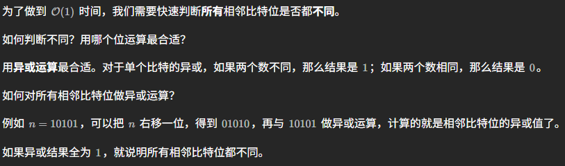

### 9.10.6 LeetCode 231 2的幂

这道题20260305首刷，紧跟着693。就是因为我们在693的最后还需要判断一下，什么情况下一个数的二进制展开全为1？


### 9.10.7 LeetCode 面试题05.01 插入

这道题20260307首刷，学到了非常多的东西，题目虽然不难，甚至可以用最基本的循环+数组实现，但是如果考虑用位运算来解的话，有非常多的细节要考虑到。我目前（20260307）还没有彻底搞懂，先贴上代码，以及我学到的一些知识点：

```javascript
var insertBits = function (n, m, i, j) {
  // 清除 n 的从低到高 i~j 位（i 从 0 开始）
  n &= ~(((1 << (j - i + 1)) - 1) << i)
  // 把 m 填入 n
  return n | (m << i)
}
```

整个思路如上所示，就是先清除i-j位，然后将M左移i位后与N相加。如何清除就是构造掩码，这个只要稍微学过一点位运算就不难想到，但是细节在于，j - i + 1如果大于等于31怎么办，为什么答案还是对的，我始终想不明白。

细节1：位运算的“坑”

- 大多数位运算符（<<、>>、&、|、^、~）基于32位有符号整数。
- 无符号右移（>>>） 基于32位无符号整数。
- 位运算的结果会被转换回64位浮点数存储（但值已被限制在32位整数范围内）。

这种设计源于底层硬件的整数运算实现，确保了位操作的跨平台一致性和执行效率。

所以实际上，1 << 31 是一个负数，我们也应该尽可能避免这种写法造成的影响。因为实际上，JS的Number以有符号整数在电脑中存储，且为64位的。Number类型基于IEEE 754双精度浮点数（64位），确实可以表示到 $2^{53} - 1$ 左右的整数。但位移操作的处理逻辑独立于存储范围，即使Number能存储更大的数，位移操作仍会强制转换为32位整数。

细节2：位运算左移右移规则：

左移或者右移，移动的位数会自动对32取模。也就是说，1 << 32 等价于 1 << 0，1 >> 32 等价于 1 >> 0。

### 9.10.8 LeetCode 3211 生成不含相邻零的二进制字符串

这道题20260309首刷，位运算的思路很巧妙：

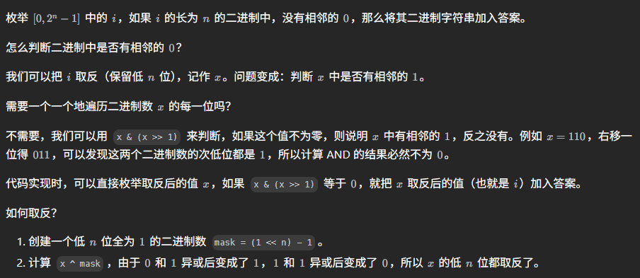

我们需要注意一点，就是不能直接用~i，因为~i会将i的每一位都取反，包括符号位。我们只需要取i的低n位。另外，padStart方法可以用来在字符串的开头填充指定的字符，直到字符串达到指定的长度。

### 9.10.9 LeetCode 2527 查询数组异或美丽值

这道题20260320首刷，纯数学题，使用分类讨论的思想，但是容易猜出来答案：

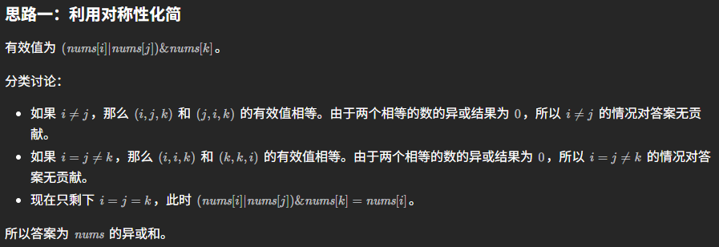

### 9.10.10 拆位/贡献法

这一类题其实有一种统一的思想，就是将一个数的二进制展开，逐位考虑对答案的贡献。一般来说一个数据范围肯定不超过32位，那么只需要遍历32\*O(n)的时间基本上就可以解决问题。

#### 9.10.10.1 LeetCode 1318 或运算的最小翻转次数

这道题20260328首刷，如果单从题目去分析，其实很简单，不可能不会写。在这里我学到的是，它可以不用掩码的思想，可以不去开辟几个新的数组，而实现对一个数二进制的遍历。

来看一下这个题的解法，非常的巧妙，每次移动一定的位数，就可以同时取到这么些位：

```javascript
var minFlips = function (a, b, c) {
  const bitLength = (x) => (x === 0 ? 1 : 32 - Math.clz32(x))
  // 求出最大位数
  const maxBitLength = Math.max(bitLength(a), bitLength(b), bitLength(c))
  let cnt = 0
  for (let i = 0; i < maxBitLength; i++) {
    const bit_a = (a >> i) & 1
    const bit_b = (b >> i) & 1
    const bit_c = (c >> i) & 1
    if (bit_c === 0) cnt += bit_a + bit_b
    else cnt += bit_a + bit_b === 0 ? 1 : 0
  }
  return cnt
}
```

#### 9.10.10.2 LeetCode 477 汉明距离总和

这道题20260401首刷，1318题的思想在这道题里也能体现。

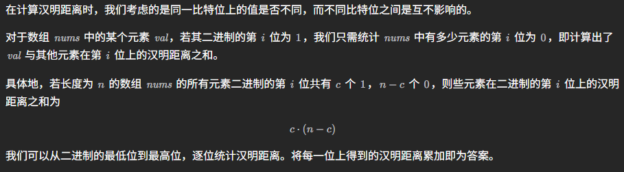

#### 9.10.10.3 LeetCode 1863 找出所有子集的异或总和再求和

这道题20260401首刷，也是拆位的思想，但是前置结论不好想到，需要提前证明：

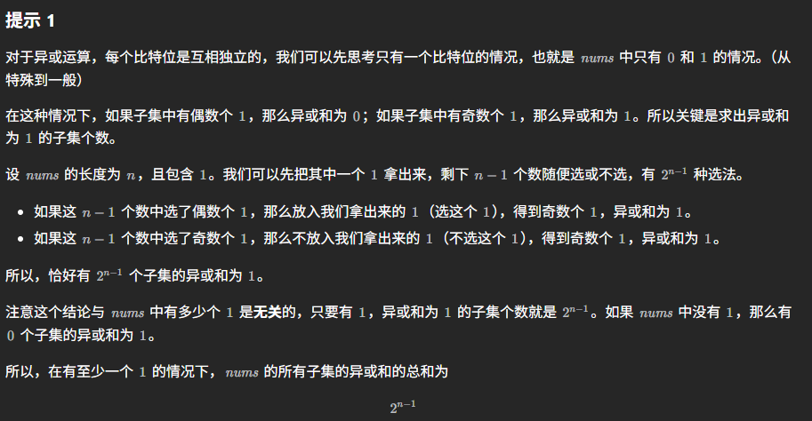

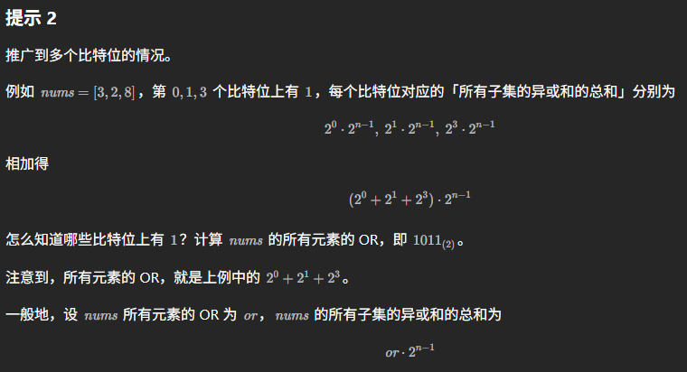

#### 9.10.10.4 LeetCode 1835 所有数对按位与结果的异或和

这道题20260403首刷，其实就是一个结论：

$$ x \mathbin{\&} (y \oplus z) = (x \mathbin{\&} y) \oplus (x \mathbin{\&} z) $$

另外，在位运算中证明一个结论，最直接的方法就是把每个数用0和1枚举。因为位运算是按每一位运算，所以我们可以枚举每一位的取值，来证明结论。

#### 9.10.10.5 LeetCode 137 只出现一次的数字II

这道题20260411首刷。这种叫做“只出现一次的数字”的题目，在力扣上出现了好多个变式，做法都十分巧妙，可以说是思维题。这道题如果用最简单的方法去实现题目的要求，就是使用拆位法。思路见下图。

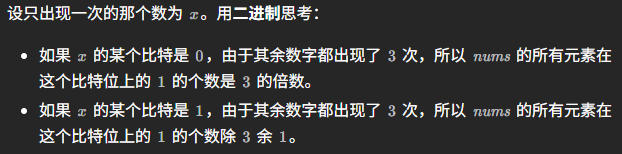

#### 9.10.10.6 LeetCode 3097 或值至少为K的最短子数组

这道题20260425首刷，是一道滑动窗口题目。在想到滑动窗口之后，我不知道怎么样快速的判断该窗口是否优雅，这就是本题使用拆位法的绝妙之点。我们只需要用一个数组bits，记录当前窗口每一位（最多30位）的元素个数，即可在O(30)的时间里面求出当前窗口是否优雅，快速化解了此问题。

### 9.10.11 LeetCode 2401 最长优雅子数组

这道题20260330首刷，是一道非常好的位运算题。这道题其实有两种解法，都需要巧妙用到位运算的性质。

解法一是暴力枚举：

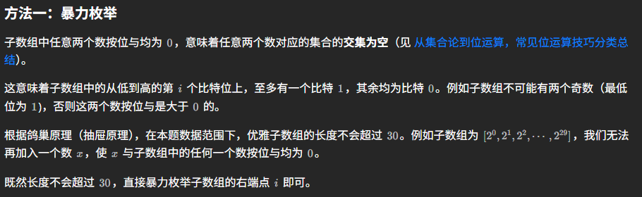

老实说我真没想到这题能用暴力枚举，但优雅子数组的长度确实没办法超过30。

解法二才是我们真正应该学习的通用方法：滑动窗口。可问题在于，我们怎么样快速去判断右边新加入的一项是否会导致子数组不优雅？其实我们可以用$O(1)$的时间复杂度就实现：


如果发现不可行了，那就再把之前的给用异或的方法去除掉，综上代码如下（感觉看代码更加容易懂）：

```javascript
var longestNiceSubarray = function (nums) {
  let ans = 0
  let or = 0
  let left = 0
  for (let right = 0; right < nums.length; right++) {
    while ((or & nums[right]) > 0) {
      or ^= nums[left]
      left++
    }
    or |= nums[right]
    ans = Math.max(ans, right - left + 1)
  }
  return ans
}
```

这是一道好题，非常值得二刷。

### 9.10.12 LeetCode 2546 执行逐位运算使字符串相等

这道题20260404首刷，是一道脑筋急转弯题。

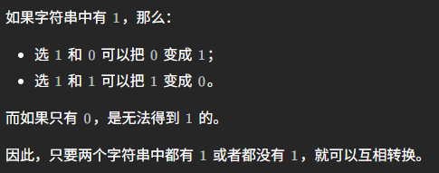

### 9.10.13 LeetCode 2568 最小无法得到的或值

这道题20260408首刷，也是一道思维题。

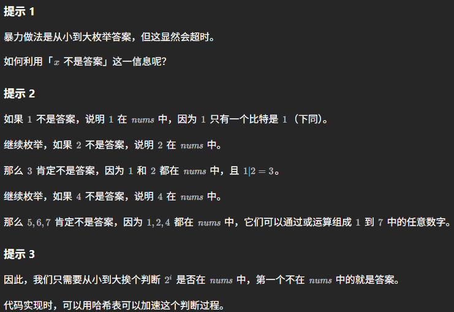

### 9.10.14 LeetCode 260 只出现一次的数字III

这道题20260408首刷，我认为还是一道脑筋急转弯。参考灵神题解。

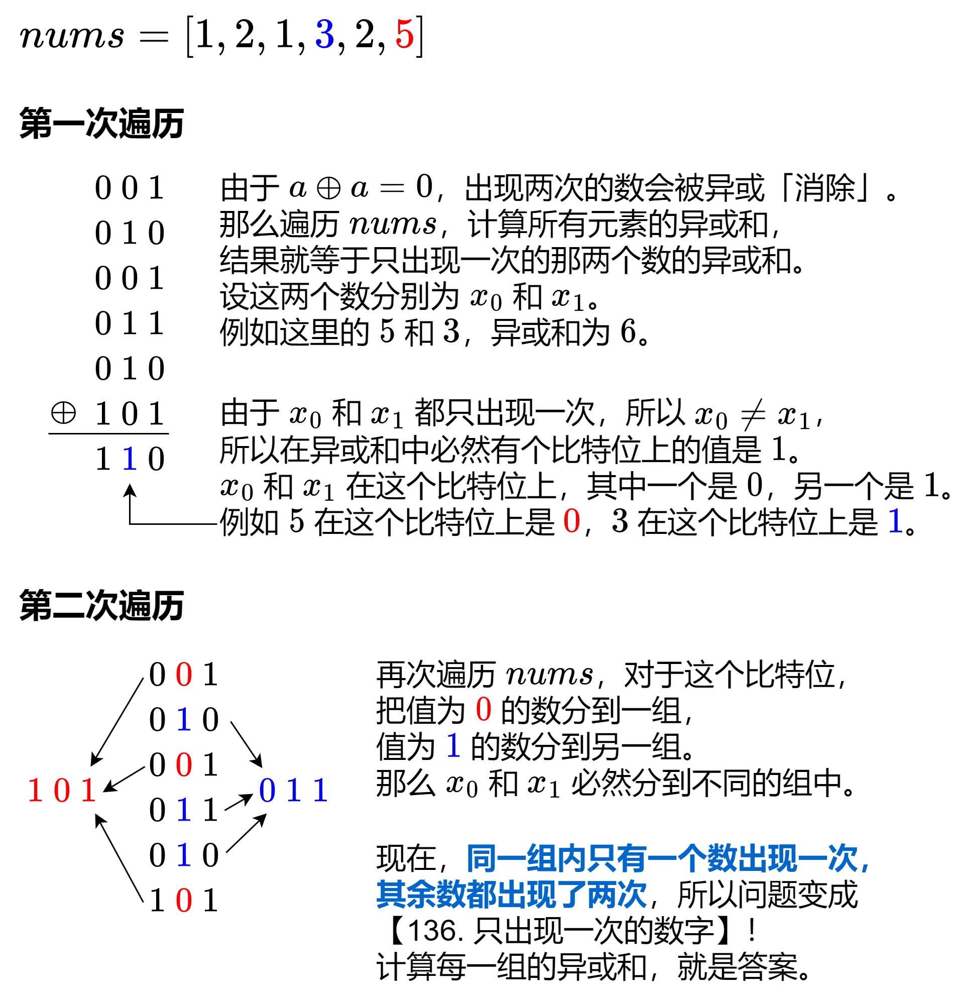

#### 9.10.14.1 LeetCode 2965 找出缺失和重复的数字

这道题20260409首刷，实现解决并不难，但是还是一样，如果我们的目标是让空间仅用$O(1)$，那么思路和前面的260题是很类似的。此外，这道题还需要一点变化，就是套用之前1486题在$O(1)$时间内算出0到某个数异或和的结论。此题考察的非常综合，可以简单做也可以高级做，非常适合二刷。

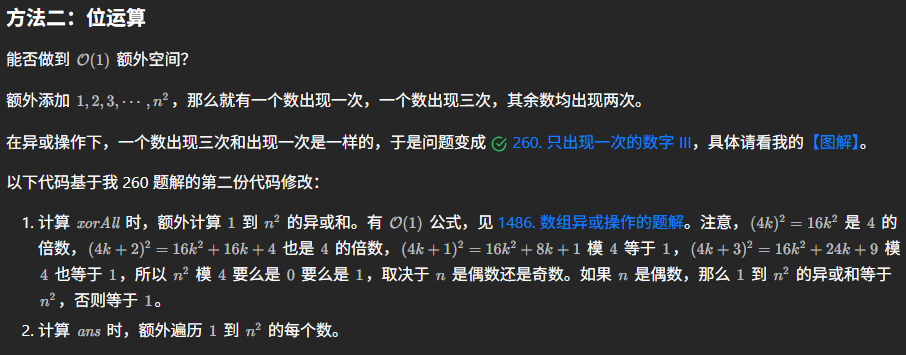

### 9.10.15 LeetCode 371 两整数之和

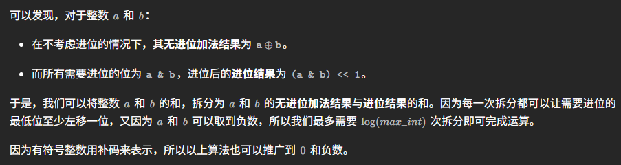

这道题20260413首刷，我觉得没什么好讲的，记结论：

```javascript
var getSum = function (a, b) {
  while (b != 0) {
    const carry = (a & b) << 1
    a = a ^ b
    b = carry
  }
  return a
}
```

### 9.10.16 LeetCode 89 格雷编码

这道题20260419首刷，我认为是一道结论题，做过就知道，没做过就不知道。基本上做了几分钟，发现用基本的算法没法解的时候，肯定就是用到某些数学方法。有两个非常巧妙的方法解决这个题，方法一采用归纳法，便于理解：

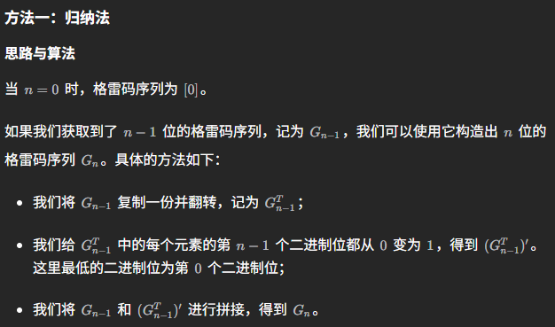

上面的正确性是显然的，证明略去，给出代码：

```javascript
/**
 * @param {number} n
 * @return {number[]}
 */
var grayCode = function (n) {
  const ret = [0]
  for (let i = 1; i <= n; i++) {
    const m = ret.length
    for (let j = m - 1; j >= 0; j--) {
      ret.push(ret[j] | (1 << (i - 1)))
    }
  }
  return ret
}
```

第二种方法是构造格雷编码的公式：


证明同样略去，建议背公式。

本题还有个变形，就是1238题。

## 9.11 LeetCode 1015 可被K整除的最小整数

本题20260522首刷，有些数学加上脑筋急转弯的性质。我们巧妙地使用模运算：

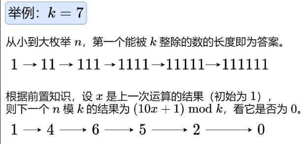

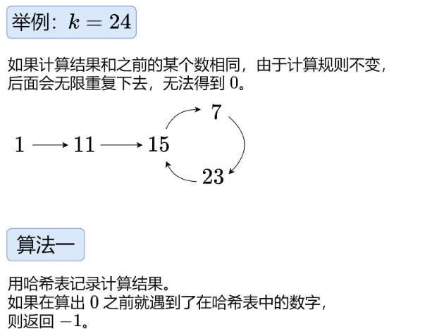

## 9.12 LeetCode 2975 移除栅栏得到的正方形田地的最大面积

这道题20260522首刷，仍旧是个数学题，并且带有脑筋急转弯性质，需要开动思维和脑筋，其实思路很简单：

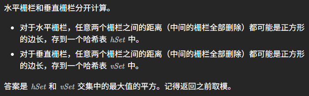

## 9.13 LeetCode 2196 根据描述创建二叉树

这道题20260609首刷，思路上建树没难度，但是技巧在于如何去寻找根节点。我们说这个寻找根节点的方法有点脑筋急转弯：

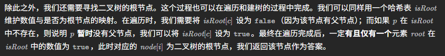

## 9.14 LeetCode 50 pow(x, n)

本题20260612首刷，这是最经典的快速幂算法。实现快速幂一般有两个办法，一个是递归，一个是迭代，迭代的算法更优，但是不是很好理解，因此在这里初学，我们先来介绍递归算法：

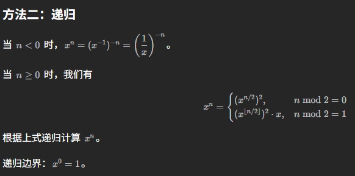

来看一下代码的实现：

```javascript
var myPow = function (x, n) {
  if (n < 0) {
    return myPow(1 / x, -n)
  }
  if (n === 0) {
    return 1
  }
  let res = myPow(x, Math.floor(n / 2))
  res *= res
  if (n % 2) {
    res *= x
  }
  return res
}
```

关于迭代算法，我们来看一下思路：

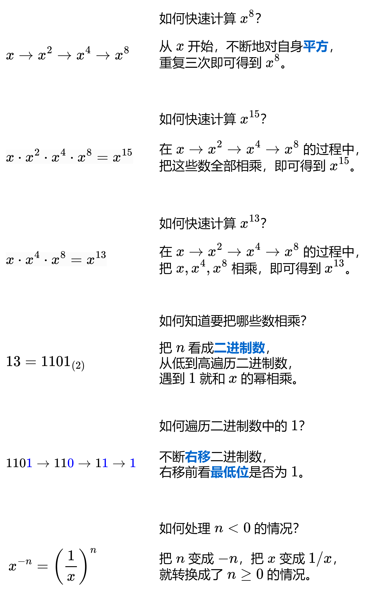

## 9.15 埃式筛

### 9.15.1 LeetCode 3326 使数组非递减的最少除法操作次数

这道题20260619首刷。思路几乎想到了，卡就卡在不知道如何进行预处理上。

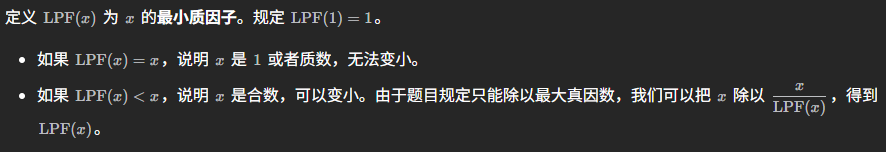

实际上，每一次变化，都会把这个数变成它的最小质因子。那么我们如何初始化这些最小质因子呢？我们来看一下代码：

```javascript
const MX = 10 ** 6 + 1
const lpf = new Array(MX).fill(-1) // 最小真因数
lpf[0] = 0
lpf[1] = 1
for (let i = 2; i < MX; i++) {
  if (lpf[i] === -1) {
    let j = 1
    while (i * j < MX) {
      if (lpf[i * j] === -1) lpf[i * j] = i
      j++
    }
  }
}
```

这实际上有点像埃式筛的原理。就是我不去想一个数的最小质因子是什么，而是去想某一个质因子能成为哪些数的最小质因子。上面的算法的时间复杂度为$O(U \log \log U)$，证明需要涉及数论，在此略去。

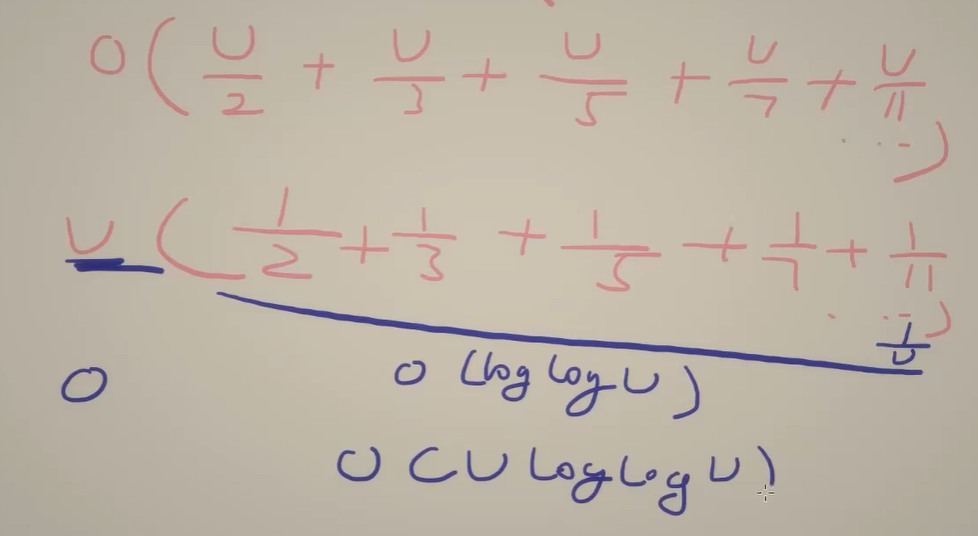

### 9.15.2 LeetCode 3233 统计不是特殊数字的数字数量

这道题20260623首刷。难点在于，你要想到只有质数的平方是特殊数字，然后再想到使用埃式筛去筛，这道题有一些思维量，值得二刷。

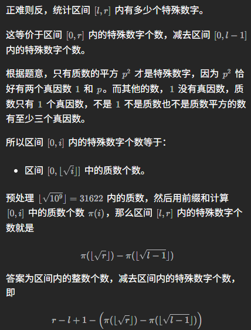

### 9.15.3 LeetCode 2507 使用质因数之和替换后可以取到的最小值

这道题20260626首刷。这个题解法不说，说一下时间复杂度的证明：

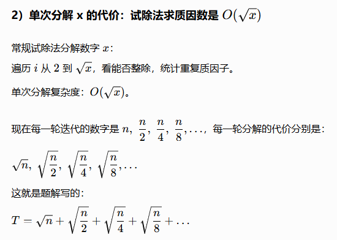

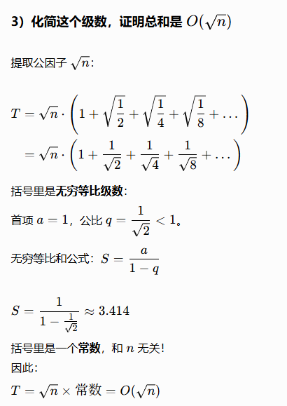

# 10 暴力与模拟

这部分类型的题，没有技巧可循，考验的就是纯代码能力。**注意，这种类型的题一定要想办法在紧张的环境下，限制自己的时间做题。** 这里推荐几个不错的题：

1. LeetCode 54 螺旋矩阵

2. LeetCode 240 搜索二维矩阵

3. LeetCode 3499 操作后最大活跃区段数I （不会直接看视频题解吧）

太妙了，实在是太妙了。从右上角开始搜索。

这种解法也同样适用于LeetCode 74。不过那个题简单。

# 11 排序

把排序题单独拎出来。这里主要是介绍归并排序与快速排序。

## 11.1 LeetCode 148 排序链表

这道题要求我们在链表上采用$O(nlog(n))$的时间复杂度来实现。显然我们得选择快速排序或者归并排序。这里我选择归并排序，参考K神的题解。**这种题一定要多动手实践**。

# 12 动态规划

## 12.1 LeetCode 5 最长回文子串 多维动态规划

针对这道题，我们定义`dp[i][j]`为“从i到j是否为回文子串”这一布尔类型。显然我们可以推导出这样的状态转移方程：dp[i][j] = dp[i + 1][j - 1] && (s[i] == s[j])。但显然这样子还不够。这些状态的初值如何确定呢？这里我们需要再添加一个判定条件：

```javascript
if (j - i < 2) {
  if (s[i] === s[j]) dp[i][j] = true // 如果这个字符串只有两个字符比较这两个字符是否相同
} else {
  dp[i][j] = dp[i + 1][j - 1] && s[i] === s[j]
}
```

那如果只有一个字符呢？我们需要在开始时就将dp[i][i]类型的所有值都赋为true。

**而这个题最恶心的地方，就在于将状态转移方程应用的时候，需要一列一列从上往下遍历。至于这个结果怎么来的可以参看力扣官方题解。**

## 12.2 LeetCode 1143 最长公共子序列 LCS

**典中典，务必掌握。**

搞清楚下面的状态转移方程：

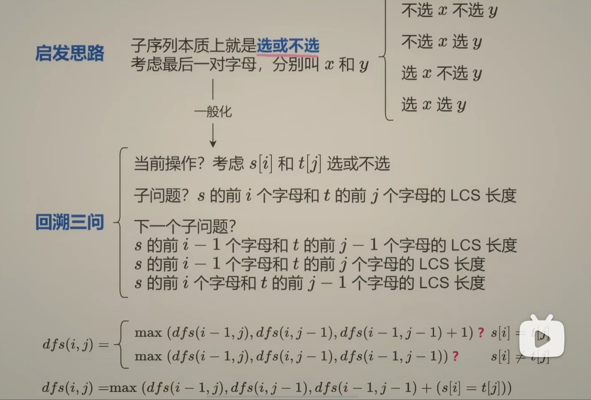

搞清楚简化版的状态转移方程，也就是可以优化的地方：

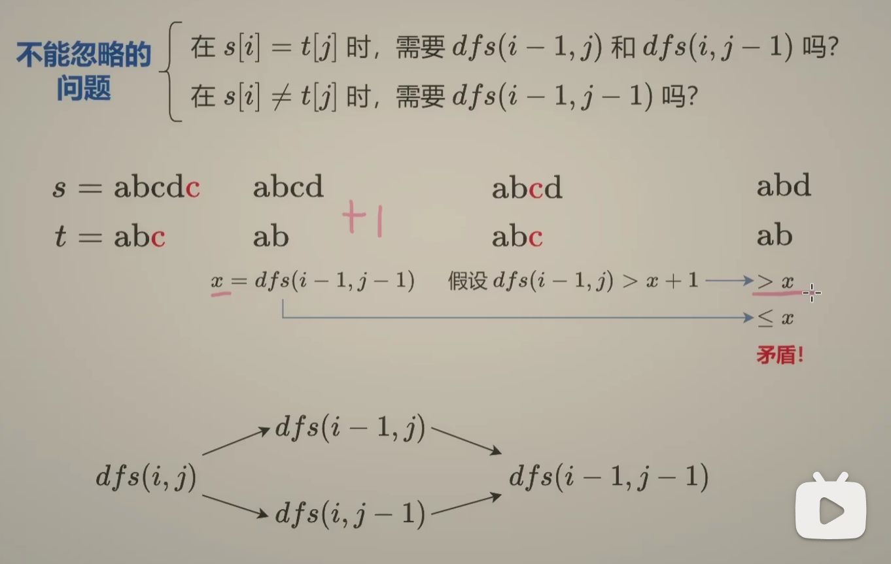

### 变式

**LeetCode 583** 两个字符串的删除操作，本质上就是1143，可以直接拿1143的代码写。**但是直接写对这个问题的动态规划代码更有助于锻炼思维。**


**LeetCode 97** 交错字符串。这个题我在一开始想的时候，想到了从后往前的动态规划，即：原问题，$s1[0:m]$ 和 $s2[0:n]$ 能否拼出交错的 $s3[0:k]$ ？如果 $s1[0] = s3[0]$，那么问题可以转化为由 $s1[1:m]$ 和 $s2[0:n]$ 能否拼出 $s3[1:k]$；如果 $s2[0] = s3[0]$，那么问题可以转化为由 $s1[0:m]$ 和 $s2[1:n]$ 能否拼出 $s3[1:k]$。我试图倒着来进行动态规划，但这样子很难实现。**实际上，这个思路同正解已经很近了，后来参考了官解，正着动态规划。** **2025新年第一刷，这个题可以反复练习。**

**LeetCode 115** 不同的子序列。非常好的困难题值得二刷，20250107首刷。还是看官方题解，题解的设dp数组的方式十分巧妙。

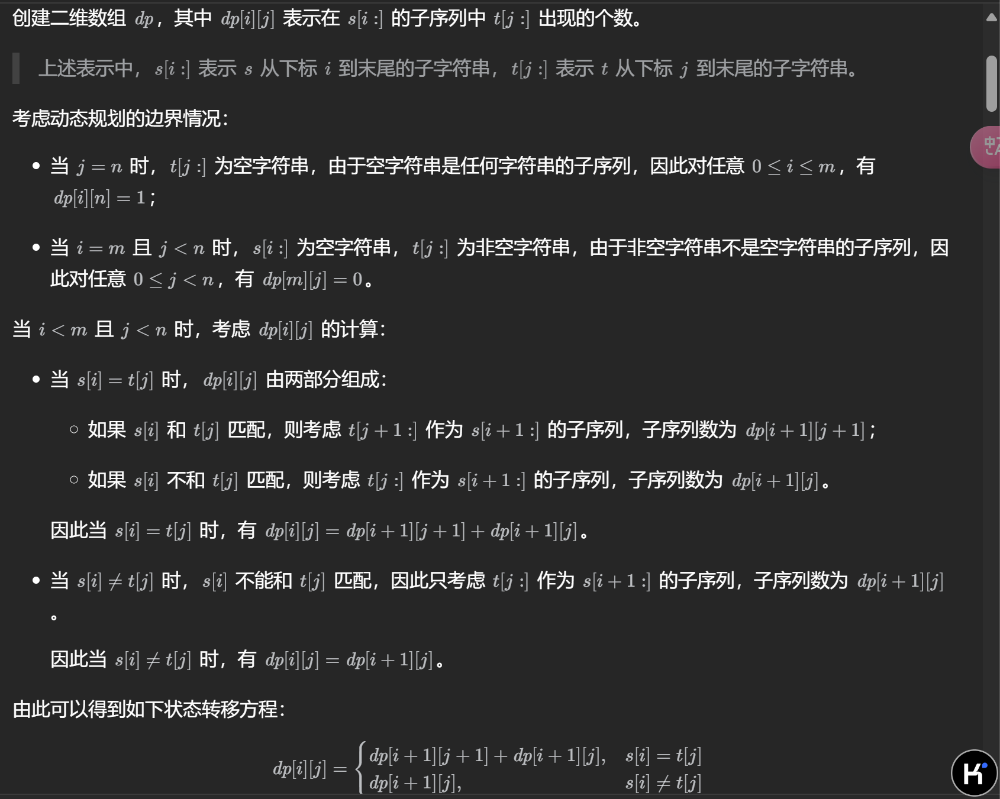

**LeetCode 1092** 最短公共超序列。20250115首刷。先求出LCS方案，接着使用双指针构造。我觉得这个题难在双指针部分，即如何在求出了LCS之后构造出最短公共超序列。好题，值得二刷。

## 12.3 LeetCode 300 最长上升子序列 LIS

**典中典，务必掌握。**

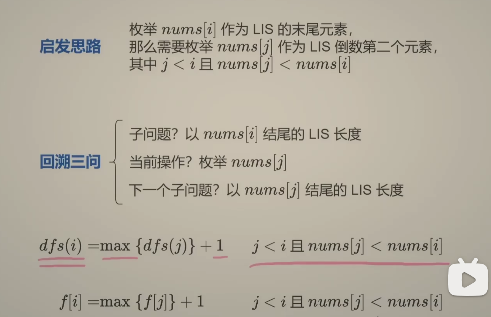

上面的普通动态规划方法时间复杂度是$O(n^2)$。**此外，还有一种使用贪心+二分的方法用于解决LIS类问题，可以将时间复杂度降到$O(nlogn)$，也需要掌握。** 下面介绍该方法：


把状态与状态值进行交换。定义$g[i]$为长度为$i + 1$的上升子序列末尾元素最小值。这实际上是一种贪心的思想，我让末尾元素尽可能小，是为了让后面的元素有更大的机会加入到这个子序列中。详细的证明过程见灵神的视频题解。

维护一个序列$p$，二分查找第一个下标$j$，让$p[j]>=nums[i]$，如果不存在，则直接把$nums[i]$加入$p$的末尾，否则替换$p[j]$为$nums[i]$。这样子，当我遍历完整个序列时，$p$的长度就是最长上升子序列的长度。

### 12.3.1 673 最长递增子序列的个数

这个题是300的变形，20250122首刷，目前只掌握了普通动态规划的方法。具体思路参考官方题解。

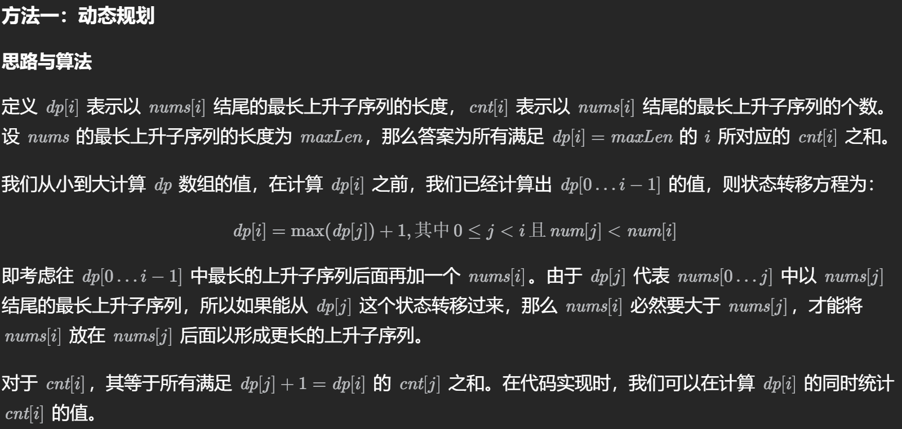

### 12.3.2 354 俄罗斯套娃信封问题

这个题是在300题的基础上套了二维变形，20250125首刷。一开始我想的是对一维和二维都进行升序排序，但是实际上，**对第二个维度进行降序排序更能接近这题的本质。** 为什么呢？看下面：（下面的`h`就是第二个维度）

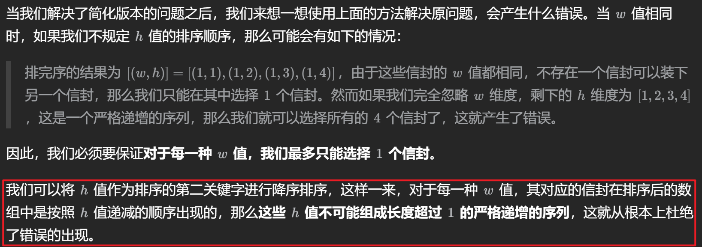

对第一和第二维排完序之后，只需要对第二维求LIS即可。

**这两个变形题也都出的非常经典，十分适合二刷。**

## 12.4 LeetCode 152 乘积最大子数组

这个题没啥好说的，关键难度在于状态转移方程的设计，2024.9.3是理解了，**改天再拿来做一遍**，如果做不出来就说明还没掌握。智商题。

## 12.5 LeetCode 72 编辑距离

这个题也是典中典，务必掌握。**这个题的状态转移方程是最难的。**

整不明白看视频题解：https://leetcode.cn/problems/edit-distance/solutions/188223/bian-ji-ju-chi-by-leetcode-solution/

首先，我们要搞懂：**如果`word1[i] === word2[j]`，那么我们只需要比较word1[0...i-1]和word2[0...j-1]就可以了。** 这样子操作，也即是把两个word的最后一个字符给删去。

那如果`word1[i] !== word2[j]`呢？接下来，我们尝试理解编辑的含义。请注意，我们说的“编辑”操作都只针对`word1`而言。

大家不妨试着想一想，“插入”“删除”“替换”这些操作到底干了一件什么事？我们这样想，假设我把`word2[j]`放在了`word1[i]`的后面，即`word1[i+1]`的位置，那么，我是不是可以把这两个字符同时删去？这样子，我就可以把问题转化为比较`word1[0...i]`和`word2[0...j-1]`的问题。

同理，如果我把`word1[i]`删去，那么我是不是可以把问题转化为比较`word1[0...i-1]`和`word2[0...j]`的问题？如果我把`word1[i]`替换成`word2[j]`，那么我是不是可以把问题转化为比较`word1[0...i-1]`和`word2[0...j-1]`的问题？

**选择最小耗费的一步操作，随后我们需要将其得到的结果+1。我们用一个数组dp来存储耗费的步数。**

用两个图来搞清楚：


## 12.6 LeetCode 53 最大子数组和

不说了，直接上代码，20241006理解了，下次再拿出来刷：

```javascript
/**
 * @param {number[]} nums
 * @return {number}
 */
var maxSubArray = function (nums) {
  let n = nums.length
  let dp = new Array(nums.length)
  dp[n - 1] = nums[n - 1]
  for (let i = n - 2; i >= 0; i--) {
    dp[i] = nums[i] + Math.max(0, dp[i + 1])
  }
  let ans = dp[0]
  for (let i = 1; i < nums.length; i++) {
    if (dp[i] > ans) ans = dp[i]
  }
  return ans
}
```

**这个题有个变形，是1749这个题，我在20241105拿出来做了，它只需要求两遍，一遍求最大值一遍求最小值即可，有点像脑筋急转弯问题。**

**这个题还有个变形，是991这个题。在20241108拿出来做了，也像是脑筋急转弯，只需要减掉中间的最小值，用同样的算法求出最小值即可。但这个题需要特别注意边界条件，相对1749上了难度。**

## 12.7 LeetCode 2266 统计打字方案数

这道题是爬楼梯+斐波那契额数列的进阶，关键在于理解两个状态转移方程：

$f[i] = (f[i - 1] + f[i - 2] + f[i - 3]) \% MOD$

$g[i] = (g[i - 1] + g[i - 2] + g[i - 3] + g[i - 4]) \% MOD$

两个状态转移方程如何理解？

当已知$dp[i-1]$的情况下，我们多加1个字符，如果 $chs[i] == chs[i-1]$ ，则加的那个字符可以作为一个单独字母跟之前的方案组成方案(方案数为$dp[i-1]$)，也可以与第$i-1$个字符组合变成另一个字母，然后与前面的字符组成新方案(方案数目为$dp[i-2]$)，但如果 $i-2<0$ ，则第$i$与$i-1$的字符组成的字母单独作为1个方案。

## 12.8 LeetCode 2435 矩阵中和能被K整除的路径

日期：20241205

这个题的技巧在于：把路径和模 $k$ 的结果当成一个扩展维度。具体地，定义 $f[i][j][v]$ 表示从左上走到 $(i,j)$，且路径和模 $k$ 的结果为 $v$ 时的路径数。

这个题让我知道了JS如何初始化三维数组，还是只能使用最笨的方法一维一维初始化。此外，为了防止某些状态转移方程下标越界，我们可以把每个下标都加上1。此外关于此题的初始化和状态转移方程也十分的巧妙。我在这里贴出完整代码。

这道题并不算太难，没有太大的数学思维量，却有着很巧妙的编程思维和动态规划思维。十分适合二刷。

```javascript
/**
 * @param {number[][]} grid
 * @param {number} k
 * @return {number}
 */
var numberOfPaths = function (grid, k) {
  const MOD = 10 ** 9 + 7
  // 技巧：把路径和模 k 的结果当成一个扩展维度。
  // 初始化三维数组
  let m = grid.length
  let n = grid[0].length
  let arr = new Array(m + 1)
  for (let i = 0; i < m + 1; i++) {
    arr[i] = new Array(n + 1)
    for (let j = 0; j < n + 1; j++) {
      arr[i][j] = new Array(k).fill(0)
    }
  }
  arr[1][1][grid[0][0] % k] = 1 // 初始化
  for (let i = 0; i < m; i++) {
    for (let j = 0; j < n; j++) {
      for (let v = 0; v < k; v++) {
        arr[i + 1][j + 1][(v + grid[i][j]) % k] =
          (arr[i + 1][j + 1][(v + grid[i][j]) % k] +
            arr[i][j + 1][v] +
            arr[i + 1][j][v]) %
          MOD // 刷表法
      }
    }
  }
  return arr[m][n][0]
}
```

## 12.9 0-1 背包问题

我们来看一下这一类问题，通常采用动态规划进行求解：

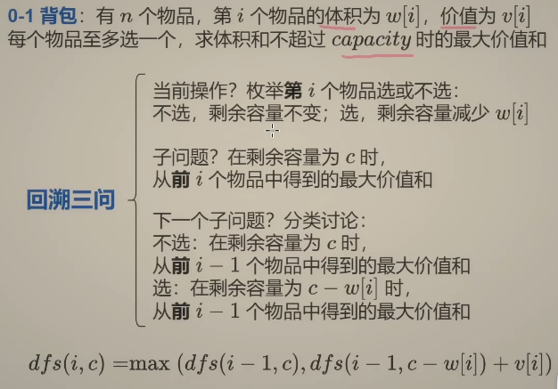

### 12.9.1 LeetCode 494 目标和

20241207首刷。

这道题是背包问题的应用。众所周知，背包问题可以使用**回溯**法，但是对于很多竞赛题目来说，回溯的时间复杂度太高，会超时。虽然这道题不会超时，但是后面的很多问题都会超时。所以，我们需要把回溯改成动态规划。

**递归搜索 + 保存计算结果 = 记忆化搜索**

这道题参考灵神解法，我们可以把题目变成一个背包问题。接着，参照**选或不选**的思路，我们可以推出状态转移方程：

$dfs(i, c) = dfs(i - 1, c) + dfs(i - 1, c - nums[i])$

其中i为nums中的第i个元素，c为当前背包的和。

用一个dp数组记忆化存储，便加速了整个过程。**为了方便代码实现，我们把状态转移方程中的i加了1。** 完整代码参考力扣。

转移方程变成了$dfs(i + 1, c) = dfs(i, c) + dfs(i, c - nums[i])$。但这里我有个问题至始至终都不太清楚，那就是，**为什么后面的`nums[i]`不需要将i加1？**

接着，把思路变为递推。难点在于，怎样理解初始化？`dp[0][0] = 1;` 意思就是，当我们没有任何元素时，背包和为0的方案数为1。这个初始化是很巧妙的，需要多揣摩。

总的来说，这是一道十分经典的问题，是背包变形的基础，需要多多练习。

### 12.9.2 LeetCode 2915 和为目标值的最长子序列的长度

这道题20260323首刷，感觉又忘记了0-1背包。本题是恰好装满型0-1背包。这种类型的题上来就要想到动态规划：

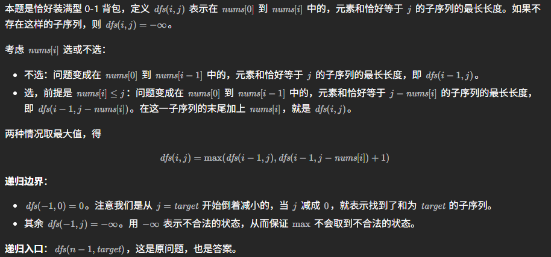

### 12.9.3 LeetCode 3877 达到目标异或值的最少删除次数

这道题是20260322的Q3竞赛题，20260324首刷，本题思路和前面的2915大致一致。有一个问题我一直没想明白，看下面的解答：


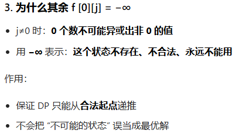

这个思路给到前面的2915也适用，加深了理解。

## 12.10 LeetCode 2218 从栈中取出K个硬币的最大面值和

20241227首刷。这道题通过前缀和转化为了一个背包问题，十分适合二刷。

## 12.11 状态机DP

这一类问题，代表题目为力扣上的**股票类问题**。所谓状态机DP，一般定义 $f[i][j]$ 表示前缀 $a[:i]$ 在状态 $j$ 下的最优值。一般 $j$ 都很小。

这一类题的解法我不喜欢灵神的解题思路，有点绕。个人推荐yyj的题解。整体思路如下：

```python
class Solution:
    def maxProfit(self, prices: List[int]) -> int:
        # 甲：这n天怎样买股票赚的多-------------------------------------
        n = len(prices)

        # 乙：dp[i]代表第i天-------------------------------------------
        # 乙：dp[i][0]代表第i天过后手上有股票时的最大收益
        # 乙：总之，今天过后我必有股票在手上，要么之前买的，要么今天买的
        # 乙：dp[i][1]代表第i天过后手上无股票时的最大收益
        # 乙：总之，今天过后我手上空空如也，要么本来就没有，有我也给卖了
        dp = [[0, 0] for _ in range(n)]

        # 乙： 今天是第一天---------------------------------------------
        # 乙： 保证必须有股票是吧，prices[0]块钱拿去，今天股票我买了
        # 乙： 保证没有股票，啥都不干就好了
        dp[0] = [-prices[0], 0]

        # 旁白： 时间一天天过去
        for i in range(1, n):
            # 甲： 今天是第i天，如果我一定要保证自己有股票，该怎么操作------
            # 乙： dp[i-1][0] 今天的股票太贵了，买之前的股票更划算
            # 乙： - prices[i] 今天的股票更便宜，我买了，prices[i]块钱拿去
            dp[i][0] = max(dp[i-1][0], - prices[i])

            # 甲： 今天是第i天，如果我一定要保证自己没有股票，该怎么操作------
            # 乙： dp[i-1][1] 今天股市不行，还是之前卖更划算
            # 乙： + prices[i] + dp[i-1][0] 今天的行情不错，股票卖掉，血赚prices[i]块钱，
            # dp[i-1][0]是我用低价买入花的钱
            dp[i][1] = max(dp[i-1][1], + prices[i] + dp[i-1][0])

        return dp[-1][-1]
```

### 12.11.1 LeetCode 2826 将三个数排序

这个题我们之前用了LIS的方法解决过，解决LIS问题的最快方法时间是$O(nlogn)$的，但是这个题有更简单的方法，就是状态机DP。20250208首刷。

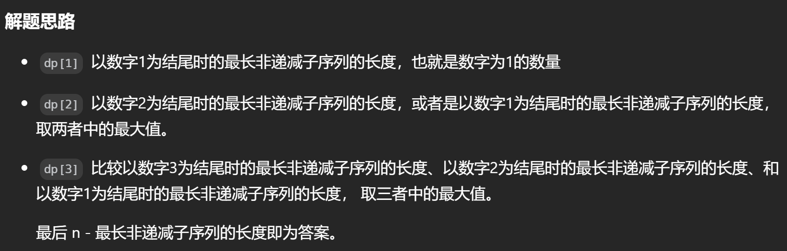

### 12.11.2 LeetCode 1911 最大子序列交替和

20250208首刷。参考下面的思路：

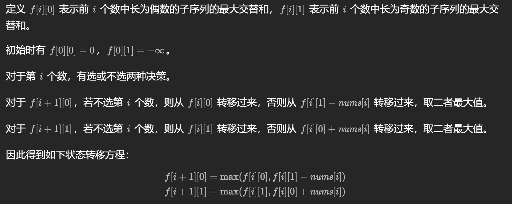

总结来说，状态机DP就是一类股票问题，这类问题关键是怎么样合理定义状态，写出状态转移方程。

## 12.12 区间DP

一般的线性DP，我们是在数组的前缀或者后缀进行转移的。而这一类区间DP，我们会把问题的规模缩小到数组中间的区间上，不仅仅是前缀或者后缀了。

一般而言，我们定义$f[i][j]$为区间$[i,j]$的最优值。

区间DP有两个经典题，516和1039。1039太难了首刷还没做。

### 12.12.0 LeetCode 516 最长回文子序列

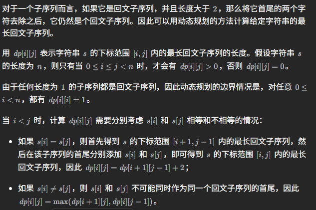

根据上面的思路，不难写出状态转移方程。

### 12.12.1 LeetCode 375 猜数字大小II

这个题没什么好说的，就是分区间，$O(n^3)$复杂度，也没法优化，20250222首刷，建议二刷。

### 12.12.2 LeetCode 132 分割回文串II

这个题连续套用两次DP，非常经典，20250225首刷。

一次就是初始化最小回文串，同力扣131。另一次还不能沿用上面那个猜数字大小的思想，而应该把状态定义为：$f[i]$表示前$i$个字符的最小分割次数。

**这道题给我的经验是如果一种定义方式行不通，不如考虑另外一种定义的方式，说不定会有惊喜之处。**

### 12.12.3 LeetCode 3040 相同分数的最大操作数II

这个题巧妙。20250226首刷。


### 12.12.4 LeetCode 1312 让字符串成为回文串的最少插入次数

这又是一个回文题，我发现回文题总是会喜欢和区间DP结合在一起出题，20250309首刷。


### 12.12.5 LeetCode 1770 执行乘法运算的最大分数

这个题非常好，20250310首刷。

这个题我起初用了$O(n^2)$的DP发现没做出来，内存超限了。一开始我定义状态的方式是$dp[i][j]$为存储采用题目这种方式计算的从`i`到`j`的最大分数。**但同样的思路对于Python3来说却没有任何问题，这就再一次说明了Python的@cache装饰器比普通定义状态的DP要来的灵活。**

接着我参考了题解，发现在其他语言上，用我一开始定义状态的方式是不可行的，我们需要转换对状态的定义。实际上，我们可以这样定义状态：$dp[p][q]$ 表示nums数组中前`p`个数和后`q`个数组成的最大分数。**接下来一步也很重要，这样子定义状态只能采用递推的方式，不能使用递归的方式了。**


我个人倾向于采用第二种遍历方式。

### 12.12.6 LeetCode 1771 由子序列构造的最长回文串的长度

这个题我在20250311的时候思考了10分钟没想出来，就看题解了，其实很简单，把`word1+word2`看成是一个字符串`s`，那么这个题就很接近于516了，但是此题有两个陷阱：


正确做法是什么意思呢，其实就是说，一旦我遇到了`s[i] === s[j]`的时候，我就要更新答案了，因为这个时候肯定是在`word1`和`word2`里都出现了字符。

### 12.12.7 LeetCode 1000 合并石头的最低成本

这个题使用了三维的区间DP，非常经典，值得二刷。20250313首刷。

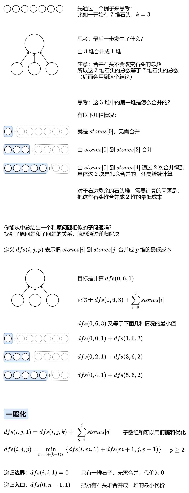

到此为止，区间DP告一段落，我发现DP的题的难点在于，**如何定义状态**，这个问题很重要，很多时候我们定义的状态不对，就会导致无法解决问题。**区间DP的题很多道都没有自己做出来，整理的也比较多，因为区间DP上手就比较难。未来还得多多练习。**

### 12.12.8 LeetCode 3472 至多K次操作后的最长回文子序列

这道题20260502首刷。是第516题的变形。在区间DP训练了一年之后，这道题已经完全想不出来判断回文串的解法了。我们说回文串+区间DP，还是要用选或不选的思路来解决，具体可见516题的视频题解，在此贴出本题的解法：

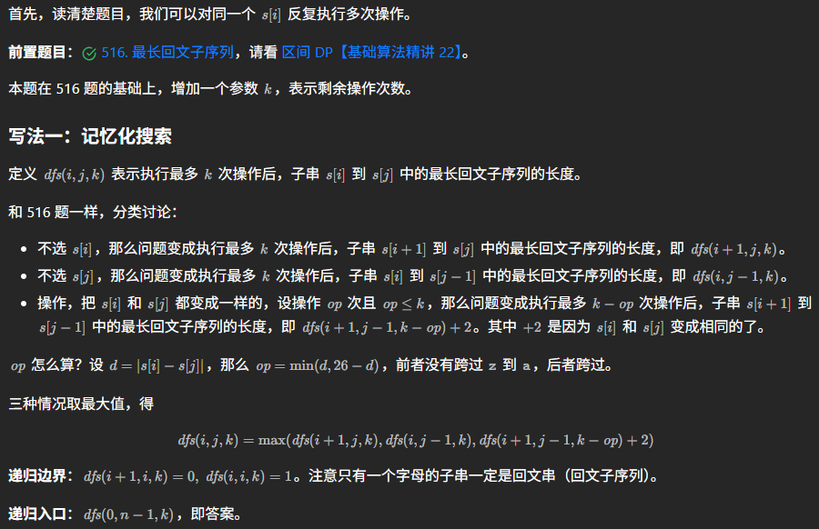

## 12.13 树形DP①：树的直径

### 12.13.1 再提 LeetCode 543 二叉树的直径

这道题在本文第3.1节的时候提到过。

### 12.13.2 LeetCode 3203 合并两棵树之后的最小直径

20250320首刷。这个题非常好，非常值得二刷。

这个题有两个要点，第一个最重要的，是这个题的核心思想。我在一开始写题的时候也想到了应该取两棵树直径的中点连起来，但为什么是这样？随后我听了灵神的题解：

**如果属于下图中第三种情况，即新树的直径经过添加的边，那么，新直径在第一棵树的部分一定是由接入第一棵树的点引出，到第一棵树的最远点。如果接入这棵树的点不在直径上，那么它肯定还要走到直径上，接着实现它走最远的梦想。所以它在直径上。如果它在直径上，那么为了最小肯定得忘中点附近靠，否则就不平衡了，肯定大于中点的长度。**

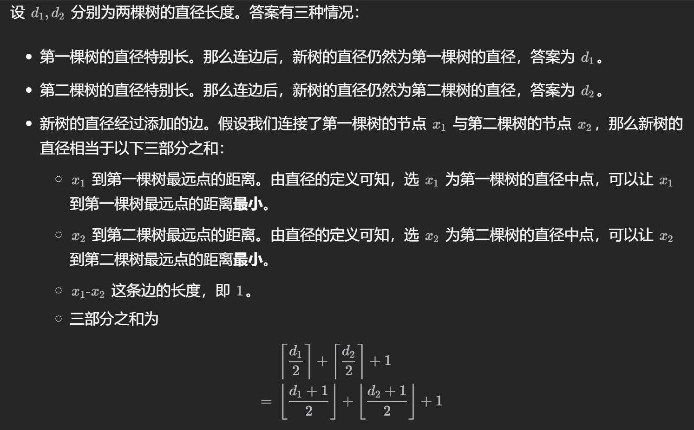

第二个就是具体实现上。如果没告诉你一棵树具体长什么样，而是完全是通过像本文中用了一个edges给出的，**竟然可以直接把树变成邻接表的形式存储，并用邻接表去遍历这棵树！** 建立完邻接表之后，要像灵神写的代码一样，你是需要知道这个结点从哪里遍历过来，我不能倒着遍历回去，所以可以在`dfs`遍历函数里面再加一个根节点，告诉当前结点你的父亲是谁，具体参见下面的代码：

```java
// Java
private int dfs(int x, int fa, List<Integer>[] g) {
    int maxLen = 0;
    for (int y : g[x]) {
        if (y != fa) {
            int subLen = dfs(y, x, g) + 1;
            res = Math.max(res, maxLen + subLen);
            maxLen = Math.max(maxLen, subLen);
        }
    }
    return maxLen;
}
```

## 12.14 树形DP②：树上最大独立集

最大独立集是指，在一个图中选择尽量多的点，使得这些点互不相邻。由于树是特殊的图，因此在这里也成立。

那么一个变形就是下面的337题，**使最大化点权之和。**

### 12.14.1 LeetCode 337 打家劫舍III

这道题20250323首刷。一开始我想在一个dfs中直接调两个dfs，但很可惜超时了。原因是，一个调两次，那么两个调四次，$n$个就会调$2^n$次，超时是必然的。

而如果直接沿用打家劫舍I的思想，也行不通，因为在一棵树中，隔点访问必然涉及判断树是否为空的过程，代码写起来非常的复杂。

那么怎么办呢，方法是，可以一次性直接返回两个状态。由于代码很简洁，我直接在这里放代码：

```javascript
function dfs(node) {
  if (node === null) {
    // 递归边界
    return [0, 0] // 没有节点，怎么选都是 0
  }
  const [lRob, lNotRob] = dfs(node.left) // 递归左子树
  const [rRob, rNotRob] = dfs(node.right) // 递归右子树
  const rob = lNotRob + rNotRob + node.val // 选
  const notRob = Math.max(lRob, lNotRob) + Math.max(rRob, rNotRob) // 不选
  return [rob, notRob]
}

var rob = function (root) {
  return Math.max(...dfs(root)) // 根节点选或不选的最大值
}
```

### 12.14.2 LeetCode 2646 最小化旅行的价格总和

这题20250325首刷，和337异曲同工，没啥好说的，值得二刷。

## 12.15 树形DP③：树的最小支配集

### 12.15.1 LeetCode 968 监控二叉树

这个题20250327首刷。参看视频题解，定义状态的方式实在是太妙了。

## 12.16 LeetCode 32 最长有效括号

这个题20250706首刷，直接看题解，注意题解稍微有点绕，2是关键，要从下面的解释开始解读：

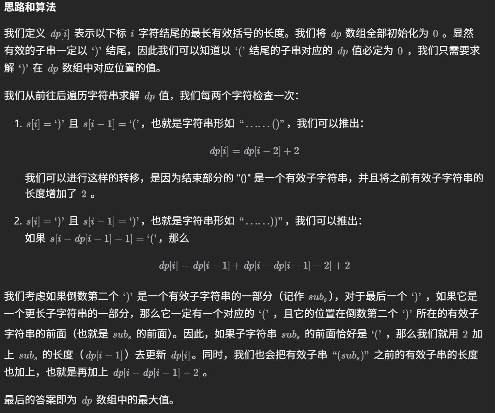

## 12.17 LeetCode 2008 出租车的最大盈利

这道题20260529首刷，我也说不出这题难在哪，好像看了题解就秒懂，但是自己做没有做出来。值得二刷。

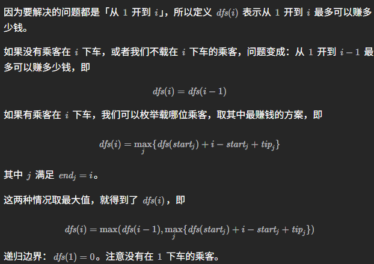

# 13 复杂数据结构

## 13.1 并查集

【并查集(Union Find)】 https://www.bilibili.com/video/BV1LojAzfEoj/?share_source=copy_web&vd_source=adb76b0abd2583fe45600a97ce5e6760

它的英文名字叫 Union-Find Set，也叫 Disjoint Set，意思是“不相交集合”。它是一种树型的数据结构，用于处理一些不相交集合的合并及查询问题（即所谓的并、查）。比如说，我们可以用并查集来判断一个森林中有几棵树、某个节点是否属于某棵树等。这个结构在很多重要的算法中都扮演着关键角色。比如说，判断一个图中有没有环，或者我们要处理网络中哪些节点是连通的，再比如 Kruskal 算法，用来构建最小生成树的时候，同样也会用到并查集。

我们在实现一个并查集时，一般会包含三种操作：

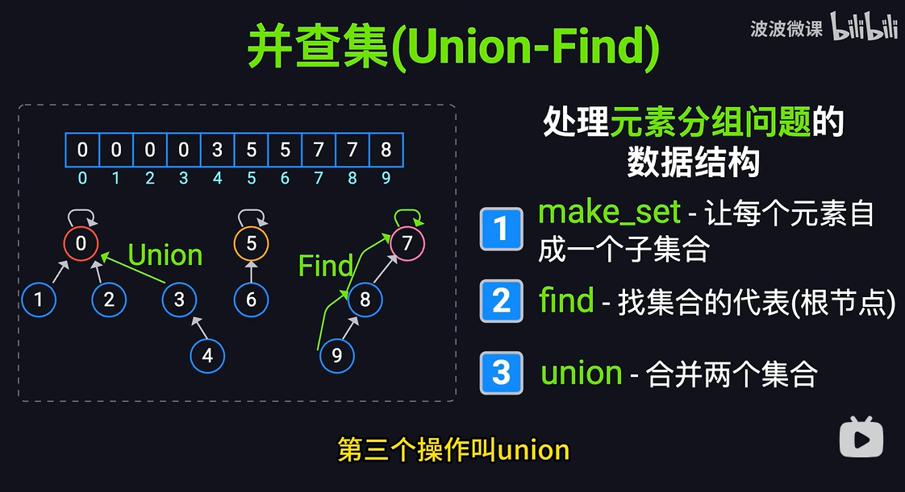

我们需要一个数组，用来存储自己的父节点是谁。初始情况下，每个节点的父节点都是自己。当两个元素的父节点相同时，我们可以认为它们在同一个集合中。

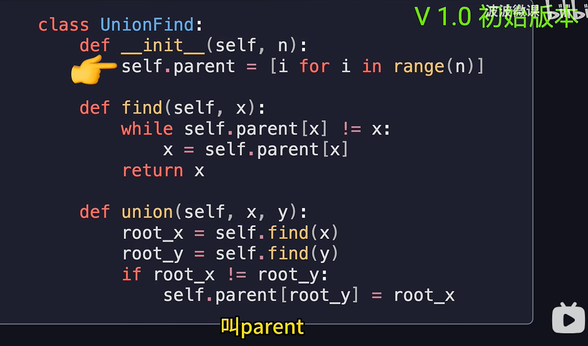

对于初学者，上面的Python代码不难理解。但是随着元素越来越多，如果直接这样调用find查询那么查询效率会变得非常的低。

为了优化，我们引入两个方法：路径压缩与按秩合并。路径压缩的思想是，在查询一个节点的祖先节点时，把它沿途经过的所有节点都直接挂在祖先节点下面。这样子，下次再查询这些节点时，就可以直接找到祖先节点了。按秩合并的思想是，在合并两个集合时，把节点数较少的集合挂在节点数较多的集合下面（当然，按秩合并还可以是把较深的树挂在较浅的树下面，甚至是把树的深浅和大小都当作秩来实现，此处不再赘述）。这样子，可以避免形成过深的树，从而提高查询效率。

给出并查集的模板JS代码：

```javascript
class UnionFind {
  constructor(n) {
    // 创建一个大小为n的并查集
    this.p = Array.from({ length: n }, (_, i) => i) // 初始化情况下，每个元素的父元素都是自己，p指parent
    this.size = new Array(n).fill(1) // 初始时每个集合都只有一个元素
  }

  find(x) {
    if (this.p[x] !== x) {
      this.p[x] = this.find(this.p[x]) // 递归查找，查找时同时进行路径压缩
    }
    return this.p[x]
  }

  union(a, b) {
    const pa = this.find(a)
    const pb = this.find(b)
    if (pa === pb) return false // 当前的两个节点具有相同的祖先，挂在同一个集合里面，无需合并
    if (this.size[pa] > this.size[pb]) {
      // 把小的集合挂在大的集合下面
      this.p[pb] = pa
      this.size[pa] += this.size[pb]
    } else {
      this.p[pa] = pb
      this.size[pb] += this.size[pa]
    }
    return true
  }
}
```

### 13.1.1 LeetCode 3608 包含K个连通分量需要的最小时间

这道题20251128首刷。这道题让我掌握了一个很重要的性质，就是**并查集加边容易删边难**。你不能说删除一条边，就多出一个连通分量，这是不正确的。所以有的时候，我们需要倒过来思考。
